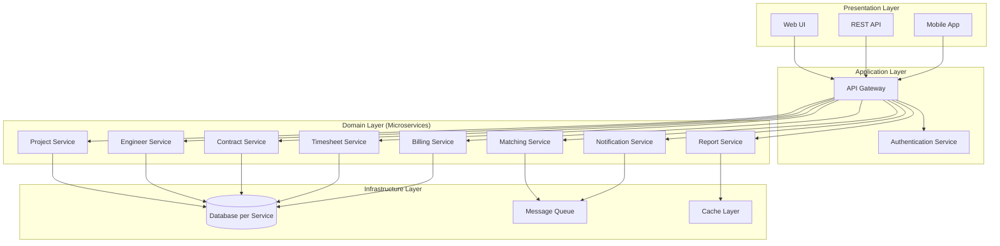
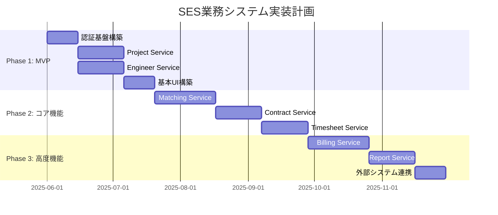

# SES業務システム 基本設計方針

## 1. 設計思想・原則

### 1.1 設計哲学
- **ドメイン駆動設計（DDD）**を中核とした設計アプローチ
- **ビジネス価値の最大化**を最優先とした機能実装
- **継続的な改善とリファクタリング**を前提とした柔軟な設計
- **チーム開発の効率性**を重視した明確な責務分離

### 1.2 設計原則
| 原則 | 説明 | 実装指針 |
|------|------|----------|
| **単一責任の原則** | 各コンポーネントは一つの責務のみを持つ | 境界づけられたコンテキスト単位でのサービス分割 |
| **オープン・クローズドの原則** | 拡張に対して開かれ、修正に対して閉じている | インターフェース駆動設計、イベント駆動アーキテクチャ |
| **依存関係逆転の原則** | 上位レベルは下位レベルに依存してはならない | ドメイン層中心の依存関係設計 |
| **関心の分離** | 異なる関心事は異なる場所で処理 | レイヤードアーキテクチャの採用 |

## 2. アーキテクチャ方針

### 2.1 全体アーキテクチャ


### 2.2 マイクロサービス分割戦略
- **DDD境界づけられたコンテキスト**に基づくサービス分割
- **Database per Service**パターンでのデータ独立性確保
- **Event-Driven Architecture**による疎結合な連携
- **API Gateway**による統一アクセスポイント

### 2.3 レイヤードアーキテクチャ
```
┌─────────────────────────────────────┐
│ Presentation Layer                  │ ← UI, REST API, Controller
├─────────────────────────────────────┤
│ Application Layer                   │ ← Use Case, Application Service
├─────────────────────────────────────┤
│ Domain Layer                        │ ← Entity, Value Object, Domain Service
├─────────────────────────────────────┤
│ Infrastructure Layer                │ ← Repository Impl, External API
└─────────────────────────────────────┘
```

## 3. 技術選定方針

### 3.1 技術選定基準
| 基準 | 重要度 | 評価ポイント |
|------|--------|-------------|
| **学習コスト** | 高 | チームの既存スキルとの親和性 |
| **コミュニティサポート** | 高 | ドキュメント充実度、問題解決の容易さ |
| **保守性・拡張性** | 高 | 長期運用での技術的負債リスク |
| **パフォーマンス** | 中 | 非機能要件の充足度 |
| **ライセンス** | 中 | 商用利用での制約・コスト |

### 3.2 採用技術スタック
#### バックエンド
- **Java 17 LTS** - 長期サポート、企業システム実績
- **Spring Boot 3.2** - 豊富なエコシステム、自動設定
- **PostgreSQL 15** - ACID準拠、JSON対応、高性能
- **Apache Kafka** - Event Streaming、高スループット

#### フロントエンド
- **Thymeleaf** - サーバーサイドレンダリング、SEO対応
- **Bootstrap 5** - レスポンシブ、豊富なコンポーネント
- **Alpine.js** - 軽量フロントエンド、学習コスト低

#### 認証・セキュリティ
- **Keycloak** - エンタープライズ認証、OAuth2/OIDC対応
- **Spring Security** - OAuth2クライアント、JWT処理

#### インフラストラクチャ
- **Docker** - コンテナ化、環境統一
- **Redis** - セッション管理、キャッシュ
- **GitHub Actions** - CI/CD、無料枠活用

## 4. データ設計方針

### 4.1 データモデリング原則
- **正規化**: 第3正規形まで適用、データ整合性確保
- **監査ログ**: 全エンティティに作成・更新履歴を記録
- **論理削除**: 物理削除は避け、フラグによる論理削除
- **バージョニング**: 楽観的排他制御によるデータ整合性

### 4.2 命名規則
```sql
-- テーブル名: 複数形、スネークケース
CREATE TABLE user_accounts (
    -- 主キー: UUID使用
    id UUID PRIMARY KEY DEFAULT gen_random_uuid(),
    
    -- カラム名: スネークケース
    user_name VARCHAR(100) NOT NULL,
    email_address VARCHAR(255) UNIQUE NOT NULL,
    
    -- 監査項目: 必須
    created_at TIMESTAMP DEFAULT CURRENT_TIMESTAMP,
    updated_at TIMESTAMP DEFAULT CURRENT_TIMESTAMP,
    created_by UUID,
    updated_by UUID,
    
    -- 論理削除フラグ
    is_deleted BOOLEAN DEFAULT FALSE,
    
    -- バージョニング
    version INTEGER DEFAULT 1
);

-- インデックス名: idx_テーブル名_カラム名
CREATE INDEX idx_user_accounts_email_address ON user_accounts(email_address);
```

### 4.3 データ整合性戦略
- **単一サービス内**: ACID特性によるトランザクション管理
- **サービス間**: Sagaパターンによる結果整合性
- **イベント設計**: Event Sourcingによる状態変更の追跡可能性

## 5. API設計方針

### 5.1 RESTful API設計原則
```yaml
# リソース指向設計
GET    /api/projects           # プロジェクト一覧取得
POST   /api/projects           # プロジェクト作成
GET    /api/projects/{id}      # プロジェクト詳細取得
PUT    /api/projects/{id}      # プロジェクト更新
DELETE /api/projects/{id}      # プロジェクト削除

# ネストしたリソース
GET    /api/projects/{id}/engineers     # プロジェクトの技術者一覧
POST   /api/projects/{id}/engineers     # プロジェクトに技術者追加

# フィルタ・ソート・ページング
GET    /api/projects?status=active&sort=created_at&page=1&size=20
```

### 5.2 API仕様管理
- **OpenAPI 3.0** による仕様書自動生成
- **契約テスト** によるAPI互換性保証
- **バージョニング** によるAPIライフサイクル管理

### 5.3 エラーハンドリング
```json
{
  "error": {
    "code": "VALIDATION_ERROR",
    "message": "入力値に誤りがあります",
    "details": [
      {
        "field": "email",
        "code": "INVALID_FORMAT",
        "message": "メールアドレス形式が正しくありません"
      }
    ],
    "timestamp": "2025-05-31T12:00:00Z",
    "path": "/api/engineers"
  }
}
```

## 6. セキュリティ設計方針

### 6.1 認証・認可
- **OIDC（OpenID Connect）**: Keycloakによる統一認証
- **JWT（JSON Web Token）**: ステートレスな認証情報伝達
- **RBAC（Role-Based Access Control）**: ロールベースアクセス制御

### 6.2 データ保護
- **暗号化**: 
  - 保存データ: AES-256暗号化
  - 通信データ: TLS 1.3使用
- **個人情報保護**: GDPR準拠のデータ処理
- **監査ログ**: 全操作の追跡可能性確保

### 6.3 セキュリティテスト
- **OWASP Top 10** 対策の実装
- **静的解析**: SonarQubeによるコード品質検査
- **動的テスト**: ペネトレーションテストの定期実施

## 7. テスト設計方針

### 7.1 テスト戦略
```
┌─────────────────────────────────────┐
│ E2E Tests                          │ ← UI自動テスト
├─────────────────────────────────────┤
│ Integration Tests                   │ ← API統合テスト
├─────────────────────────────────────┤
│ Unit Tests                          │ ← ドメインロジックテスト
└─────────────────────────────────────┘
```

### 7.2 テストカバレッジ目標
- **単体テスト**: 80%以上（ドメイン層は90%以上）
- **統合テスト**: 主要APIパス100%
- **E2Eテスト**: 重要業務フロー100%

### 7.3 テスト自動化
- **CI/CD**: プルリクエスト時の自動テスト実行
- **Test Containers**: 実際のDBを使った統合テスト
- **Mock**: 外部システム依存の排除

## 8. 運用・監視方針

### 8.1 可観測性（Observability）
- **ログ**: 構造化ログによる検索・分析容易化
- **メトリクス**: Micrometer + Prometheusによる性能監視
- **トレーシング**: 分散トレーシングによる障害調査支援

### 8.2 SLI/SLO設定
| サービス | SLI | SLO | 監視方法 |
|----------|-----|-----|----------|
| API応答時間 | 95%ile応答時間 | < 2秒 | APM監視 |
| 可用性 | 正常応答率 | 99.9% | ヘルスチェック |
| エラー率 | 5xx エラー率 | < 0.1% | ログ監視 |

### 8.3 障害対応
- **アラート**: 閾値超過時の即座通知
- **ランブック**: 障害対応手順の文書化
- **ポストモーテム**: 障害分析と改善策の策定

## 9. 開発プロセス方針

### 9.1 アジャイル開発
- **スプリント期間**: 2週間
- **ユーザーストーリー**: ビジネス価値重視の機能分割
- **MVP（最小viable製品）**: 早期価値提供

### 9.2 品質管理
- **コードレビュー**: 全変更に対するピアレビュー必須
- **Definition of Done**: 完成条件の明確化
- **リファクタリング**: 技術的負債の継続的返済

### 9.3 ドキュメント管理
- **Living Documentation**: コードと同期したドキュメント維持
- **ADR（Architecture Decision Record）**: 設計判断の記録
- **Runbook**: 運用手順の文書化

## 10. 性能設計方針

### 10.1 性能目標
- **同時ユーザー数**: 500ユーザー
- **応答時間**: 平均 < 2秒、95%ile < 5秒
- **スループット**: 1000 req/sec
- **可用性**: 99.9%（月次約43分のダウンタイム）

### 10.2 性能最適化戦略
- **キャッシュ戦略**: Redis による頻繁アクセスデータのキャッシュ
- **データベース最適化**: インデックス設計、クエリ最適化
- **非同期処理**: 重い処理のバックグラウンド実行
- **CDN**: 静的コンテンツの配信最適化

## 11. 実装ガイドライン

### 11.1 コーディング規約
- **Java**: Google Java Style Guide準拠
- **SQL**: 大文字キーワード、インデント統一
- **JSON**: camelCase命名規則

### 11.2 パッケージ構成
```
com.sesmanager
├── project/                 # Project Context
│   ├── domain/
│   │   ├── model/          # エンティティ、値オブジェクト
│   │   ├── repository/     # リポジトリインターフェース
│   │   └── service/        # ドメインサービス
│   ├── application/
│   │   ├── usecase/        # ユースケース
│   │   └── service/        # アプリケーションサービス
│   ├── infrastructure/
│   │   ├── persistence/    # JPA実装
│   │   └── external/       # 外部API
│   └── presentation/
│       ├── web/           # Webコントローラー
│       └── api/           # REST API
├── engineer/               # Engineer Context
└── shared/                 # 共通ライブラリ
    ├── domain/
    ├── infrastructure/
    └── presentation/
```

### 11.3 例外設計
```java
// ドメイン例外
public abstract class DomainException extends RuntimeException {
    private final ErrorCode errorCode;
}

// ビジネスルール違反
public class BusinessRuleViolationException extends DomainException {
    public BusinessRuleViolationException(String message) {
        super(ErrorCode.BUSINESS_RULE_VIOLATION, message);
    }
}

// リソース未発見
public class ResourceNotFoundException extends DomainException {
    public ResourceNotFoundException(String resourceType, String id) {
        super(ErrorCode.RESOURCE_NOT_FOUND, 
              String.format("%s not found: %s", resourceType, id));
    }
}
```

## 12. 移行・展開戦略

### 12.1 段階的実装計画


### 12.2 リスク管理
| リスク | 影響度 | 対策 |
|--------|--------|------|
| 技術的負債蓄積 | 高 | 継続的リファクタリング、コードレビュー強化 |
| パフォーマンス劣化 | 中 | 性能テスト自動化、監視強化 |
| セキュリティ脆弱性 | 高 | 定期的なセキュリティ監査、OWASP対策 |
| チーム生産性低下 | 中 | ペアプログラミング、知識共有会 |

## 13. 継続的改善方針

### 13.1 メトリクス駆動改善
- **開発メトリクス**: ベロシティ、バーンダウン、サイクルタイム
- **品質メトリクス**: 欠陥密度、テストカバレッジ、技術的負債
- **ビジネスメトリクス**: ユーザー満足度、機能使用率

### 13.2 フィードバックループ
- **レトロスペクティブ**: スプリント毎の振り返り
- **ユーザーフィードバック**: 定期的なユーザーインタビュー
- **技術調査**: 新技術の継続的な評価・検証

---

**作成者**: システム化プロジェクトチーム  
**対象読者**: 開発チーム全員、プロジェクトマネージャー、アーキテクト  
**管理方針**: プロジェクト期間中は継続的に更新・改善