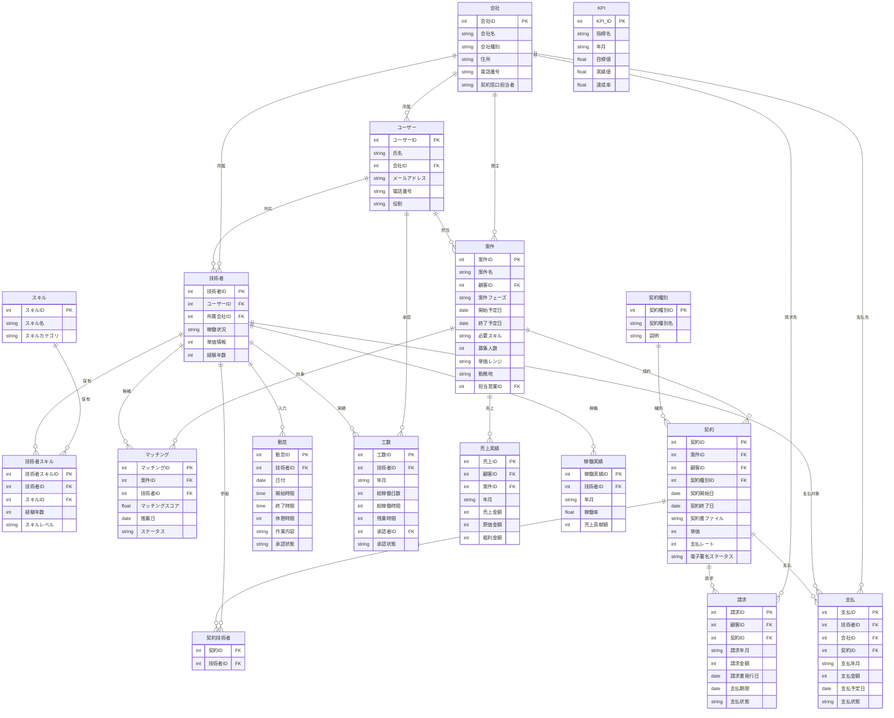

# SES業務システム データモデル概念設計

## 1. はじめに

本ドキュメントは、SES業務システムのデータモデルを概念レベルで記述したものです。このデータモデル概念設計は、基本設計フェーズでのER図やテーブル定義書の詳細設計に先立ち、システムで扱う主要なエンティティ（情報の単位）とその関連性を整理することを目的としています。

## 2. 主要エンティティ

システムで管理する主要エンティティは以下の通りです：

### 2.1 マスタ系エンティティ（基本情報）

| エンティティ名 | 概要 | 主要な属性 |
|----------------|------|-----------|
| **会社** | 自社、顧客企業、協力会社などの会社情報 | 会社ID、会社名、会社種別（自社/顧客/協力会社）、住所、電話番号、契約窓口担当者 |
| **ユーザー** | システムを利用するユーザー情報 | ユーザーID、氏名、会社ID、メールアドレス、電話番号、役割（営業/人事/技術者/PM/経理/経営層） |
| **スキル** | 技術者が保有するスキル情報のマスタ | スキルID、スキル名、スキルカテゴリ（言語/DB/OS/フレームワークなど） |
| **契約種別** | 契約の種別を管理 | 契約種別ID、契約種別名（準委任/派遣/請負）、説明 |
| **契約テンプレート** | 契約書の雛形 | テンプレートID、テンプレート名、契約種別ID、本文テンプレート |

### 2.2 トランザクション系エンティティ（業務データ）

| エンティティ名 | 概要 | 主要な属性 |
|----------------|------|-----------|
| **案件** | 顧客から受注する案件情報 | 案件ID、案件名、顧客ID、案件フェーズ（リード/提案/交渉/受注）、開始予定日、終了予定日、必要スキル、募集人数、単価レンジ、勤務地、担当営業ID |
| **技術者** | 案件にアサインする技術者情報 | 技術者ID、ユーザーID、所属会社ID、稼働状況、単価情報、経験年数 |
| **技術者スキル** | 技術者が保有するスキル | 技術者スキルID、技術者ID、スキルID、経験年数、スキルレベル |
| **マッチング** | 案件と技術者のマッチング情報 | マッチングID、案件ID、技術者ID、マッチングスコア、推薦日、ステータス（提案中/面談調整中/面談済/成約/不成立） |
| **契約** | 成約した案件の契約情報 | 契約ID、案件ID、技術者ID（複数可）、顧客ID、契約種別ID、契約開始日、契約終了日、契約書ファイル、単価、支払レート、電子署名ステータス |
| **勤怠** | 技術者の日次勤怠情報 | 勤怠ID、技術者ID、日付、開始時間、終了時間、休憩時間、作業内容、承認状態 |
| **工数** | 月次の工数集計情報 | 工数ID、技術者ID、年月、総稼働日数、総稼働時間、残業時間、承認者ID、承認状態 |
| **請求** | 顧客への請求情報 | 請求ID、顧客ID、契約ID、請求年月、請求金額、請求書発行日、支払期限、支払状態 |
| **支払** | 技術者/協力会社への支払情報 | 支払ID、技術者ID/会社ID、契約ID、支払年月、支払金額、支払予定日、支払状態 |

### 2.3 レポート系エンティティ

| エンティティ名 | 概要 | 主要な属性 |
|----------------|------|-----------|
| **売上実績** | 売上に関する実績データ | 売上ID、顧客ID、案件ID、年月、売上金額、原価金額、粗利金額 |
| **稼働実績** | 技術者の稼働に関する実績データ | 稼働実績ID、技術者ID、年月、稼働率、売上貢献額 |
| **KPI** | 経営指標データ | KPI_ID、指標名、年月、目標値、実績値、達成率 |

## 3. エンティティ間の関連性

主要なエンティティ間の関連性は以下の通りです：

### 3.1 案件管理に関する関連

- **会社（顧客）** - **案件** : 1対多
  - 1つの顧客企業は複数の案件を発注することができる
- **ユーザー（営業担当）** - **案件** : 1対多
  - 1人の営業担当者は複数の案件を担当することができる

### 3.2 技術者管理に関する関連

- **会社（自社/協力会社）** - **技術者** : 1対多
  - 1つの会社には複数の技術者が所属する
- **技術者** - **技術者スキル** : 1対多
  - 1人の技術者は複数のスキルを持つことができる
- **スキル** - **技術者スキル** : 1対多
  - 1つのスキルは複数の技術者に紐づく

### 3.3 マッチングに関する関連

- **案件** - **マッチング** : 1対多
  - 1つの案件に対して複数の技術者がマッチングされる
- **技術者** - **マッチング** : 1対多
  - 1人の技術者は複数の案件にマッチングされる

### 3.4 契約に関する関連

- **案件** - **契約** : 1対多
  - 1つの案件から複数の契約が生成される（複数の技術者が参画する場合）
- **技術者** - **契約** : 多対多
  - 1人の技術者は複数の契約に関連付けられる
  - 1つの契約は複数の技術者を含むことがある（チーム単位の契約の場合）
- **契約種別** - **契約** : 1対多
  - 1つの契約種別は複数の契約に使用される
- **契約テンプレート** - **契約** : 1対多
  - 1つの契約テンプレートから複数の契約が生成される

### 3.5 勤怠・工数管理に関する関連

- **技術者** - **勤怠** : 1対多
  - 1人の技術者は複数の勤怠情報を持つ
- **技術者** - **工数** : 1対多
  - 1人の技術者は複数の工数情報を持つ
- **ユーザー（承認者）** - **工数** : 1対多
  - 1人の承認者は複数の工数承認を行う

### 3.6 請求・支払に関する関連

- **契約** - **請求** : 1対多
  - 1つの契約から複数の請求が発生する（月次請求の場合）
- **会社（顧客）** - **請求** : 1対多
  - 1つの顧客企業に対して複数の請求が発生する
- **契約** - **支払** : 1対多
  - 1つの契約から複数の支払が発生する（月次支払の場合）
- **技術者/会社** - **支払** : 1対多
  - 1人の技術者または1つの会社に対して複数の支払が発生する

### 3.7 レポート系に関する関連

- **案件** - **売上実績** : 1対多
  - 1つの案件は複数の売上実績を持つ
- **技術者** - **稼働実績** : 1対多
  - 1人の技術者は複数の稼働実績を持つ

## 4. Mermaid ER図

## 5. 今後の設計に向けて

このデータモデル概念設計は、基本設計フェーズでの詳細な設計作業の基礎となります。基本設計フェーズでは、以下の内容を詳細化していきます：

1. 物理テーブル設計（テーブル名、カラム名の決定）
2. データ型と制約の詳細定義
3. インデックス設計
4. 正規化の適用
5. パフォーマンスを考慮した設計最適化

基本設計では、このドキュメントで示した概念モデルをER図として視覚化し、テーブル定義書として詳細化します。

---

**作成者**: システム化プロジェクトチーム