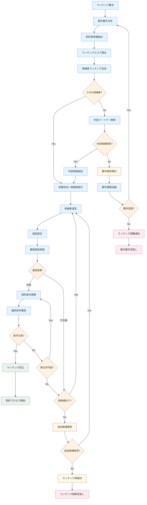

# マッチング 業務フロー

## マッチングフロー図

## マッチング業務詳細

### 1. 初期マッチングフェーズ
#### 自動マッチング処理
- **案件要件分析**: 必要スキル、経験年数、稼働期間等の分析
- **技術者候補抽出**: システムデータベースから条件に合致する候補者を抽出
- **マッチングスコア算出**: 
  - スキル適合度（40%）
  - 経験年数適合度（25%）
  - 稼働可能性（20%）
  - 過去実績評価（15%）
- **候補者ランキング生成**: スコア順でのランキング作成

#### 候補者補強
- **外部パートナー検索**: 社内候補が不足の場合の外部検索
- **要件緩和検討**: 候補者不足時の要件調整検討

### 2. 選考・面談フェーズ
#### 候補者選定・面談
- **候補者選定**: 営業判断による最終候補者選定（通常3-5名）
- **面談設定**: 顧客・技術者・営業の都合調整
- **顧客面談実施**: 技術面談、スキル確認、人物面談
- **面談結果評価**: 技術的適合性、コミュニケーション能力等の評価

#### 追加候補対応
- **追加候補検索**: 初回候補で決まらない場合の追加検索
- **マッチング再検討**: 要件の再分析、検索条件の見直し

### 3. 条件調整・成約フェーズ
#### 契約条件調整
- **最終条件確認**: 単価、期間、勤務条件等の最終調整
- **条件合意**: 顧客・技術者・営業三者での条件合意
- **再交渉**: 条件不一致時の再交渉プロセス

#### マッチング完了
- **マッチング成立**: 全条件合意による正式なマッチング成立
- **契約プロセス開始**: 契約書作成・締結プロセスへの移行

### 4. マッチング品質管理
#### 成功要因分析
- マッチング成功事例の分析
- スコア算出ロジックの改善
- 営業担当のフィードバック収集

#### 失敗要因分析
- マッチング失敗理由の分析
- 要件設定の適切性評価
- プロセス改善点の特定

### 5. マッチング KPI
- **マッチング成功率**: 成立件数 / 総マッチング件数
- **平均マッチング期間**: 要求から成立までの平均日数
- **候補者提示数**: 平均候補者提示数
- **面談通過率**: 面談合格数 / 面談実施数