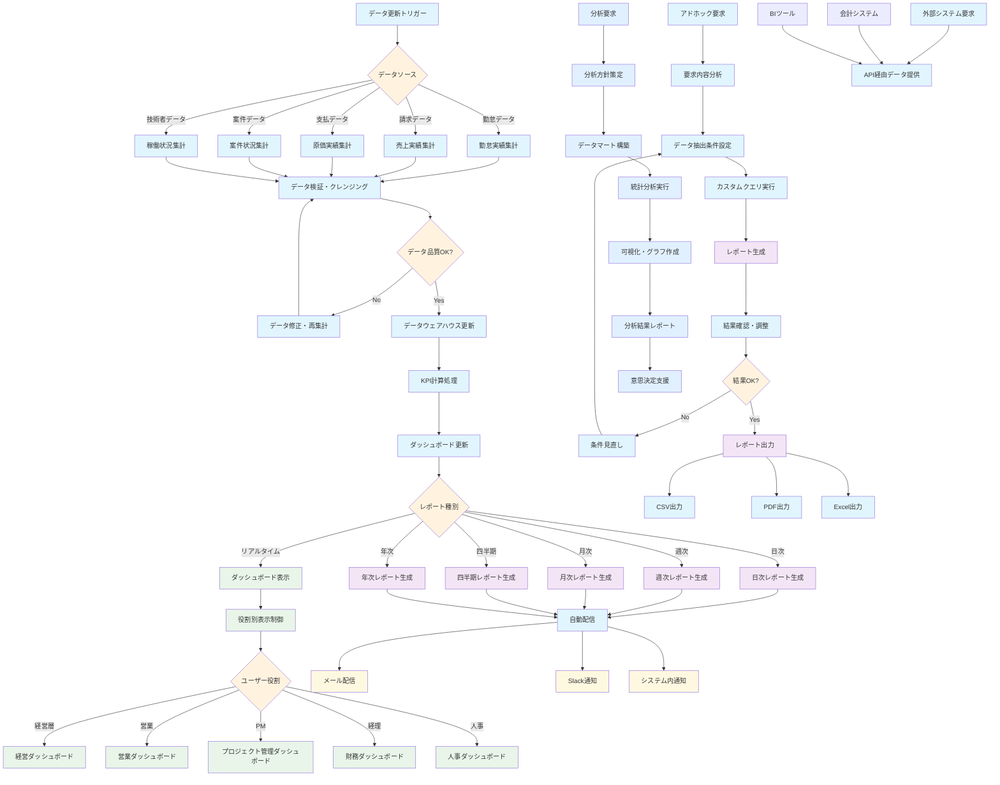

# レポーティング 業務フロー

## レポーティングフロー図

## レポーティング業務詳細

### 1. データ収集・統合フェーズ
#### データソース統合
- **データ更新トリガー**: 各業務システムからのデータ更新検知
- **実績データ集計**: 
  - 勤怠実績: 技術者別、プロジェクト別稼働実績
  - 売上実績: 顧客別、案件別売上データ
  - 原価実績: 技術者コスト、外注費等
  - 案件状況: 案件進捗、受注予測等
  - 稼働状況: 技術者の稼働率、アサイン状況

#### データ品質管理
- **データ検証・クレンジング**: 
  - 欠損値チェック
  - 異常値検出
  - データ整合性確認
- **データウェアハウス更新**: 統合データの一元管理

### 2. KPI計算・ダッシュボード更新フェーズ
#### KPI自動計算
- **KPI計算処理**: 
  - 売上、粗利、稼働率
  - 受注予測、パイプライン状況
  - 技術者稼働率、アサイン率
  - 顧客満足度、リピート率
- **ダッシュボード更新**: リアルタイムでのKPI更新

#### 役割別ダッシュボード
- **経営ダッシュボード**: 
  - 売上推移、利益率
  - 主要KPI一覧
  - 予実対比
- **営業ダッシュボード**: 
  - 案件パイプライン
  - 営業個人成績
  - 顧客別売上
- **プロジェクト管理ダッシュボード**: 
  - プロジェクト進捗
  - 技術者稼働状況
  - 工数実績 vs 予定
- **財務ダッシュボード**: 
  - 売掛・買掛管理
  - キャッシュフロー
  - 請求・支払状況
- **人事ダッシュボード**: 
  - 技術者稼働率
  - スキル分布
  - 採用・配置状況

### 3. 定期レポート生成フェーズ
#### 自動レポート生成
- **日次レポート**: 
  - 勤怠入力状況
  - 当日売上速報
  - アラート情報
- **週次レポート**: 
  - 週間売上サマリー
  - プロジェクト週報
  - 技術者稼働状況
- **月次レポート**: 
  - 月次業績レポート
  - 顧客別実績
  - 技術者別実績
- **四半期レポート**: 
  - 四半期業績分析
  - 事業部別成績
  - 市場動向分析
- **年次レポート**: 
  - 年間業績総括
  - 年次計画実績
  - 来期計画策定資料

#### レポート配信
- **自動配信**: 設定されたスケジュールでの自動配信
- **通知機能**: 
  - メール配信
  - Slack通知
  - システム内通知

### 4. アドホックレポート・分析フェーズ
#### カスタムレポート作成
- **アドホック要求**: 個別の分析要求対応
- **要求内容分析**: レポート要件の詳細分析
- **データ抽出条件設定**: 必要データの抽出条件設定
- **カスタムクエリ実行**: SQL等による柔軟なデータ抽出
- **レポート生成**: 要求に応じたレポート作成

#### 出力形式対応
- **CSV出力**: データ分析用のCSV形式
- **PDF出力**: 印刷・配布用のPDF形式
- **Excel出力**: 加工・分析用のExcel形式

### 5. 高度分析・BI連携フェーズ
#### データ分析
- **分析要求**: 高度な分析要求への対応
- **分析方針策定**: 分析手法・指標の決定
- **データマート構築**: 分析用データの構築
- **統計分析実行**: 統計的手法による分析
- **可視化・グラフ作成**: 分析結果の可視化
- **分析結果レポート**: 分析結果の報告書作成
- **意思決定支援**: 経営判断のための情報提供

#### 外部システム連携
- **API経由データ提供**: 外部システムへのデータ提供
- **会計システム連携**: 会計データの自動連携
- **BIツール連携**: TableauやPower BI等との連携

### 6. レポーティング KPI
- **レポート生成時間**: 各種レポートの生成時間
- **データ更新頻度**: リアルタイムデータの更新頻度
- **ダッシュボード利用率**: ユーザー別ダッシュボード利用状況
- **レポート配信成功率**: 自動配信の成功率
- **データ品質スコア**: データの正確性・完全性評価