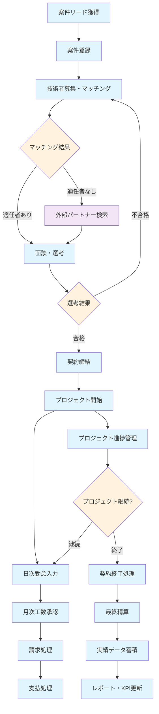

# SES業務システム 全体業務フロー

## 全体業務フロー図

## 業務フロー詳細

### フェーズ1: 案件獲得・登録
1. **案件リード獲得**: 営業活動による案件情報の取得
2. **案件登録**: システムへの案件詳細情報登録
   - 顧客情報、案件概要、必要スキル、期間、予算等

### フェーズ2: リソースマッチング
3. **技術者募集・マッチング**: システムによる自動マッチング
   - スキル、稼働状況、希望条件による候補者抽出
4. **外部パートナー検索**: 社内リソースが不足の場合

### フェーズ3: 選考・契約
5. **面談・選考**: 顧客との面談および選考プロセス
6. **契約締結**: 電子契約システムによる契約締結

### フェーズ4: プロジェクト実行
7. **プロジェクト開始**: 実際の業務開始
8. **日次勤怠入力**: 技術者による勤怠データ入力
9. **月次工数承認**: PM/営業による工数承認

### フェーズ5: 請求・支払
10. **請求処理**: 顧客への月次請求書発行
11. **支払処理**: 技術者/パートナーへの支払処理

### フェーズ6: 管理・分析
12. **プロジェクト進捗管理**: 継続的な進捗確認
13. **契約終了処理**: プロジェクト完了時の処理
14. **実績データ蓄積**: 各種実績データの蓄積
15. **レポート・KPI更新**: 経営ダッシュボードの更新