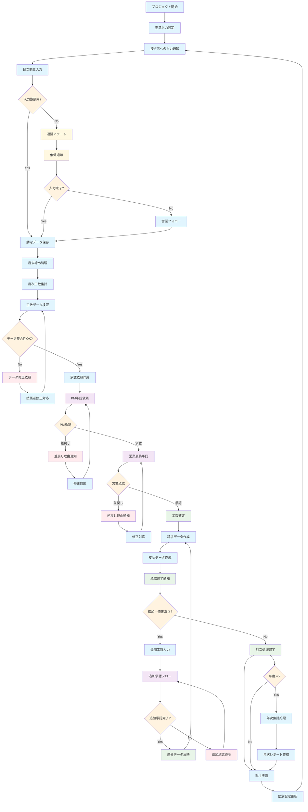

# 勤怠工数管理 業務フロー

## 勤怠工数管理フロー図

## 勤怠工数管理業務詳細

### 1. 勤怠入力フェーズ
#### 初期設定
- **勤怠入力設定**: プロジェクト開始時の勤怠入力ルール設定
  - 入力頻度（日次/週次）
  - 入力項目（開始/終了時刻、休憩時間、作業内容）
  - 入力期限設定
- **技術者への入力通知**: 勤怠入力開始の通知・説明

#### 日次勤怠入力
- **勤怠データ入力**: 技術者による日次勤怠入力
  - Web画面またはモバイルアプリでの入力
  - 開始時刻、終了時刻、休憩時間
  - 作業内容、プロジェクトコード
  - 残業理由（残業時）
- **入力期限管理**: 入力期限の監視・アラート
- **遅延対応**: 入力遅延時の催促・フォロー

### 2. 月次集計・検証フェーズ
#### 工数集計
- **月末締め処理**: 月末での勤怠データ集計
- **月次工数集計**: 
  - 総稼働時間、総稼働日数
  - 通常時間、残業時間
  - プロジェクト別工数
- **工数データ検証**: 
  - 入力漏れチェック
  - 異常値検出（過度な残業等）
  - 休日出勤の妥当性確認

#### データ修正対応
- **データ修正依頼**: 不整合データの修正依頼
- **技術者修正対応**: 技術者による修正実施
- **修正内容確認**: 修正後のデータ検証

### 3. 承認フェーズ
#### 段階的承認プロセス
1. **PM承認**: プロジェクトマネージャーによる一次承認
   - 作業内容の妥当性確認
   - 工数の適切性評価
   - 残業の必要性確認

2. **営業最終承認**: 営業担当による最終承認
   - 顧客請求の妥当性確認
   - 契約範囲内での作業確認
   - 収益性の確認

#### 差戻し処理
- **差戻し理由通知**: 承認者からの差戻し理由の明確化
- **修正対応**: 技術者・PMによる修正対応
- **再承認**: 修正後の再承認プロセス

### 4. 確定・連携フェーズ
#### 工数確定
- **工数確定**: 全承認完了による工数の正式確定
- **請求データ作成**: 顧客請求用データの自動生成
- **支払データ作成**: 技術者支払用データの自動生成
- **承認完了通知**: 関係者への確定通知

#### 追加・修正処理
- **追加工数入力**: 確定後の追加工数がある場合の処理
- **追加承認フロー**: 追加分の承認プロセス
- **差分データ反映**: 追加分の請求・支払データ反映

### 5. 定期処理・分析
#### 翌月準備
- **翌月準備**: 次月の勤怠入力準備
- **勤怠設定更新**: 必要に応じた設定変更

#### 年次処理
- **年次集計処理**: 年度末の総合集計
- **年次レポート作成**: 稼働実績の年次レポート作成

### 6. 勤怠工数管理 KPI
- **入力完了率**: 期限内入力完了率
- **承認処理時間**: 工数承認の平均処理時間
- **差戻し率**: 承認差戻しの発生率
- **データ精度**: 修正・差戻し件数による精度評価