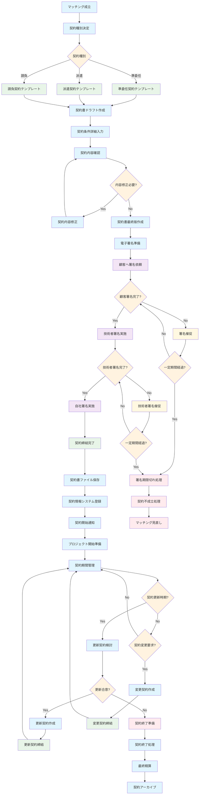

# 契約管理 業務フロー

## 契約管理フロー図

## 契約管理業務詳細

### 1. 契約締結フェーズ
#### 契約準備
- **契約種別決定**: 案件特性に応じた契約形態の選択
  - 準委任契約: 技術支援、コンサルティング等
  - 派遣契約: 人材派遣
  - 請負契約: 成果物納入型
- **契約テンプレート選択**: 契約種別に応じたテンプレート適用
- **契約書ドラフト作成**: 個別案件に応じた契約書案作成

#### 契約内容調整
- **契約条件詳細入力**: 
  - 業務内容、期間、場所
  - 報酬・支払条件
  - 責任・義務事項
  - 機密保持条項
- **契約内容確認**: 法務・営業・技術者による内容確認
- **契約内容修正**: 必要に応じた条項の修正・追加

#### 電子署名プロセス
- **電子署名準備**: DocuSign等の電子署名システム準備
- **顧客署名**: 顧客による電子署名実施
- **技術者署名**: 技術者による電子署名実施
- **自社署名**: 自社担当者による最終署名
- **署名完了確認**: 全当事者の署名完了確認

### 2. 契約実行フェーズ
#### 契約開始
- **契約締結完了**: 正式な契約成立
- **契約書ファイル保存**: 署名済み契約書の安全保存
- **契約情報システム登録**: 契約詳細のシステム登録
- **契約開始通知**: 関係者への契約開始通知
- **プロジェクト開始準備**: 実際の業務開始準備

#### 契約期間管理
- **契約期間監視**: 契約期間の定期的な監視
- **更新時期通知**: 契約更新時期の事前通知
- **変更要求対応**: 契約期間中の変更要求への対応

### 3. 契約変更・更新フェーズ
#### 契約更新
- **更新契約検討**: 契約継続の可否検討
- **更新条件交渉**: 新たな期間・条件の交渉
- **更新契約作成**: 更新契約書の作成・締結

#### 契約変更
- **変更事由確認**: 契約変更の必要性・妥当性確認
- **変更契約作成**: 変更契約書の作成・締結
- **変更内容反映**: システムへの変更内容反映

### 4. 契約終了フェーズ
#### 契約終了処理
- **契約終了準備**: 契約満了・中途終了の準備
- **最終精算**: 未払い報酬、経費等の最終精算
- **契約アーカイブ**: 契約書類の長期保存対応

### 5. 契約管理 KPI
- **契約締結期間**: マッチング成立から契約締結までの期間
- **契約更新率**: 契約満了時の更新率
- **契約変更頻度**: 契約期間中の変更発生頻度
- **電子署名完了率**: 電子署名プロセスの完了率