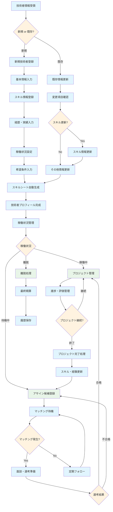

# 技術者管理 業務フロー

## 技術者管理フロー図

## 技術者管理業務詳細

### 1. 技術者登録フェーズ
#### 新規技術者登録
- **基本情報入力**: 氏名、連絡先、所属会社、雇用形態等
- **スキル情報登録**: 保有技術、習熟度、経験年数
- **経歴・実績入力**: 過去のプロジェクト経験、実績
- **稼働状況設定**: 現在の稼働状況、稼働可能時期
- **希望条件入力**: 希望単価、勤務地、案件タイプ等

#### 既存技術者情報更新
- **変更項目確認**: 更新が必要な項目の特定
- **スキル情報更新**: 新規習得スキル、資格取得等の反映
- **その他情報更新**: 連絡先、希望条件等の変更

### 2. プロフィール管理
- **スキルシート自動生成**: 登録情報からスキルシート（PDF/Word）を自動作成
- **技術者プロフィール完成**: システム上での技術者情報の完成

### 3. 稼働状況管理
#### 稼働中
- **プロジェクト管理**: 現在参画中のプロジェクト情報管理
- **進捗・評価管理**: 定期的な進捗確認、評価入力
- **プロジェクト完了処理**: プロジェクト終了時の処理
- **スキル・経験更新**: 新たに得た経験・スキルの反映

#### 待機中
- **アサイン候補登録**: 新規案件への候補者として登録
- **マッチング待機**: システムによる自動マッチング対象
- **面談・選考準備**: マッチング発生時の面談準備
- **定期フォロー**: 定期的な状況確認、モチベーション管理

#### 離脱
- **離脱処理**: 契約終了、退職等の処理
- **最終精算**: 最終的な支払・精算処理
- **履歴保存**: 技術者の活動履歴をアーカイブ保存

### 4. 技術者評価・育成
- 定期的なスキル評価
- 育成計画の策定・実行
- キャリアパスの相談・支援
- 研修・資格取得支援