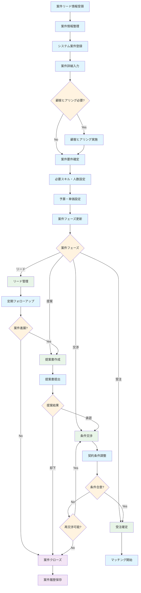

# 案件管理 業務フロー

## 案件管理フロー図

## 案件管理業務詳細

### 1. 案件登録フェーズ
- **案件リード情報受領**: 営業活動、紹介、問い合わせ等による案件情報取得
- **案件情報整理**: 受領した情報の整理・分析
- **システム案件登録**: 基本情報をシステムに登録
- **案件詳細入力**: 顧客情報、案件概要、技術要件等の詳細入力

### 2. 要件確定フェーズ
- **顧客ヒアリング**: 必要に応じて追加のヒアリング実施
- **案件要件確定**: 技術要件、期間、予算等の確定
- **必要スキル・人数設定**: マッチングに必要な条件設定
- **予算・単価設定**: 収益計画の策定

### 3. 案件フェーズ管理
#### リードフェーズ
- 定期的なフォローアップ
- 案件の進展状況確認
- 競合他社の動向把握

#### 提案フェーズ
- 提案書の作成・提出
- プレゼンテーション実施
- 顧客からのフィードバック対応

#### 交渉フェーズ
- 契約条件の詳細交渉
- 技術的要件の調整
- 価格・期間の最終調整

#### 受注フェーズ
- 受注確定処理
- マッチングプロセス開始
- プロジェクト準備開始

### 4. 案件ステータス管理
- 各フェーズでの進捗状況追跡
- 案件確度の評価・更新
- 売上予測への反映