# 請求支払 業務フロー

## 請求支払フロー図

```mermaid
graph TD
    A[工数確定] --> B[請求処理開始]
    B --> C[請求データ集計]
    C --> D[単価×工数計算]
    D --> E[請求金額算出]
    E --> F{請求内容確認}
    F -->|OK| G[請求書作成]
    F -->|修正| H[請求データ修正]
    H --> C
    
    G --> I[請求書PDF生成]
    I --> J[請求書送付]
    J --> K[請求管理台帳更新]
    K --> L[入金管理開始]
    
    L --> M{入金確認}
    M -->|入金あり| N[入金データ照合]
    M -->|期限内未入金| O[催促通知]
    M -->|期限超過| P[督促処理]
    
    N --> Q{金額一致?}
    Q -->|一致| R[入金確定]
    Q -->|不一致| S[差額確認・調整]
    S --> T{調整完了?}
    T -->|完了| R
    T -->|未完了| U[顧客問合せ]
    
    O --> V[催促メール送信]
    V --> W{一定期間経過?}
    W -->|No| M
    W -->|Yes| P
    
    P --> X[督促状送付]
    X --> Y[債権管理強化]
    
    R --> Z[支払処理開始]
    Z --> AA[支払対象確認]
    AA --> BB{支払種別}
    BB -->|社員| CC[給与連携処理]
    BB -->|協力会社| DD[外注費処理]
    BB -->|個人| EE[個人支払処理]
    
    CC --> FF[給与システム連携]
    DD --> GG[支払依頼書作成]
    EE --> HH[個人支払依頼作成]
    
    FF --> II[給与計算確認]
    GG --> JJ[支払承認依頼]
    HH --> JJ
    
    II --> KK[給与支払確定]
    JJ --> LL{支払承認}
    LL -->|承認| MM[支払実行]
    LL -->|差戻し| NN[支払データ修正]
    NN --> JJ
    
    MM --> OO[支払完了確認]
    KK --> OO
    OO --> PP[支払管理台帳更新]
    PP --> QQ[会計システム連携]
    QQ --> RR[月次締め処理]
    
    %% 例外処理・調整
    RR --> SS{差額・調整あり?}
    SS -->|Yes| TT[調整仕訳作成]
    SS -->|No| UU[月次完了]
    TT --> VV[調整承認]
    VV --> UU
    
    UU --> WW[レポート作成]
    WW --> XX[経営報告]
    
    %% 年次処理
    XX --> YY{年度末?}
    YY -->|Yes| ZZ[年次決算処理]
    YY -->|No| AAA[翌月処理準備]
    ZZ --> BBB[税務処理]
    BBB --> AAA
    
    %% スタイリング
    classDef process fill:#e1f5fe
    classDef decision fill:#fff3e0
    classDef payment fill:#e8f5e8
    classDef billing fill:#f3e5f5
    classDef alert fill:#fff8e1
    classDef success fill:#e8f5e8
    classDef error fill:#ffebee
    
    class A,B,C,D,E,G,H,I,J,K,L,N,S,V,X,Y,Z,AA,CC,DD,EE,FF,GG,HH,II,MM,OO,PP,QQ,RR,TT,VV,WW,XX,ZZ,BBB,AAA process
    class F,M,Q,T,W,BB,LL,SS,YY decision
    class CC,DD,EE,FF,GG,HH,II,JJ,MM,KK payment
    class G,I,J,K billing
    class O,P,V,X,NN alert
    class R,KK,OO,UU,XX success
    class P,Y,NN error
```

## 請求支払業務詳細

### 1. 請求処理フェーズ
#### 請求データ準備
- **工数確定**: 承認済み工数データの確定
- **請求データ集計**: 契約別・技術者別の工数集計
- **単価×工数計算**: 契約単価と確定工数による売上計算
- **請求金額算出**: 
  - 基本料金（時間単価×稼働時間）
  - 残業料金（残業単価×残業時間）
  - 諸経費（交通費等）
  - 消費税計算

#### 請求書作成・送付
- **請求内容確認**: 営業・経理による請求内容の最終確認
- **請求書作成**: PDF形式の請求書自動生成
- **請求書送付**: メール送付またはシステム連携
- **請求管理台帳更新**: 請求情報のシステム登録

### 2. 入金管理フェーズ
#### 入金確認・照合
- **入金管理開始**: 請求書発行後の入金監視開始
- **入金確認**: 銀行口座、会計システムでの入金確認
- **入金データ照合**: 請求金額と入金金額の照合
- **金額差異対応**: 金額不一致時の原因調査・調整

#### 未入金対応
- **催促通知**: 支払期限前の催促通知
- **督促処理**: 支払期限超過時の督促
- **債権管理強化**: 長期未回収債権の管理強化

### 3. 支払処理フェーズ
#### 支払対象確認・分類
- **支払対象確認**: 入金確定後の支払対象確認
- **支払種別判定**: 
  - 社員: 給与として処理
  - 協力会社: 外注費として処理
  - 個人事業主: 個人支払として処理

#### 社員支払処理
- **給与システム連携**: 人事給与システムとのデータ連携
- **給与計算確認**: 基本給与との合算確認
- **給与支払確定**: 月次給与での支払確定

#### 外部支払処理
- **支払依頼書作成**: 協力会社・個人への支払依頼書作成
- **支払承認依頼**: 経理・管理者による支払承認
- **支払実行**: 銀行振込等による実際の支払
- **支払完了確認**: 支払完了の確認・記録

### 4. 会計連携・締め処理フェーズ
#### 会計システム連携
- **支払管理台帳更新**: 支払情報の正式記録
- **会計システム連携**: 
  - freee、マネーフォワード等との自動連携
  - 売上計上、支払計上の自動仕訳
- **月次締め処理**: 月次での売上・支払の締め処理

#### 調整・例外処理
- **差額調整**: 請求・支払における差額の調整処理
- **調整仕訳作成**: 会計上の調整仕訳の作成
- **調整承認**: 調整内容の承認プロセス

### 5. レポート・分析フェーズ
#### 月次レポート
- **レポート作成**: 月次の売上・利益レポート作成
- **経営報告**: 経営層への業績報告
- **KPI更新**: 経営ダッシュボードのKPI更新

#### 年次処理
- **年次決算処理**: 年度末の決算処理
- **税務処理**: 法人税、消費税等の税務処理
- **翌年度準備**: 次年度の処理準備

### 6. 請求支払管理 KPI
- **請求書発行日数**: 工数確定から請求書発行までの日数
- **入金回収率**: 請求額に対する入金回収率
- **入金サイクル**: 請求から入金までの平均日数
- **支払処理日数**: 入金から支払完了までの日数
- **債権回転率**: 売掛金の回転効率
- **支払遅延率**: 支払期限遅延の発生率