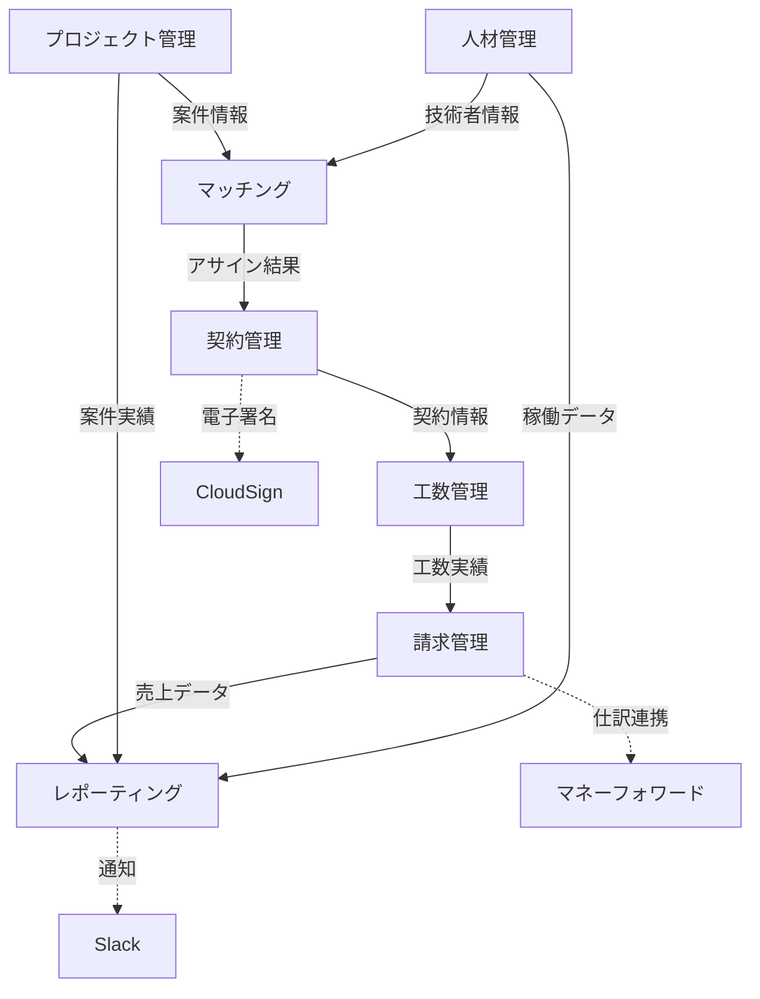

# DDD設計アプローチ - SES業務システム

## 1. DDD実践手順

### Step 1: ドメインエキスパートとの協働
- **ユビキタス言語の確立**: 業務専門用語の統一
- **イベントストーミング**: 業務フローの可視化
- **ドメイン知識の抽出**: 暗黙知の明文化

### Step 2: 戦略的設計
- **境界づけられたコンテキスト（Bounded Context）の特定**
- **コンテキストマップの作成**
- **ドメインの分割と関係性の定義**

### Step 3: 戦術的設計
- **エンティティとバリューオブジェクトの設計**
- **集約（Aggregate）の設計**
- **ドメインサービスの抽出**
- **リポジトリパターンの適用**

## 2. SES業務システムの境界づけられたコンテキスト

### 2.1 特定されたコンテキスト

#### プロジェクト管理コンテキスト（Project Management Context）
- **責務**: 案件のライフサイクル管理
- **主要概念**: 案件、顧客、営業活動、提案
- **ユビキタス言語**:
  - 案件（Project）: 顧客から受注する業務
  - リード（Lead）: 見込み案件
  - 受注（Order）: 成約した案件

#### 人材管理コンテキスト（Human Resource Context）
- **責務**: 技術者情報とスキル管理
- **主要概念**: 技術者、スキル、経験、評価
- **ユビキタス言語**:
  - 技術者（Engineer）: プロジェクトに参画する人材
  - スキルセット（SkillSet）: 技術者の保有技術
  - 稼働状況（Availability）: アサイン可能性

#### マッチングコンテキスト（Matching Context）
- **責務**: 案件と技術者の最適な組み合わせ
- **主要概念**: マッチング、適合度、推薦
- **ユビキタス言語**:
  - マッチング（Matching）: 案件と技術者の組み合わせ
  - 適合度（Compatibility）: スキル・経験の一致度
  - アサイン（Assignment）: 技術者の案件配属

#### 契約管理コンテキスト（Contract Management Context）
- **責務**: 契約締結と管理
- **主要概念**: 契約、条件、署名、更新
- **ユビキタス言語**:
  - 契約（Contract）: 法的な取り決め
  - 準委任（Quasi-delegation）: 委任契約の一種
  - 派遣（Temporary Staffing）: 人材派遣契約

#### 工数管理コンテキスト（Time Management Context）
- **責務**: 勤怠・工数の記録と承認
- **主要概念**: 勤怠、工数、承認、実績
- **ユビキタス言語**:
  - 勤怠（Attendance）: 日次の労働時間記録
  - 工数（WorkHour）: 月次の作業時間集計
  - 承認（Approval）: 工数の正式認定

#### 請求管理コンテキスト（Billing Context）
- **責務**: 請求・支払処理
- **主要概念**: 請求、支払、入金、債権
- **ユビキタス言語**:
  - 請求（Billing）: 顧客への代金請求
  - 支払（Payment）: 技術者・協力会社への支払
  - 入金（Receipt）: 顧客からの代金受領

#### レポーティングコンテキスト（Reporting Context）
- **責務**: 分析・レポート生成
- **主要概念**: KPI、ダッシュボード、分析
- **ユビキタス言語**:
  - KPI（Key Performance Indicator）: 重要業績評価指標
  - ダッシュボード（Dashboard）: 経営情報の一覧表示
  - 実績（Performance）: 業務成果の数値化

### 2.2 コンテキストマップ



## 3. 戦術的設計の実装方針

### 3.1 アーキテクチャパターン
```
presentation/     # UI層（Controller, View）
├── web/
└── api/

application/      # アプリケーション層（Use Case, Service）
├── usecase/
└── service/

domain/          # ドメイン層（Entity, Value Object, Repository Interface）
├── model/
├── repository/
└── service/

infrastructure/  # インフラ層（Repository Implementation, External API）
├── persistence/
├── external/
└── config/
```

### 3.2 パッケージ構成（例：プロジェクト管理コンテキスト）
```
com.sesmanager.project/
├── domain/
│   ├── model/
│   │   ├── Project.java           # 集約ルート
│   │   ├── ProjectId.java         # Value Object
│   │   ├── ProjectStatus.java     # Enum
│   │   └── Customer.java          # エンティティ
│   ├── repository/
│   │   └── ProjectRepository.java # リポジトリインターface
│   └── service/
│       └── ProjectDomainService.java
├── application/
│   ├── usecase/
│   │   ├── CreateProjectUseCase.java
│   │   └── UpdateProjectStatusUseCase.java
│   └── service/
│       └── ProjectApplicationService.java
├── infrastructure/
│   ├── persistence/
│   │   ├── ProjectRepositoryImpl.java
│   │   └── ProjectJpaEntity.java
│   └── external/
└── presentation/
    ├── web/
    │   └── ProjectController.java
    └── api/
        └── ProjectRestController.java
```

### 3.3 主要な集約設計

#### Project集約（プロジェクト管理）
```java
// 集約ルート
public class Project {
    private ProjectId id;
    private ProjectName name;
    private Customer customer;
    private ProjectStatus status;
    private ProjectPeriod period;
    private RequiredSkills requiredSkills;
    private Budget budget;
    
    // ビジネスルールを含むメソッド
    public void startNegotiation() { /* ... */ }
    public void acceptOrder() { /* ... */ }
    public boolean canAssignEngineer(Engineer engineer) { /* ... */ }
}
```

#### Engineer集約（人材管理）
```java
public class Engineer {
    private EngineerId id;
    private PersonalInfo personalInfo;
    private SkillSet skillSet;
    private WorkStatus workStatus;
    private Company company;
    
    public boolean isAvailableFor(ProjectPeriod period) { /* ... */ }
    public MatchingScore calculateMatchingScore(RequiredSkills required) { /* ... */ }
}
```

## 4. 実装の進め方

### Phase 1: 基盤とコアドメイン（4-6週間）
1. **DDD基盤の構築**
   - パッケージ構造の作成
   - 基本的なValue ObjectとEntity の実装
   - リポジトリパターンの基盤

2. **プロジェクト管理コンテキスト**
   - Project集約の実装
   - ProjectRepository の実装
   - 基本的なCRUD操作

3. **人材管理コンテキスト**
   - Engineer集約の実装
   - スキル管理の実装

### Phase 2: 重要なドメインサービス（6-8週間）
1. **マッチングコンテキスト**
   - マッチングアルゴリズムの実装
   - ドメインサービスとしてのマッチング機能

2. **契約管理コンテキスト**
   - Contract集約の実装
   - 契約状態の管理

### Phase 3: 周辺コンテキスト（8-10週間）
1. **工数管理・請求管理コンテキスト**
2. **レポーティングコンテキスト**
3. **外部システム連携**

## 5. DDDの成功要件

### 開発チーム
- **ドメインエキスパートとの継続的な協働**
- **ユビキタス言語の継続的な改善**
- **リファクタリングを恐れない文化**

### 技術的要件
- **テスト駆動開発（TDD）**
- **継続的リファクタリング**
- **ドメインモデルの単体テスト**

---

**作成者**: システム化プロジェクトチーム