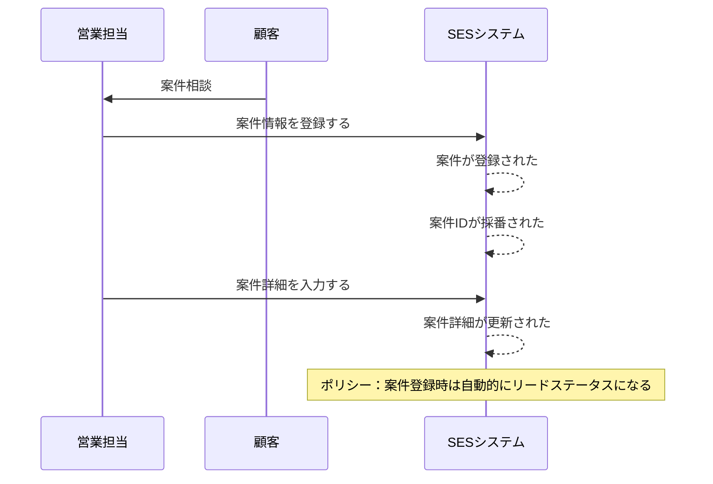
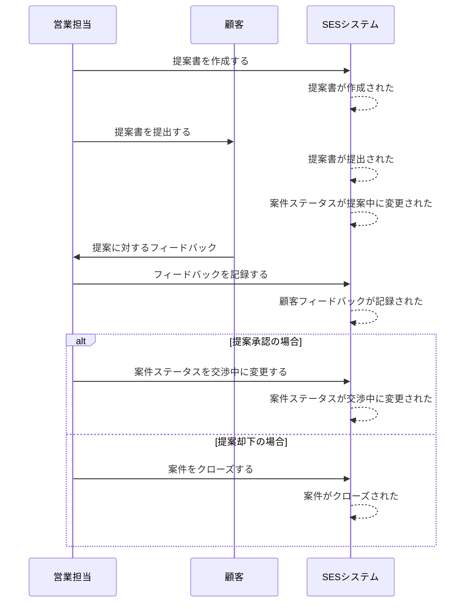
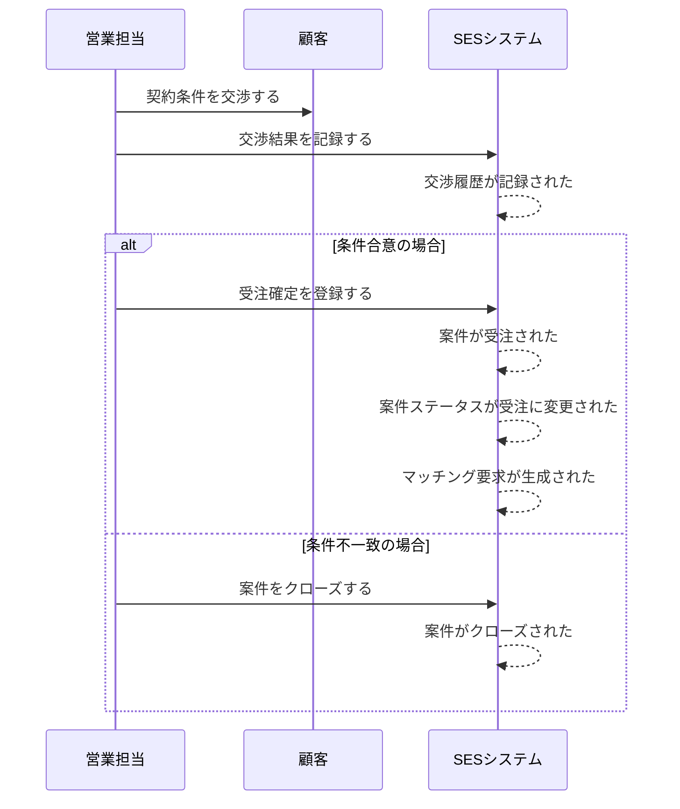
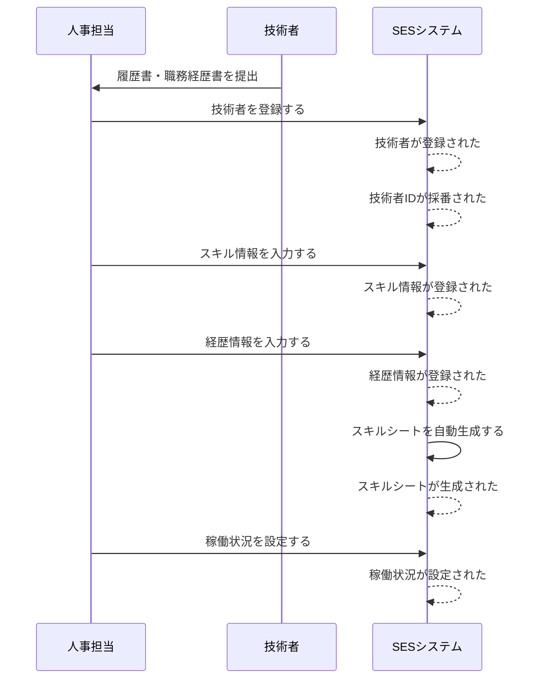
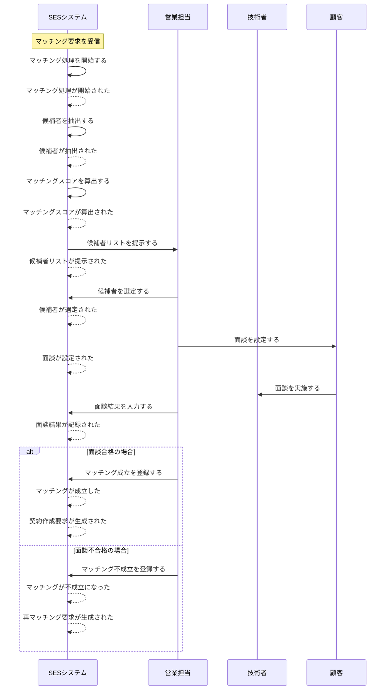
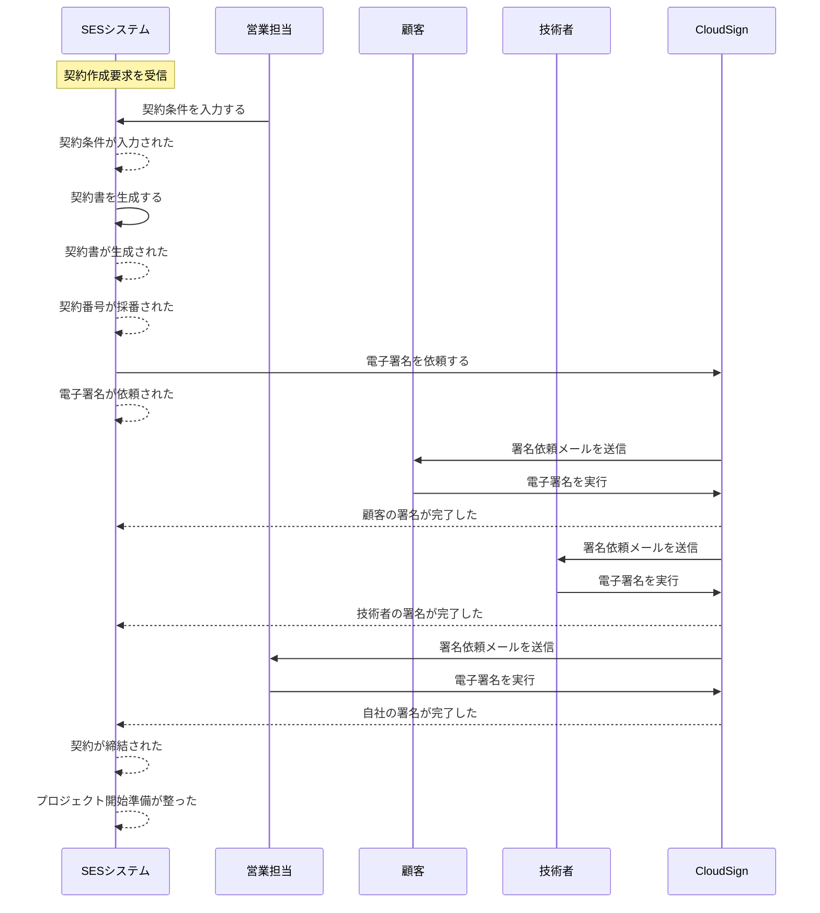
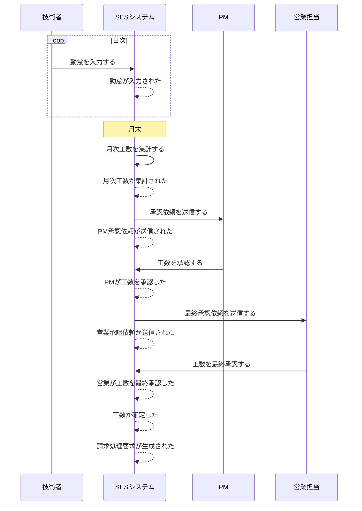
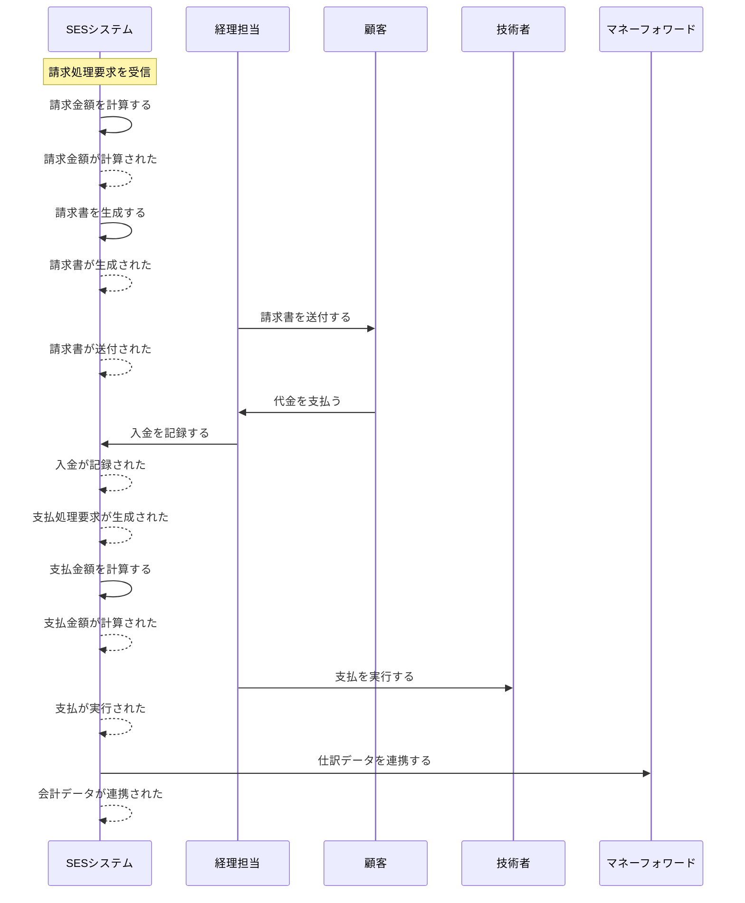

# イベントストーミング設計 - SES業務システム

## 1. イベントストーミングとは

### 目的
- 業務フローを時系列で可視化
- ドメインイベントの洗い出し
- ビジネスルールの発見
- チーム全体での業務理解の統一

### 参加者
- **ドメインエキスパート**: 営業担当、人事担当、経理担当、PM
- **開発チーム**: アーキテクト、開発者
- **ファシリテーター**: DDDに精通したメンバー

## 2. SES業務のドメインイベント

### 表記ルール
- **ドメインイベント**: 過去形で記述（例：案件が登録された）
- **コマンド**: 動詞形で記述（例：案件を登録する）
- **外部システム**: 紫色で記述
- **ポリシー**: 業務ルール（例：〜の場合、〜する）

## 3. 時系列ドメインイベント一覧

### 3.1 案件獲得〜受注フロー

#### フェーズ1: 案件発掘

**発生するドメインイベント:**
1. `案件相談が受領された`
2. `案件が登録された`
3. `案件IDが採番された`
4. `案件詳細が入力された`
5. `案件ステータスがリードに設定された`

#### フェーズ2: 提案・交渉

**発生するドメインイベント:**
6. `提案書が作成された`
7. `提案書が提出された`
8. `案件ステータスが提案中に変更された`
9. `顧客フィードバックが記録された`
10. `案件ステータスが交渉中に変更された`
11. `案件がクローズされた`

#### フェーズ3: 受注確定

**発生するドメインイベント:**
12. `契約条件が交渉された`
13. `交渉履歴が記録された`
14. `案件が受注された`
15. `案件ステータスが受注に変更された`
16. `マッチング要求が生成された`

### 3.2 人材管理フロー

#### 技術者登録

**発生するドメインイベント:**
17. `技術者が登録された`
18. `技術者IDが採番された`
19. `スキル情報が登録された`
20. `経歴情報が登録された`
21. `スキルシートが生成された`
22. `稼働状況が設定された`

### 3.3 マッチングフロー

**発生するドメインイベント:**
23. `マッチング処理が開始された`
24. `候補者が抽出された`
25. `マッチングスコアが算出された`
26. `候補者リストが提示された`
27. `候補者が選定された`
28. `面談が設定された`
29. `面談結果が記録された`
30. `マッチングが成立した`
31. `契約作成要求が生成された`
32. `マッチングが不成立になった`
33. `再マッチング要求が生成された`

### 3.4 契約管理フロー

**発生するドメインイベント:**
34. `契約条件が入力された`
35. `契約書が生成された`
36. `契約番号が採番された`
37. `電子署名が依頼された`
38. `顧客の署名が完了した`
39. `技術者の署名が完了した`
40. `自社の署名が完了した`
41. `契約が締結された`
42. `プロジェクト開始準備が整った`

### 3.5 勤怠・工数管理フロー

**発生するドメインイベント:**
43. `勤怠が入力された`
44. `月次工数が集計された`
45. `PM承認依頼が送信された`
46. `PMが工数を承認した`
47. `営業承認依頼が送信された`
48. `営業が工数を最終承認した`
49. `工数が確定した`
50. `請求処理要求が生成された`

### 3.6 請求・支払フロー

**発生するドメインイベント:**
51. `請求金額が計算された`
52. `請求書が生成された`
53. `請求書が送付された`
54. `入金が記録された`
55. `支払処理要求が生成された`
56. `支払金額が計算された`
57. `支払が実行された`
58. `会計データが連携された`

## 4. 重要なビジネスルール（ポリシー）

### 案件管理ポリシー
- **P1**: 案件登録時は自動的にリードステータスになる
- **P2**: 受注確定時にマッチング要求が自動生成される
- **P3**: 案件クローズ後30日間は再オープン可能

### マッチングポリシー
- **P4**: マッチングスコア60点以上の技術者のみ候補に表示
- **P5**: 面談不合格の場合、自動的に再マッチング要求が生成される
- **P6**: 同一技術者は同一案件に対して3回まで面談可能

### 契約管理ポリシー
- **P7**: 全当事者の電子署名完了後に契約締結とみなす
- **P8**: 契約期間満了30日前に更新確認が必要
- **P9**: 契約変更は変更契約書の締結が必要

### 工数管理ポリシー
- **P10**: 勤怠入力期限は翌月5日まで
- **P11**: PM承認後に営業承認が必要（2段階承認）
- **P12**: 承認完了後の工数変更は追加承認が必要

### 請求管理ポリシー
- **P13**: 工数確定後、自動的に請求処理が開始される
- **P14**: 入金確認後に支払処理が開始される
- **P15**: 会計システムへの仕訳データは日次バッチで連携

## 5. 次のステップ

このイベントストーミングの結果を基に：

1. **ユビキタス言語辞書の作成**
2. **境界づけられたコンテキストの詳細化**
3. **集約の設計**
4. **ドメインサービスの抽出**

を進めていきます。

---

**作成者**: システム化プロジェクトチーム