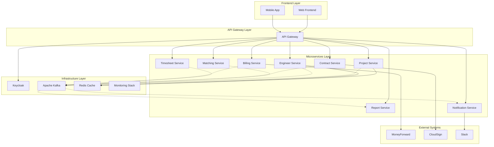

# マイクロサービスアーキテクチャ設計 - SES業務システム

## 1. アーキテクチャ概要

### 1.1 設計方針
- **DDD Bounded Context** ベースのサービス分割
- **API Gateway** パターンでの統一アクセス
- **Event-Driven Architecture** によるサービス間連携
- **Database per Service** でのデータ独立性確保

### 1.2 マイクロサービス分割戦略


## 2. マイクロサービス詳細設計

### 2.1 Project Service（案件管理サービス）
#### 責務
- 案件のライフサイクル管理
- 顧客情報管理
- 営業活動追跡

#### API設計
```yaml
endpoints:
  - POST /api/projects
  - GET /api/projects/{id}
  - PUT /api/projects/{id}
  - GET /api/projects/search
  - POST /api/projects/{id}/status
  - POST /api/projects/{id}/proposals
```

#### Database Schema
```sql
-- projects テーブル
CREATE TABLE projects (
    id UUID PRIMARY KEY,
    name VARCHAR(255) NOT NULL,
    customer_id UUID NOT NULL,
    status VARCHAR(50) NOT NULL,
    start_date DATE,
    end_date DATE,
    budget_min INTEGER,
    budget_max INTEGER,
    required_skills JSONB,
    created_at TIMESTAMP,
    updated_at TIMESTAMP
);

-- customers テーブル
CREATE TABLE customers (
    id UUID PRIMARY KEY,
    name VARCHAR(255) NOT NULL,
    contact_person VARCHAR(255),
    email VARCHAR(255),
    phone VARCHAR(20)
);
```

#### Published Events
- `ProjectCreated`
- `ProjectStatusChanged`
- `ProjectOrderReceived`

### 2.2 Engineer Service（技術者管理サービス）
#### 責務
- 技術者プロフィール管理
- スキル・経験管理
- 稼働状況管理

#### API設計
```yaml
endpoints:
  - POST /api/engineers
  - GET /api/engineers/{id}
  - PUT /api/engineers/{id}
  - GET /api/engineers/search
  - POST /api/engineers/{id}/skills
  - PUT /api/engineers/{id}/availability
```

#### Database Schema
```sql
-- engineers テーブル
CREATE TABLE engineers (
    id UUID PRIMARY KEY,
    user_id UUID NOT NULL,
    company_id UUID,
    experience_years INTEGER,
    hourly_rate INTEGER,
    availability_status VARCHAR(50),
    created_at TIMESTAMP,
    updated_at TIMESTAMP
);

-- engineer_skills テーブル
CREATE TABLE engineer_skills (
    id UUID PRIMARY KEY,
    engineer_id UUID REFERENCES engineers(id),
    skill_name VARCHAR(100),
    experience_years INTEGER,
    skill_level VARCHAR(20)
);
```

#### Published Events
- `EngineerRegistered`
- `EngineerSkillUpdated`
- `EngineerAvailabilityChanged`

### 2.3 Matching Service（マッチングサービス）
#### 責務
- マッチングアルゴリズム実行
- マッチングスコア算出
- 候補者推薦

#### API設計
```yaml
endpoints:
  - POST /api/matching/requests
  - GET /api/matching/requests/{id}
  - GET /api/matching/requests/{id}/candidates
  - POST /api/matching/requests/{id}/selections
```

#### Database Schema
```sql
-- matching_requests テーブル
CREATE TABLE matching_requests (
    id UUID PRIMARY KEY,
    project_id UUID NOT NULL,
    required_skills JSONB,
    status VARCHAR(50),
    created_at TIMESTAMP
);

-- matching_candidates テーブル
CREATE TABLE matching_candidates (
    id UUID PRIMARY KEY,
    matching_request_id UUID REFERENCES matching_requests(id),
    engineer_id UUID NOT NULL,
    matching_score DECIMAL(5,2),
    status VARCHAR(50)
);
```

#### Published Events
- `MatchingRequestCreated`
- `CandidatesGenerated`
- `MatchingCompleted`

### 2.4 Contract Service（契約管理サービス）
#### 責務
- 契約書生成・管理
- 電子署名連携
- 契約ステータス管理

#### API設計
```yaml
endpoints:
  - POST /api/contracts
  - GET /api/contracts/{id}
  - PUT /api/contracts/{id}
  - POST /api/contracts/{id}/sign
  - GET /api/contracts/{id}/status
```

#### External Integrations
- CloudSign API連携
- 契約書テンプレート管理
- 電子署名ステータス同期

#### Published Events
- `ContractCreated`
- `ContractSigned`
- `ContractCompleted`

### 2.5 Timesheet Service（勤怠・工数管理サービス）
#### 責務
- 勤怠データ収集
- 工数集計・承認
- 実績データ管理

#### API設計
```yaml
endpoints:
  - POST /api/timesheets
  - GET /api/timesheets/{engineerId}
  - PUT /api/timesheets/{id}
  - POST /api/timesheets/{id}/approve
  - GET /api/timesheets/summary/{engineerId}/{month}
```

#### Published Events
- `TimesheetSubmitted`
- `TimesheetApproved`
- `MonthlyTimesheetCompleted`

### 2.6 Billing Service（請求・支払サービス）
#### 責務
- 請求書生成
- 支払処理
- 会計システム連携

#### API設計
```yaml
endpoints:
  - POST /api/billing/invoices
  - GET /api/billing/invoices/{id}
  - POST /api/billing/payments
  - GET /api/billing/reports
```

#### External Integrations
- マネーフォワード API連携
- PDF生成
- メール送信

#### Published Events
- `InvoiceGenerated`
- `PaymentCompleted`
- `BillingDataSynced`

### 2.7 Report Service（レポートサービス）
#### 責務
- KPI計算・集計
- ダッシュボードデータ提供
- レポート生成

#### API設計
```yaml
endpoints:
  - GET /api/reports/dashboard
  - GET /api/reports/kpi
  - POST /api/reports/generate
  - GET /api/reports/analytics
```

#### Data Sources
- すべてのサービスからのイベント
- 集約データの保存・分析

### 2.8 Notification Service（通知サービス）
#### 責務
- システム通知の一元管理
- Slack連携
- メール送信

#### API設計
```yaml
endpoints:
  - POST /api/notifications
  - GET /api/notifications/{userId}
  - PUT /api/notifications/{id}/read
```

#### External Integrations
- Slack API
- SMTP/SendGrid
- プッシュ通知

## 3. 技術スタック詳細

### 3.1 共通技術スタック
| 技術 | 用途 | 理由 |
|------|------|------|
| **Spring Boot 3.2** | マイクロサービス基盤 | 豊富なライブラリ、自動設定 |
| **Spring Cloud Gateway** | API Gateway | 負荷分散、認証、レート制限 |
| **Spring Cloud OpenFeign** | サービス間通信 | 宣言的HTTPクライアント |
| **Apache Kafka** | Event Streaming | 高スループット、永続化 |
| **PostgreSQL** | 各サービスDB | トランザクション、ACID保証 |
| **Redis** | キャッシュ・セッション | 高速アクセス、分散キャッシュ |

### 3.2 監視・運用技術
| 技術 | 用途 | 理由 |
|------|------|------|
| **Spring Cloud Sleuth** | 分散トレーシング | リクエスト追跡 |
| **Micrometer + Prometheus** | メトリクス収集 | 標準的な監視スタック |
| **Zipkin/Jaeger** | トレーシング可視化 | 性能分析、障害調査 |
| **ELK Stack** | ログ集約 | 検索可能なログ管理 |

### 3.3 デプロイメント
| 技術 | 用途 | 理由 |
|------|------|------|
| **Docker** | コンテナ化 | 環境統一 |
| **Kubernetes** | オーケストレーション | 自動スケーリング、自己修復 |
| **Helm** | K8sパッケージ管理 | 設定管理、バージョン管理 |
| **ArgoCD** | GitOps CD | 宣言的デプロイメント |

## 4. データ整合性戦略

### 4.1 Sagaパターン
- **Choreography Saga**: イベント駆動での分散トランザクション
- **Compensation**: 失敗時の補償アクション定義

### 4.2 Event Sourcing
- 重要なビジネスイベントの永続化
- 監査ログとしての活用
- 状態復元の可能性

### 4.3 CQRS（Command Query Responsibility Segregation）
- Report Serviceでの読み取り最適化
- 書き込みと読み取りの分離

## 5. セキュリティ設計

### 5.1 認証・認可
- **Keycloak**: 統一認証基盤
- **JWT**: サービス間認証
- **OAuth2/OIDC**: 標準プロトコル

### 5.2 ネットワークセキュリティ
- **Service Mesh (Istio)**: サービス間通信暗号化
- **mTLS**: 相互TLS認証
- **Network Policy**: K8sネットワーク制御

## 6. 段階的移行戦略

### Phase 1: モノリス構築（MVP）
- 単一Spring Bootアプリケーション
- 内部モジュール分離（後のサービス分割準備）

### Phase 2: サービス分割開始
- Project Service + Engineer Service分離
- API Gateway導入

### Phase 3: 完全マイクロサービス化
- 全サービスの分離完了
- Event-Driven Architecture導入

---

**作成者**: システム化プロジェクトチーム