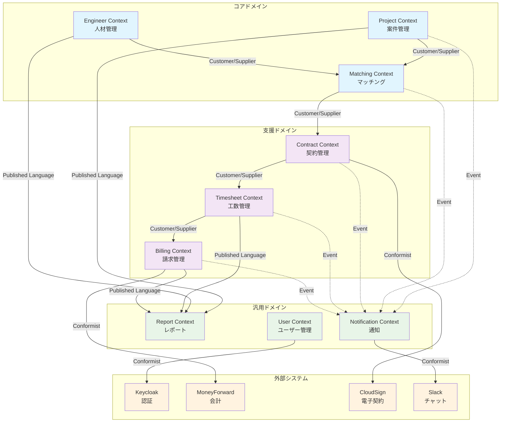

# 境界づけられたコンテキスト詳細化 - SES業務システム

## 1. コンテキスト設計の原則

### 1.1 設計方針
- **業務責任の明確な分離**
- **高凝集・疎結合の実現**
- **独立したデプロイ・スケーリングの可能性**
- **チーム単位での開発・運用**

### 1.2 コンテキスト間の関係パターン
- **Shared Kernel**: 共有カーネル（共通ライブラリ）
- **Customer/Supplier**: 顧客・供給者関係
- **Conformist**: 適合者関係
- **Anti-corruption Layer**: 腐敗防止層
- **Published Language**: 公開言語（API）

## 2. コンテキストマップ詳細



## 3. 各コンテキストの詳細設計

### 3.1 Project Context（案件管理コンテキスト）

#### 責務と境界
- **主責務**: 案件のライフサイクル管理
- **含まれるもの**: 案件、顧客、営業活動、提案書
- **含まれないもの**: 技術者情報、マッチング結果、契約書

#### ユビキタス言語
```
- Project（案件）: 顧客から受注する業務単位
- Customer（顧客）: 案件を発注する企業  
- Lead（リード）: 見込み案件
- Order（受注）: 正式契約決定案件
- Proposal（提案）: 顧客への提案書
- BusinessFlow（商流）: 受注形態（直請/一次/二次）
```

#### 集約設計
```java
// Project集約ルート
public class Project {
    private ProjectId id;
    private ProjectName name;
    private CustomerId customerId;
    private ProjectStatus status;
    private ProjectPeriod period;
    private RequiredSkills requiredSkills;
    private Budget budget;
    private BusinessFlow businessFlow;
    
    // ビジネスルール
    public void startProposal() {
        if (this.status != ProjectStatus.LEAD) {
            throw new IllegalStateException("提案開始はリード状態でのみ可能");
        }
        this.status = ProjectStatus.PROPOSING;
        // ProjectProposalStarted イベント発行
    }
    
    public void receiveOrder() {
        if (this.status != ProjectStatus.NEGOTIATING) {
            throw new IllegalStateException("受注はネゴシエーション状態でのみ可能");
        }
        this.status = ProjectStatus.ORDERED;
        // ProjectOrdered イベント発行（Matching Contextへ）
    }
}
```

#### API設計
```yaml
# Project Context API
/api/projects:
  POST: 案件作成
  GET: 案件検索・一覧
  
/api/projects/{projectId}:
  GET: 案件詳細取得
  PUT: 案件更新
  DELETE: 案件削除
  
/api/projects/{projectId}/status:
  PUT: ステータス変更
  
/api/projects/{projectId}/proposals:
  POST: 提案書作成
  GET: 提案書一覧
```

#### 発行イベント
- `ProjectCreated`: 案件作成時
- `ProjectStatusChanged`: ステータス変更時
- `ProjectOrdered`: 受注確定時（→ Matching Context）
- `ProjectClosed`: 案件クローズ時

#### データベース設計
```sql
-- projects テーブル
CREATE TABLE projects (
    id UUID PRIMARY KEY,
    name VARCHAR(255) NOT NULL,
    customer_id UUID NOT NULL,
    status VARCHAR(50) NOT NULL,
    business_flow VARCHAR(50),
    start_date DATE,
    end_date DATE,
    budget_min INTEGER,
    budget_max INTEGER,
    required_skills JSONB,
    created_at TIMESTAMP DEFAULT CURRENT_TIMESTAMP,
    updated_at TIMESTAMP DEFAULT CURRENT_TIMESTAMP,
    created_by UUID,
    updated_by UUID
);

-- customers テーブル
CREATE TABLE customers (
    id UUID PRIMARY KEY,
    name VARCHAR(255) NOT NULL,
    contact_person VARCHAR(255),
    email VARCHAR(255),
    phone VARCHAR(20),
    address TEXT
);

-- proposals テーブル  
CREATE TABLE proposals (
    id UUID PRIMARY KEY,
    project_id UUID REFERENCES projects(id),
    title VARCHAR(255),
    content TEXT,
    submitted_at TIMESTAMP,
    status VARCHAR(50)
);
```

### 3.2 Engineer Context（人材管理コンテキスト）

#### 責務と境界
- **主責務**: 技術者情報とスキル管理
- **含まれるもの**: 技術者、スキル、経験、稼働状況
- **含まれないもの**: 案件情報、マッチング結果、勤怠データ

#### ユビキタス言語
```
- Engineer（技術者）: プロジェクトに参画する人材
- SkillSet（スキルセット）: 技術者の保有技術集合
- Experience（経験）: 実務経験年数
- Availability（稼働可能性）: アサイン可能状態
- SkillSheet（スキルシート）: 技術者の経歴書
```

#### 集約設計
```java
// Engineer集約ルート
public class Engineer {
    private EngineerId id;
    private UserId userId;
    private CompanyId companyId;
    private PersonalInfo personalInfo;
    private SkillSet skillSet;
    private WorkStatus workStatus;
    private ContractInfo contractInfo;
    
    public void updateSkill(Skill skill, ExperienceYears years) {
        this.skillSet.updateSkill(skill, years);
        // EngineerSkillUpdated イベント発行
    }
    
    public void changeWorkStatus(WorkStatus newStatus, LocalDate availableFrom) {
        if (!this.workStatus.canChangeTo(newStatus)) {
            throw new IllegalStateException("不正な状態変更");
        }
        this.workStatus = newStatus;
        // EngineerAvailabilityChanged イベント発行（→ Matching Context）
    }
    
    public MatchingScore calculateMatchingScore(RequiredSkills requirements) {
        return this.skillSet.calculateCompatibility(requirements);
    }
}

// SkillSet値オブジェクト
public class SkillSet {
    private List<EngineerSkill> skills;
    
    public MatchingScore calculateCompatibility(RequiredSkills requirements) {
        // マッチングスコア算出ロジック
        float skillMatch = calculateSkillMatch(requirements);
        float experienceMatch = calculateExperienceMatch(requirements);
        return new MatchingScore(skillMatch, experienceMatch);
    }
}
```

#### API設計
```yaml
# Engineer Context API
/api/engineers:
  POST: 技術者登録
  GET: 技術者検索

/api/engineers/{engineerId}:
  GET: 技術者詳細
  PUT: 技術者情報更新
  
/api/engineers/{engineerId}/skills:
  POST: スキル追加
  PUT: スキル更新
  DELETE: スキル削除
  
/api/engineers/{engineerId}/availability:
  PUT: 稼働状況更新
  
/api/engineers/{engineerId}/skillsheet:
  GET: スキルシート生成
```

#### 発行イベント
- `EngineerRegistered`: 技術者登録時
- `EngineerSkillUpdated`: スキル更新時（→ Matching Context）
- `EngineerAvailabilityChanged`: 稼働状況変更時（→ Matching Context）
- `SkillSheetGenerated`: スキルシート生成時

### 3.3 Matching Context（マッチングコンテキスト）

#### 責務と境界
- **主責務**: 案件と技術者の最適なマッチング
- **含まれるもの**: マッチング要求、候補者、マッチングスコア
- **含まれないもの**: 案件詳細、技術者詳細、契約情報

#### ユビキタス言語
```
- MatchingRequest（マッチング要求）: 案件に対する技術者検索要求
- Candidate（候補者）: マッチング対象技術者
- MatchingScore（マッチングスコア）: 適合度数値
- Recommendation（推薦）: システム推薦結果
```

#### 集約設計
```java
// MatchingRequest集約ルート
public class MatchingRequest {
    private MatchingRequestId id;
    private ProjectId projectId;
    private RequiredSkills requiredSkills;
    private List<Candidate> candidates;
    private MatchingStatus status;
    
    public void generateCandidates(List<Engineer> availableEngineers) {
        this.candidates = availableEngineers.stream()
            .map(engineer -> new Candidate(
                engineer.getId(),
                engineer.calculateMatchingScore(this.requiredSkills)
            ))
            .filter(candidate -> candidate.getScore().isAboveThreshold())
            .sorted(Candidate::compareByScore)
            .collect(toList());
            
        // CandidatesGenerated イベント発行
    }
    
    public void selectCandidate(EngineerId engineerId) {
        Candidate candidate = findCandidate(engineerId);
        candidate.select();
        // CandidateSelected イベント発行
    }
}

// ドメインサービス
@DomainService
public class MatchingService {
    public MatchingRequest createMatchingRequest(ProjectOrdered event) {
        // Project Contextからのイベントを受信してマッチング開始
        RequiredSkills skills = extractRequiredSkills(event);
        return new MatchingRequest(event.getProjectId(), skills);
    }
}
```

#### API設計
```yaml
# Matching Context API
/api/matching/requests:
  POST: マッチング要求作成
  GET: マッチング要求一覧
  
/api/matching/requests/{requestId}:
  GET: マッチング要求詳細
  
/api/matching/requests/{requestId}/candidates:
  GET: 候補者一覧
  POST: 候補者選定
  
/api/matching/requests/{requestId}/execute:
  POST: マッチング実行
```

#### 発行イベント
- `MatchingRequestCreated`: マッチング要求作成時
- `CandidatesGenerated`: 候補者生成時
- `MatchingCompleted`: マッチング成立時（→ Contract Context）

### 3.4 Contract Context（契約管理コンテキスト）

#### 責務と境界
- **主責務**: 契約書の生成・管理・電子署名
- **含まれるもの**: 契約、契約書、電子署名状況
- **含まれないもの**: 案件詳細、技術者詳細、請求情報

#### ユビキタス言語
```
- Contract（契約）: 法的な取り決め文書
- ContractTemplate（契約テンプレート）: 契約書雛形
- DigitalSignature（電子署名）: 電子的な署名・捺印
- ContractType（契約種別）: 準委任/派遣/請負
```

#### 集約設計
```java
// Contract集約ルート
public class Contract {
    private ContractId id;
    private ProjectId projectId;
    private List<EngineerId> engineerIds;
    private CustomerId customerId;
    private ContractType type;
    private ContractTerms terms;
    private List<DigitalSignature> signatures;
    private ContractStatus status;
    
    public void requestSignature(SignatoryType signatoryType, String email) {
        if (this.status != ContractStatus.PENDING_SIGNATURE) {
            throw new IllegalStateException("署名要求は署名待ち状態でのみ可能");
        }
        
        // CloudSign API呼び出し
        externalSignatureService.requestSignature(this.id, signatoryType, email);
        // SignatureRequested イベント発行
    }
    
    public void completeSignature(SignatoryType signatoryType) {
        DigitalSignature signature = findSignature(signatoryType);
        signature.complete();
        
        if (allSignaturesCompleted()) {
            this.status = ContractStatus.ACTIVE;
            // ContractSigned イベント発行（→ Timesheet Context）
        }
    }
}
```

#### API設計
```yaml
# Contract Context API
/api/contracts:
  POST: 契約作成
  GET: 契約一覧
  
/api/contracts/{contractId}:
  GET: 契約詳細
  PUT: 契約更新
  
/api/contracts/{contractId}/sign:
  POST: 電子署名要求
  
/api/contracts/{contractId}/status:
  GET: 署名状況確認
```

#### 外部システム連携
```java
// CloudSign連携
@ExternalService
public class CloudSignService {
    public void requestSignature(ContractId contractId, String email) {
        // CloudSign API呼び出し
    }
    
    public void handleSignatureCompleted(CloudSignWebhook webhook) {
        // Webhookからの署名完了通知処理
        ContractId contractId = extractContractId(webhook);
        Contract contract = contractRepository.findById(contractId);
        contract.completeSignature(webhook.getSignatoryType());
    }
}
```

### 3.5 Timesheet Context（工数管理コンテキスト）

#### 責務と境界
- **主責務**: 勤怠・工数の記録と承認管理
- **含まれるもの**: 勤怠、工数、承認フロー
- **含まれないもの**: 契約詳細、請求計算、技術者詳細

#### ユビキタス言語
```
- Timesheet（工数表）: 月次工数集計
- Attendance（勤怠）: 日次出退勤記録  
- Approval（承認）: 工数の正式認定
- WorkHours（稼働時間）: 実作業時間
```

#### 集約設計
```java
// Timesheet集約ルート
public class Timesheet {
    private TimesheetId id;
    private EngineerId engineerId;
    private ContractId contractId;
    private YearMonth period;
    private List<DailyAttendance> attendances;
    private ApprovalFlow approvalFlow;
    private TimesheetStatus status;
    
    public void submitForApproval() {
        validateCompleteness();
        this.status = TimesheetStatus.PENDING_APPROVAL;
        this.approvalFlow.startApproval();
        // TimesheetSubmitted イベント発行
    }
    
    public void approve(ApprovalLevel level, UserId approverId) {
        this.approvalFlow.approve(level, approverId);
        
        if (this.approvalFlow.isCompleted()) {
            this.status = TimesheetStatus.APPROVED;
            // TimesheetApproved イベント発行（→ Billing Context）
        }
    }
    
    public WorkHoursSummary calculateSummary() {
        int totalHours = attendances.stream()
            .mapToInt(DailyAttendance::getWorkingHours)
            .sum();
        int overtimeHours = attendances.stream()
            .mapToInt(DailyAttendance::getOvertimeHours)
            .sum();
            
        return new WorkHoursSummary(totalHours, overtimeHours);
    }
}
```

#### API設計
```yaml
# Timesheet Context API
/api/timesheets:
  POST: 工数表作成
  GET: 工数表一覧
  
/api/timesheets/{timesheetId}:
  GET: 工数表詳細
  PUT: 工数表更新
  
/api/timesheets/{timesheetId}/submit:
  POST: 承認依頼
  
/api/timesheets/{timesheetId}/approve:
  POST: 承認実行
  
/api/attendances:
  POST: 勤怠入力
  GET: 勤怠一覧
```

### 3.6 Billing Context（請求管理コンテキスト）

#### 責務と境界
- **主責務**: 請求・支払処理と会計連携
- **含まれるもの**: 請求書、支払、入金、会計仕訳
- **含まれないもの**: 工数詳細、契約詳細、技術者詳細

#### ユビキタス言語
```
- Invoice（請求書）: 顧客への請求文書
- Payment（支払）: 技術者・協力会社への支払
- Receipt（入金）: 顧客からの代金受領
- AccountingEntry（会計仕訳）: 会計システム連携データ
```

#### 集約設計
```java
// Invoice集約ルート
public class Invoice {
    private InvoiceId id;
    private CustomerId customerId;
    private ContractId contractId;
    private YearMonth billingPeriod;
    private List<BillingItem> items;
    private InvoiceAmount amount;
    private InvoiceStatus status;
    
    public void calculate(TimesheetApproved event) {
        WorkHoursSummary summary = event.getWorkHoursSummary();
        ContractTerms terms = getContractTerms(event.getContractId());
        
        this.amount = calculateAmount(summary, terms);
        this.status = InvoiceStatus.CALCULATED;
        // InvoiceCalculated イベント発行
    }
    
    public void generate() {
        validateCalculation();
        this.status = InvoiceStatus.GENERATED;
        // InvoiceGenerated イベント発行
    }
    
    private InvoiceAmount calculateAmount(WorkHoursSummary summary, ContractTerms terms) {
        Money basicAmount = terms.getHourlyRate().multiply(summary.getBasicHours());
        Money overtimeAmount = terms.getOvertimeRate().multiply(summary.getOvertimeHours());
        Money taxAmount = basicAmount.add(overtimeAmount).multiply(TAX_RATE);
        
        return new InvoiceAmount(basicAmount, overtimeAmount, taxAmount);
    }
}
```

#### 外部システム連携
```java
// マネーフォワード連携
@ExternalService  
public class MoneyForwardService {
    public void syncAccountingData(InvoiceGenerated event) {
        AccountingEntry entry = createAccountingEntry(event);
        moneyForwardApi.createJournalEntry(entry);
        // AccountingDataSynced イベント発行
    }
}
```

### 3.7 Report Context（レポートコンテキスト）

#### 責務と境界
- **主責務**: 分析・レポート生成とKPI管理
- **含まれるもの**: KPI、ダッシュボード、分析データ
- **含まれないもの**: 元データの詳細、業務ロジック

#### ユビキタス言語
```
- KPI（重要業績評価指標）: 経営指標
- Dashboard（ダッシュボード）: 情報一覧画面
- Analytics（分析）: データ分析結果
- Metric（メトリクス）: 測定値
```

#### データ設計（CQRS適用）
```java
// 読み取り専用モデル（Read Model）
@ReadModel
public class ProjectAnalytics {
    private YearMonth period;
    private int totalProjects;
    private int orderedProjects;
    private BigDecimal orderRate;
    private BigDecimal totalRevenue;
    
    // 複数コンテキストからのイベントを統合
    @EventHandler
    public void handle(ProjectOrdered event) {
        this.orderedProjects++;
        this.orderRate = calculateOrderRate();
    }
    
    @EventHandler
    public void handle(InvoiceGenerated event) {
        this.totalRevenue = this.totalRevenue.add(event.getAmount());
    }
}
```

### 3.8 Notification Context（通知コンテキスト）

#### 責務と境界
- **主責務**: システム通知の一元管理
- **含まれるもの**: 通知、メール、Slack連携
- **含まれないもの**: 業務ロジック、業務データ

#### 集約設計
```java
// Notification集約ルート
public class Notification {
    private NotificationId id;
    private UserId recipientId;
    private NotificationType type;
    private NotificationContent content;
    private List<DeliveryChannel> channels;
    private NotificationStatus status;
    
    public void send() {
        for (DeliveryChannel channel : channels) {
            channel.deliver(this.content);
        }
        this.status = NotificationStatus.SENT;
    }
}

// 外部システム連携
@ExternalService
public class SlackNotificationService implements DeliveryChannel {
    public void deliver(NotificationContent content) {
        slackApi.sendMessage(content.toSlackMessage());
    }
}
```

## 4. コンテキスト間の通信設計

### 4.1 同期通信（REST API）
```yaml
# Customer/Supplier関係での直接API呼び出し
Matching Context → Engineer Context:
  GET /api/engineers/available: 稼働可能技術者取得
  
Contract Context → Project Context:  
  GET /api/projects/{id}: 案件詳細取得
```

### 4.2 非同期通信（Event-Driven）
```yaml
# 重要なビジネスイベントの伝播
Project Context:
  - ProjectOrdered → Matching Context
  
Matching Context:
  - MatchingCompleted → Contract Context
  
Contract Context:
  - ContractSigned → Timesheet Context
  
Timesheet Context:
  - TimesheetApproved → Billing Context
```

### 4.3 Anti-corruption Layer
```java
// Engineer ContextからMatching Contextへのデータ変換
@AntiCorruptionLayer
public class EngineerMatchingAdapter {
    public MatchingCandidate adaptToCandidate(Engineer engineer) {
        return MatchingCandidate.builder()
            .engineerId(engineer.getId())
            .availableSkills(adaptSkills(engineer.getSkillSet()))
            .availabilityStatus(adaptStatus(engineer.getWorkStatus()))
            .build();
    }
}
```

## 5. 実装優先順位

### Phase 1: コアドメイン
1. **Project Context** - 案件管理の基盤
2. **Engineer Context** - 人材管理の基盤  
3. **Matching Context** - ビジネスの核となるロジック

### Phase 2: 支援ドメイン
4. **Contract Context** - 契約管理
5. **Timesheet Context** - 工数管理
6. **Billing Context** - 請求管理

### Phase 3: 汎用ドメイン
7. **Report Context** - 分析・レポート
8. **Notification Context** - 通知管理

---

**作成者**: システム化プロジェクトチーム