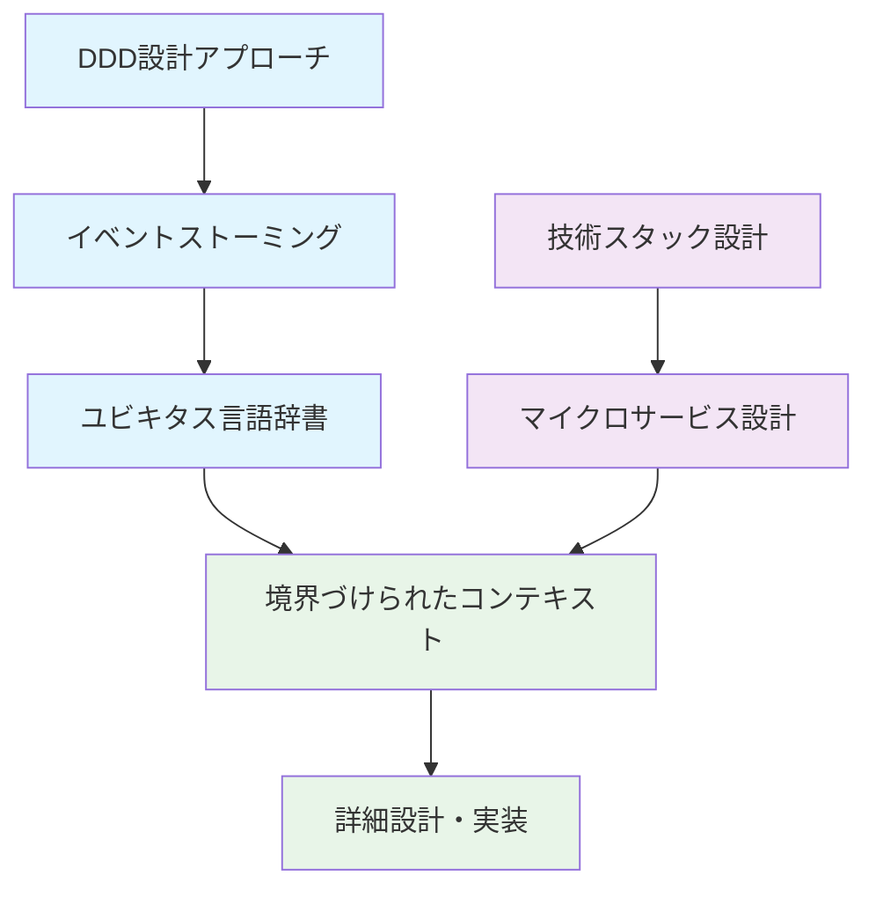

# 基本設計ドキュメント

## 📁 フォルダ構成

### 01_DDD設計
ドメイン駆動設計に関する基本的な設計ドキュメント

- **DDD設計アプローチ.md** - DDD実践手順とアーキテクチャパターン
- **イベントストーミング設計.md** - 業務フローの時系列ドメインイベント分析
- **ユビキタス言語辞書.md** - 開発チームとビジネス側の共通用語集

### 02_アーキテクチャ設計  
システム全体のアーキテクチャと技術選定

- **技術スタック設計.md** - 採用技術とその選定理由
- **マイクロサービスアーキテクチャ設計.md** - サービス分割戦略と実装方針

### 03_コンテキスト設計
境界づけられたコンテキストの詳細設計

- **境界づけられたコンテキスト詳細化.md** - 8つのコンテキストの責務・API・データ設計

## 🎯 設計の流れ

## 📋 設計成果物サマリー

### DDD設計
- **58個のドメインイベント**を特定
- **61個の業務用語**をユビキタス言語として統一
- **15個の重要なビジネスルール**を抽出

### アーキテクチャ設計  
- **8つのマイクロサービス**に分割
- **Spring Boot + Keycloak**の技術スタック
- **Event-Driven Architecture**での連携設計

### コンテキスト設計
- **3つのドメイン**に分類（コア・支援・汎用）
- **API設計**と**データベース設計**
- **段階的実装計画**（Phase 1-3）

## 🚀 次のステップ

1. **詳細設計**
   - Project集約の詳細設計
   - データベーススキーマ設計
   - API仕様書作成

2. **実装準備**
   - プロジェクト構造作成
   - 開発環境セットアップ
   - CI/CDパイプライン構築

3. **MVP開発**
   - Phase 1: コアドメインの実装
   - 認証基盤（Keycloak）構築
   - 基本CRUD機能の実装

---

**作成者**: システム化プロジェクトチーム