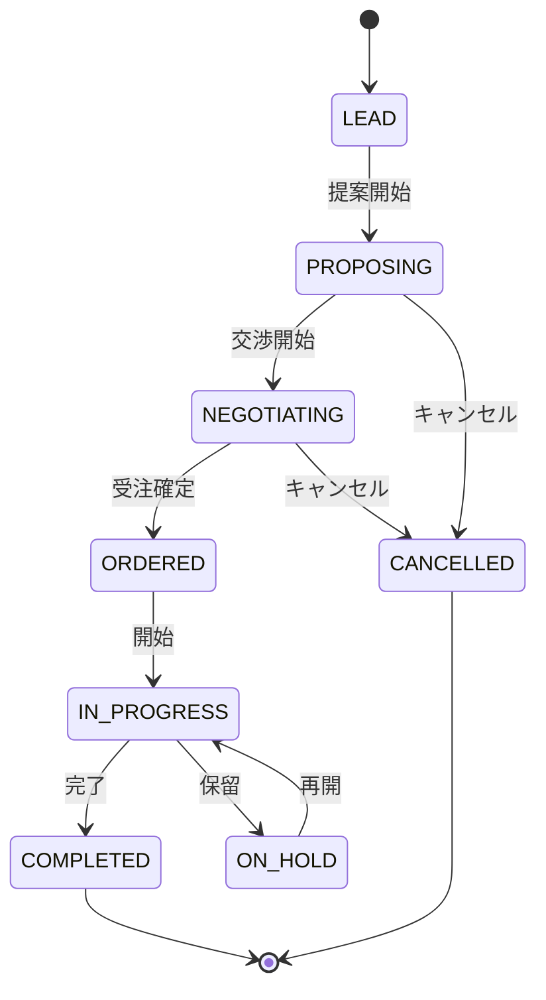

# Project Context 画面仕様書

## 📋 概要

### 文書情報
- **対象システム**: SES業務システム
- **対象コンテキスト**: Project Context（案件管理）
- **文書種別**: 画面仕様書
- **作成日**: 2025年6月1日
- **バージョン**: 1.0

### 対象画面
1. 案件一覧画面
2. 案件詳細・編集画面
3. 案件新規作成画面
4. 案件ステータス管理画面

---

## 🎯 全体方針

### デザインシステム
- **UIフレームワーク**: Bootstrap 5.3.2
- **レスポンシブ対応**: Mobile First
- **テーマカラー**:
  - Primary: #0d6efd
  - Secondary: #6c757d
  - Success: #198754
  - Warning: #ffc107
  - Danger: #dc3545

### 共通レイアウト
- **ヘッダー高**: 60px
- **サイドバー幅**: 280px（デスクトップ）
- **ブレークポイント**: sm:576px, md:768px, lg:1024px, xl:1280px
- **最小タッチターゲット**: 44px

### アクセシビリティ対応
- **WCAG 2.1 AA準拠**
- **キーボードナビゲーション**対応
- **スクリーンリーダー**対応
- **色覚多様性**配慮

---

## 📄 1. 案件一覧画面

### 1.1 画面概要

| 項目 | 内容 |
|------|------|
| **画面ID** | PRJ-001 |
| **画面名** | 案件一覧画面 |
| **URL** | `/projects` |
| **アクセス権限** | 営業担当、プロジェクトマネージャー、管理者 |
| **表示方式** | 一覧表示（テーブル + カード形式レスポンシブ） |

### 1.2 機能要件

#### 主要機能
1. **案件一覧表示**
   - ページング対応（デフォルト20件/ページ）
   - ソート機能（作成日時、更新日時、ステータス、優先度）
   - フィルタリング機能

2. **検索・フィルタ機能**
   - キーワード検索（案件名、顧客名、プロジェクトコード）
   - ステータスフィルタ
   - 期間フィルタ（開始日、終了日）
   - 優先度フィルタ
   - 営業担当者フィルタ

3. **操作機能**
   - 詳細表示（行クリック）
   - 編集（編集ボタン）
   - 新規作成（新規作成ボタン）
   - 一括操作（ステータス変更、削除）

#### データ項目
| 項目名 | 表示名 | データ型 | 必須 | 表示条件 |
|--------|--------|----------|------|----------|
| projectCode | 案件コード | String | ○ | 常時 |
| projectName | 案件名 | String | ○ | 常時 |
| customerName | 顧客名 | String | ○ | 常時 |
| status | ステータス | Enum | ○ | バッジ表示 |
| priority | 優先度 | Enum | ○ | バッジ表示 |
| startDate | 開始予定日 | Date | △ | 常時 |
| endDate | 終了予定日 | Date | △ | 常時 |
| budgetAmount | 予算金額 | Decimal | △ | 権限者のみ |
| salesRepName | 営業担当 | String | ○ | 常時 |
| progressPercentage | 進捗率 | Integer | △ | プログレスバー |
| createdAt | 作成日時 | DateTime | ○ | 常時 |
| updatedAt | 更新日時 | DateTime | ○ | 常時 |

### 1.3 画面レイアウト

#### デスクトップ版レイアウト
```
┌─────────────────────────────────────────────────────────────┐
│ ヘッダー (固定)                                               │
├─────────────┬───────────────────────────────────────────────┤
│ サイドバー   │ メインコンテンツ                               │
│ (固定)      │ ┌─────────────────────────────────────────────┐ │
│             │ │ パンくずリスト                               │ │
│             │ ├─────────────────────────────────────────────┤ │
│             │ │ ページタイトル + 新規作成ボタン              │ │
│             │ ├─────────────────────────────────────────────┤ │
│             │ │ 検索・フィルタエリア                         │ │
│             │ ├─────────────────────────────────────────────┤ │
│             │ │ 一覧表示エリア (テーブル)                   │ │
│             │ │ - ソート可能ヘッダー                        │ │
│             │ │ - 行選択チェックボックス                     │ │
│             │ │ - ステータス・優先度バッジ                   │ │
│             │ │ - 操作ボタン (詳細/編集)                    │ │
│             │ ├─────────────────────────────────────────────┤ │
│             │ │ ページング + 件数表示                       │ │
│             │ └─────────────────────────────────────────────┘ │
└─────────────┴───────────────────────────────────────────────┘
```

#### モバイル版レイアウト
```
┌─────────────────────────────────────┐
│ ヘッダー (ハンバーガーメニュー)       │
├─────────────────────────────────────┤
│ メインコンテンツ                     │
│ ┌─────────────────────────────────┐   │
│ │ 検索バー                         │   │
│ ├─────────────────────────────────┤   │
│ │ フィルタボタン                   │   │
│ ├─────────────────────────────────┤   │
│ │ カード表示エリア                 │   │
│ │ ┌─────────────────────────────┐ │   │
│ │ │ 案件カード                   │ │   │
│ │ │ - 案件名・顧客名             │ │   │
│ │ │ - ステータスバッジ           │ │   │
│ │ │ - 進捗バー                   │ │   │
│ │ │ - 期間・営業担当             │ │   │
│ │ └─────────────────────────────┘ │   │
│ │ (繰り返し)                      │   │
│ ├─────────────────────────────────┤   │
│ │ 無限スクロール or ページング    │   │
│ └─────────────────────────────────┘   │
└─────────────────────────────────────┘
```

### 1.4 ステータス・優先度表示

#### ステータスバッジ
| ステータス | バッジ色 | 表示文言 |
|------------|----------|----------|
| LEAD | secondary | リード |
| PROPOSING | info | 提案中 |
| NEGOTIATING | warning | 交渉中 |
| ORDERED | success | 受注済み |
| IN_PROGRESS | primary | 進行中 |
| COMPLETED | success | 完了 |
| CANCELLED | danger | キャンセル |
| ON_HOLD | secondary | 保留 |

#### 優先度バッジ
| 優先度 | バッジ色 | 表示文言 |
|--------|----------|----------|
| LOW | secondary | 低 |
| MEDIUM | primary | 中 |
| HIGH | warning | 高 |
| URGENT | danger | 緊急 |

### 1.5 操作仕様

#### 検索・フィルタ
```html
<!-- 検索・フィルタエリア -->
<div class="search-filter-area">
  <div class="row">
    <div class="col-md-4">
      <input type="text" class="form-control" placeholder="案件名・顧客名で検索">
    </div>
    <div class="col-md-2">
      <select class="form-select" name="status">
        <option value="">全ステータス</option>
        <option value="LEAD">リード</option>
        <!-- ... -->
      </select>
    </div>
    <div class="col-md-2">
      <select class="form-select" name="priority">
        <option value="">全優先度</option>
        <!-- ... -->
      </select>
    </div>
    <div class="col-md-2">
      <input type="date" class="form-control" name="startDate" placeholder="開始日">
    </div>
    <div class="col-md-2">
      <button class="btn btn-primary">検索</button>
      <button class="btn btn-outline-secondary">クリア</button>
    </div>
  </div>
</div>
```

#### テーブルソート
- **ソート可能項目**: 作成日時、更新日時、ステータス、優先度、開始日
- **デフォルトソート**: 更新日時降順
- **表示**: ヘッダークリックでソート、矢印アイコンで方向表示

### 1.6 API連携

#### 一覧取得API
```javascript
// GET /api/projects
const fetchProjects = async (params) => {
  const queryParams = new URLSearchParams({
    page: params.page || 0,
    size: params.size || 20,
    sort: params.sort || 'updatedAt,desc',
    status: params.status || '',
    priority: params.priority || '',
    keyword: params.keyword || '',
    startDate: params.startDate || '',
    endDate: params.endDate || ''
  });
  
  const response = await fetch(`/api/projects?${queryParams}`, {
    headers: {
      'Authorization': `Bearer ${token}`,
      'Content-Type': 'application/json'
    }
  });
  
  return response.json();
};
```

#### レスポンス例
```json
{
  "content": [
    {
      "id": "uuid",
      "projectCode": "PRJ-2025-001",
      "projectName": "ECサイト構築プロジェクト",
      "customerName": "ABC商事株式会社",
      "status": "IN_PROGRESS",
      "priority": "HIGH",
      "startDate": "2025-07-01",
      "endDate": "2025-12-31",
      "budgetAmount": 5000000,
      "salesRepName": "田中太郎",
      "progressPercentage": 65,
      "createdAt": "2025-06-01T10:00:00Z",
      "updatedAt": "2025-06-01T15:30:00Z"
    }
  ],
  "page": {
    "size": 20,
    "number": 0,
    "totalElements": 45,
    "totalPages": 3
  }
}
```

---

## 📝 2. 案件詳細・編集画面

### 2.1 画面概要

| 項目 | 内容 |
|------|------|
| **画面ID** | PRJ-002 |
| **画面名** | 案件詳細・編集画面 |
| **URL** | `/projects/{id}` |
| **アクセス権限** | 営業担当、プロジェクトマネージャー、管理者 |
| **表示方式** | タブ形式詳細表示 |

### 2.2 機能要件

#### 主要機能
1. **案件詳細表示**
   - 基本情報表示
   - ステータス履歴表示
   - 要件情報表示
   - 関連情報表示（提案書、契約書等）

2. **編集機能**
   - インライン編集
   - 一括保存
   - バリデーション機能
   - 変更履歴管理

3. **ステータス変更**
   - ワークフロー制御
   - 承認機能
   - 通知機能

#### タブ構成
1. **基本情報タブ**
2. **要件詳細タブ**
3. **営業活動タブ**
4. **関連ドキュメントタブ**
5. **履歴タブ**

### 2.3 基本情報タブ

#### データ項目
| 項目名 | 表示名 | データ型 | 必須 | 編集可能 | バリデーション |
|--------|--------|----------|------|----------|----------------|
| projectCode | 案件コード | String | ○ | × | - |
| projectName | 案件名 | String | ○ | ○ | 最大200文字 |
| description | 案件概要 | Text | △ | ○ | 最大2000文字 |
| customerId | 顧客 | UUID | ○ | ○ | 顧客マスタ存在チェック |
| projectType | 案件種別 | Enum | ○ | ○ | DEVELOPMENT/MAINTENANCE/CONSULTING |
| businessFlow | 商流 | Enum | ○ | ○ | DIRECT/PRIMARY/SECONDARY |
| status | ステータス | Enum | ○ | ○ | ワークフロー制約 |
| priority | 優先度 | Enum | ○ | ○ | LOW/MEDIUM/HIGH/URGENT |
| startDate | 開始予定日 | Date | ○ | ○ | 終了日以前 |
| endDate | 終了予定日 | Date | △ | ○ | 開始日以降 |
| budgetAmount | 予算金額 | Decimal | △ | ○ | 0以上 |
| currency | 通貨 | String | △ | ○ | ISO 4217 |
| salesRepId | 営業担当者 | UUID | ○ | ○ | ユーザーマスタ存在チェック |
| projectManagerId | PM | UUID | △ | ○ | ユーザーマスタ存在チェック |

#### レイアウト
```html
<div class="tab-pane" id="basic-info">
  <form id="basic-info-form">
    <div class="row">
      <div class="col-md-6">
        <div class="mb-3">
          <label class="form-label">案件コード</label>
          <input type="text" class="form-control" readonly value="PRJ-2025-001">
        </div>
        <div class="mb-3">
          <label class="form-label required">案件名</label>
          <input type="text" class="form-control" name="projectName" required maxlength="200">
        </div>
        <div class="mb-3">
          <label class="form-label">案件概要</label>
          <textarea class="form-control" name="description" rows="4" maxlength="2000"></textarea>
        </div>
      </div>
      <div class="col-md-6">
        <div class="mb-3">
          <label class="form-label required">顧客</label>
          <select class="form-select" name="customerId" required>
            <option value="">選択してください</option>
            <!-- 動的生成 -->
          </select>
        </div>
        <div class="mb-3">
          <label class="form-label required">案件種別</label>
          <select class="form-select" name="projectType" required>
            <option value="DEVELOPMENT">システム開発</option>
            <option value="MAINTENANCE">保守運用</option>
            <option value="CONSULTING">コンサルティング</option>
          </select>
        </div>
        <!-- 他の項目... -->
      </div>
    </div>
    
    <div class="d-flex justify-content-end gap-2">
      <button type="button" class="btn btn-outline-secondary">キャンセル</button>
      <button type="submit" class="btn btn-primary">保存</button>
    </div>
  </form>
</div>
```

### 2.4 ステータス変更機能

#### ワークフローパターン


#### ステータス変更UI
```html
<div class="status-change-section">
  <div class="d-flex align-items-center gap-3">
    <span class="current-status">
      <span class="badge bg-primary">進行中</span>
    </span>
    
    <div class="status-actions">
      <button class="btn btn-success btn-sm" onclick="changeStatus('COMPLETED')">
        完了にする
      </button>
      <button class="btn btn-warning btn-sm" onclick="changeStatus('ON_HOLD')">
        保留にする
      </button>
    </div>
  </div>
  
  <!-- ステータス変更モーダル -->
  <div class="modal fade" id="statusChangeModal">
    <div class="modal-dialog">
      <div class="modal-content">
        <div class="modal-header">
          <h5 class="modal-title">ステータス変更</h5>
        </div>
        <div class="modal-body">
          <div class="mb-3">
            <label class="form-label">変更理由</label>
            <textarea class="form-control" name="changeReason" rows="3"></textarea>
          </div>
        </div>
        <div class="modal-footer">
          <button type="button" class="btn btn-secondary" data-bs-dismiss="modal">キャンセル</button>
          <button type="button" class="btn btn-primary" onclick="confirmStatusChange()">変更する</button>
        </div>
      </div>
    </div>
  </div>
</div>
```

---

## 🆕 3. 案件新規作成画面

### 3.1 画面概要

| 項目 | 内容 |
|------|------|
| **画面ID** | PRJ-003 |
| **画面名** | 案件新規作成画面 |
| **URL** | `/projects/new` |
| **アクセス権限** | 営業担当、管理者 |
| **表示方式** | ステップ形式ウィザード |

### 3.2 ステップ構成

1. **Step 1: 基本情報入力**
2. **Step 2: 要件詳細入力**
3. **Step 3: 確認・保存**

### 3.3 Step 1: 基本情報入力

#### 必須項目
| 項目名 | 表示名 | バリデーション |
|--------|--------|----------------|
| projectName | 案件名 | 必須、最大200文字 |
| customerId | 顧客 | 必須、存在チェック |
| projectType | 案件種別 | 必須 |
| businessFlow | 商流 | 必須 |
| salesRepId | 営業担当者 | 必須、存在チェック |
| priority | 優先度 | 必須 |
| startDate | 開始予定日 | 必須、未来日 |

#### レイアウト
```html
<div class="wizard-step" data-step="1">
  <div class="step-header">
    <h4>基本情報を入力してください</h4>
    <div class="progress">
      <div class="progress-bar" style="width: 33.3%"></div>
    </div>
  </div>
  
  <form id="step1-form">
    <div class="row">
      <div class="col-md-6">
        <div class="mb-3">
          <label class="form-label required">案件名</label>
          <input type="text" class="form-control" name="projectName" required>
          <div class="invalid-feedback"></div>
        </div>
        
        <div class="mb-3">
          <label class="form-label required">顧客</label>
          <select class="form-select" name="customerId" required>
            <option value="">選択してください</option>
          </select>
          <div class="invalid-feedback"></div>
        </div>
        
        <!-- 他の項目... -->
      </div>
    </div>
    
    <div class="wizard-actions">
      <button type="button" class="btn btn-outline-secondary" onclick="cancelCreate()">キャンセル</button>
      <button type="button" class="btn btn-primary" onclick="nextStep()">次へ</button>
    </div>
  </form>
</div>
```

### 3.4 バリデーション機能

#### リアルタイムバリデーション
```javascript
// バリデーション処理
const validateStep1 = () => {
  const form = document.getElementById('step1-form');
  const formData = new FormData(form);
  const errors = {};
  
  // 必須チェック
  if (!formData.get('projectName')) {
    errors.projectName = '案件名は必須です';
  } else if (formData.get('projectName').length > 200) {
    errors.projectName = '案件名は200文字以内で入力してください';
  }
  
  if (!formData.get('customerId')) {
    errors.customerId = '顧客の選択は必須です';
  }
  
  // 日付チェック
  const startDate = new Date(formData.get('startDate'));
  if (startDate < new Date()) {
    errors.startDate = '開始予定日は今日以降の日付を入力してください';
  }
  
  // エラー表示
  displayValidationErrors(errors);
  
  return Object.keys(errors).length === 0;
};

// エラー表示
const displayValidationErrors = (errors) => {
  Object.keys(errors).forEach(field => {
    const input = document.querySelector(`[name="${field}"]`);
    const feedback = input.parentNode.querySelector('.invalid-feedback');
    
    if (errors[field]) {
      input.classList.add('is-invalid');
      feedback.textContent = errors[field];
    } else {
      input.classList.remove('is-invalid');
      feedback.textContent = '';
    }
  });
};
```

---

## 📊 4. 案件ステータス管理画面

### 4.1 画面概要

| 項目 | 内容 |
|------|------|
| **画面ID** | PRJ-004 |
| **画面名** | 案件ステータス管理画面 |
| **URL** | `/projects/status-board` |
| **アクセス権限** | プロジェクトマネージャー、管理者 |
| **表示方式** | カンバンボード形式 |

### 4.2 機能要件

#### 主要機能
1. **カンバンボード表示**
   - ステータス別コラム表示
   - ドラッグ&ドロップによるステータス変更
   - リアルタイム更新

2. **フィルタリング機能**
   - 営業担当者フィルタ
   - 優先度フィルタ
   - 期間フィルタ

3. **統計表示**
   - ステータス別件数
   - 進捗状況サマリー

### 4.3 カンバンボードレイアウト

```html
<div class="kanban-board">
  <div class="kanban-columns">
    <div class="kanban-column" data-status="LEAD">
      <div class="column-header">
        <h5>リード <span class="badge bg-secondary">5</span></h5>
      </div>
      <div class="column-content" id="column-lead">
        <!-- 案件カード -->
        <div class="project-card" draggable="true" data-project-id="uuid">
          <div class="card-header">
            <h6 class="project-name">ECサイト構築</h6>
            <span class="priority-badge badge bg-warning">高</span>
          </div>
          <div class="card-body">
            <p class="customer-name">ABC商事</p>
            <p class="sales-rep">営業: 田中太郎</p>
            <small class="text-muted">2025/06/01更新</small>
          </div>
        </div>
      </div>
    </div>
    
    <!-- 他のステータスコラム... -->
  </div>
</div>
```

### 4.4 ドラッグ&ドロップ機能

```javascript
// ドラッグ&ドロップ実装
let draggedElement = null;

document.addEventListener('dragstart', (e) => {
  if (e.target.classList.contains('project-card')) {
    draggedElement = e.target;
    e.target.style.opacity = '0.5';
  }
});

document.addEventListener('dragover', (e) => {
  e.preventDefault();
});

document.addEventListener('drop', (e) => {
  e.preventDefault();
  
  if (e.target.classList.contains('column-content')) {
    const newStatus = e.target.parentNode.dataset.status;
    const projectId = draggedElement.dataset.projectId;
    
    // ステータス変更API呼び出し
    updateProjectStatus(projectId, newStatus)
      .then(() => {
        e.target.appendChild(draggedElement);
        updateColumnCounts();
      })
      .catch(error => {
        console.error('ステータス更新エラー:', error);
        showErrorMessage('ステータスの更新に失敗しました');
      });
  }
  
  draggedElement.style.opacity = '1';
  draggedElement = null;
});

// ステータス更新API
const updateProjectStatus = async (projectId, newStatus) => {
  const response = await fetch(`/api/projects/${projectId}/status`, {
    method: 'PATCH',
    headers: {
      'Authorization': `Bearer ${token}`,
      'Content-Type': 'application/json'
    },
    body: JSON.stringify({ status: newStatus })
  });
  
  if (!response.ok) {
    throw new Error('ステータス更新失敗');
  }
  
  return response.json();
};
```

---

## 🔧 5. 共通機能仕様

### 5.1 エラーハンドリング

#### クライアントサイドエラー
```javascript
// エラーハンドリング共通関数
const handleApiError = (error, context = '') => {
  console.error(`API Error in ${context}:`, error);
  
  if (error.status === 401) {
    // 認証エラー
    redirectToLogin();
  } else if (error.status === 403) {
    // 権限エラー
    showErrorMessage('この操作を実行する権限がありません');
  } else if (error.status === 404) {
    // リソース未発見
    showErrorMessage('指定されたデータが見つかりません');
  } else if (error.status >= 500) {
    // サーバーエラー
    showErrorMessage('システムエラーが発生しました。管理者にお問い合わせください');
  } else {
    // その他のエラー
    showErrorMessage(error.message || 'エラーが発生しました');
  }
};

// エラーメッセージ表示
const showErrorMessage = (message) => {
  const toast = document.createElement('div');
  toast.className = 'toast align-items-center text-white bg-danger';
  toast.innerHTML = `
    <div class="d-flex">
      <div class="toast-body">${message}</div>
      <button type="button" class="btn-close btn-close-white me-2 m-auto" 
              data-bs-dismiss="toast"></button>
    </div>
  `;
  
  document.getElementById('toast-container').appendChild(toast);
  
  const bsToast = new bootstrap.Toast(toast);
  bsToast.show();
};
```

### 5.2 ローディング表示

```javascript
// ローディング表示制御
const showLoading = (target = 'body') => {
  const loadingHTML = `
    <div class="loading-overlay">
      <div class="spinner-border text-primary" role="status">
        <span class="visually-hidden">読み込み中...</span>
      </div>
    </div>
  `;
  
  document.querySelector(target).insertAdjacentHTML('beforeend', loadingHTML);
};

const hideLoading = (target = 'body') => {
  const overlay = document.querySelector(`${target} .loading-overlay`);
  if (overlay) {
    overlay.remove();
  }
};
```

### 5.3 権限制御

```javascript
// 権限チェック
const checkPermission = (action, resource) => {
  const userPermissions = getCurrentUserPermissions();
  const permission = `${action}:${resource}`;
  
  return userPermissions.includes(permission) || userPermissions.includes('admin:all');
};

// UI要素の権限制御
const applyPermissionControl = () => {
  // 編集ボタンの表示制御
  if (!checkPermission('update', 'projects')) {
    document.querySelectorAll('.edit-btn').forEach(btn => {
      btn.style.display = 'none';
    });
  }
  
  // 削除ボタンの表示制御
  if (!checkPermission('delete', 'projects')) {
    document.querySelectorAll('.delete-btn').forEach(btn => {
      btn.style.display = 'none';
    });
  }
  
  // 予算情報の表示制御
  if (!checkPermission('view', 'budget')) {
    document.querySelectorAll('.budget-info').forEach(elem => {
      elem.style.display = 'none';
    });
  }
};
```

---

## 📱 6. レスポンシブ対応

### 6.1 ブレークポイント定義

| サイズ | 幅 | 主な対応 |
|--------|----|---------| 
| xs | < 576px | スマートフォン縦 |
| sm | 576px - 767px | スマートフォン横 |
| md | 768px - 1023px | タブレット |
| lg | 1024px - 1279px | デスクトップ |
| xl | ≥ 1280px | 大型デスクトップ |

### 6.2 レスポンシブレイアウト

#### モバイル対応
```css
/* モバイル専用スタイル */
@media (max-width: 767px) {
  .main-content {
    margin-left: 0;
    padding: 1rem;
  }
  
  .table-responsive {
    border: none;
  }
  
  .table-responsive table,
  .table-responsive thead,
  .table-responsive tbody,
  .table-responsive th,
  .table-responsive td,
  .table-responsive tr {
    display: block;
  }
  
  .table-responsive thead tr {
    position: absolute;
    top: -9999px;
    left: -9999px;
  }
  
  .table-responsive tr {
    border: 1px solid #ccc;
    margin-bottom: 1rem;
    padding: 1rem;
    border-radius: 0.375rem;
    background-color: white;
  }
  
  .table-responsive td {
    border: none;
    position: relative;
    padding-left: 50% !important;
  }
  
  .table-responsive td:before {
    content: attr(data-label) ": ";
    position: absolute;
    left: 6px;
    width: 45%;
    padding-right: 10px;
    white-space: nowrap;
    font-weight: bold;
  }
}
```

---

## 🎨 7. UIコンポーネント仕様

### 7.1 ステータスバッジ

```html
<!-- ステータスバッジコンポーネント -->
<template id="status-badge-template">
  <span class="badge status-badge" data-status="">
    <i class="status-icon"></i>
    <span class="status-text"></span>
  </span>
</template>

<script>
const createStatusBadge = (status) => {
  const template = document.getElementById('status-badge-template');
  const badge = template.content.cloneNode(true);
  
  const statusConfig = {
    'LEAD': { class: 'bg-secondary', icon: 'bi-person-plus', text: 'リード' },
    'PROPOSING': { class: 'bg-info', icon: 'bi-file-text', text: '提案中' },
    'NEGOTIATING': { class: 'bg-warning', icon: 'bi-chat-dots', text: '交渉中' },
    'ORDERED': { class: 'bg-success', icon: 'bi-check-circle', text: '受注済み' },
    'IN_PROGRESS': { class: 'bg-primary', icon: 'bi-play-circle', text: '進行中' },
    'COMPLETED': { class: 'bg-success', icon: 'bi-check2-all', text: '完了' },
    'CANCELLED': { class: 'bg-danger', icon: 'bi-x-circle', text: 'キャンセル' },
    'ON_HOLD': { class: 'bg-secondary', icon: 'bi-pause-circle', text: '保留' }
  };
  
  const config = statusConfig[status];
  const badgeElement = badge.querySelector('.status-badge');
  const iconElement = badge.querySelector('.status-icon');
  const textElement = badge.querySelector('.status-text');
  
  badgeElement.className += ` ${config.class}`;
  badgeElement.dataset.status = status;
  iconElement.className += ` ${config.icon}`;
  textElement.textContent = config.text;
  
  return badge;
};
</script>
```

### 7.2 プログレスバー

```html
<!-- プログレスバーコンポーネント -->
<div class="progress-wrapper">
  <div class="progress" style="height: 8px;">
    <div class="progress-bar" 
         role="progressbar" 
         style="width: 65%" 
         aria-valuenow="65" 
         aria-valuemin="0" 
         aria-valuemax="100">
    </div>
  </div>
  <small class="text-muted">65%</small>
</div>
```

---

## 🧪 8. テスト仕様

### 8.1 ユニットテスト

#### JavaScript関数テスト
```javascript
// Jest テストケース例
describe('Project List Functions', () => {
  test('should filter projects by status', () => {
    const projects = [
      { id: 1, status: 'ACTIVE', name: 'Project A' },
      { id: 2, status: 'COMPLETED', name: 'Project B' },
      { id: 3, status: 'ACTIVE', name: 'Project C' }
    ];
    
    const filteredProjects = filterProjectsByStatus(projects, 'ACTIVE');
    
    expect(filteredProjects).toHaveLength(2);
    expect(filteredProjects[0].name).toBe('Project A');
    expect(filteredProjects[1].name).toBe('Project C');
  });
  
  test('should validate project form data', () => {
    const invalidData = {
      projectName: '',
      customerId: null,
      startDate: '2025-01-01'
    };
    
    const validationResult = validateProjectForm(invalidData);
    
    expect(validationResult.isValid).toBe(false);
    expect(validationResult.errors).toHaveProperty('projectName');
    expect(validationResult.errors).toHaveProperty('customerId');
  });
});
```

### 8.2 統合テスト

#### API連携テスト
```javascript
// Cypress E2E テスト例
describe('Project Management', () => {
  beforeEach(() => {
    cy.login('project_manager');
    cy.visit('/projects');
  });
  
  it('should display project list', () => {
    cy.get('[data-testid="project-list"]').should('be.visible');
    cy.get('[data-testid="project-item"]').should('have.length.greaterThan', 0);
  });
  
  it('should create new project', () => {
    cy.get('[data-testid="new-project-btn"]').click();
    cy.get('[name="projectName"]').type('Test Project');
    cy.get('[name="customerId"]').select('customer-uuid');
    cy.get('[name="projectType"]').select('DEVELOPMENT');
    cy.get('[type="submit"]').click();
    
    cy.contains('Test Project').should('be.visible');
  });
  
  it('should update project status', () => {
    cy.get('[data-testid="project-item"]:first').click();
    cy.get('[data-testid="status-change-btn"]').click();
    cy.get('[data-status="IN_PROGRESS"]').click();
    cy.get('[data-testid="confirm-btn"]').click();
    
    cy.get('[data-testid="status-badge"]').should('contain', '進行中');
  });
});
```

---

## 🚀 9. パフォーマンス要件

### 9.1 応答時間目標

| 操作 | 目標時間 | 測定方法 |
|------|----------|----------|
| 一覧表示 | < 1秒 | 初期表示完了まで |
| 検索・フィルタ | < 500ms | 結果表示まで |
| 詳細表示 | < 800ms | ページ描画完了まで |
| 保存処理 | < 2秒 | API応答完了まで |
| ステータス変更 | < 1秒 | 画面更新完了まで |

### 9.2 パフォーマンス最適化

#### クライアントサイド最適化
```javascript
// 仮想スクロール実装（大量データ対応）
class VirtualScroll {
  constructor(container, itemHeight, renderItem) {
    this.container = container;
    this.itemHeight = itemHeight;
    this.renderItem = renderItem;
    this.visibleStart = 0;
    this.visibleEnd = 0;
    
    this.setupScrollListener();
  }
  
  setupScrollListener() {
    this.container.addEventListener('scroll', 
      debounce(() => this.updateVisibleItems(), 16)
    );
  }
  
  updateVisibleItems() {
    const scrollTop = this.container.scrollTop;
    const containerHeight = this.container.clientHeight;
    
    this.visibleStart = Math.floor(scrollTop / this.itemHeight);
    this.visibleEnd = Math.min(
      this.data.length,
      this.visibleStart + Math.ceil(containerHeight / this.itemHeight) + 1
    );
    
    this.renderVisibleItems();
  }
}

// デバウンス関数
const debounce = (func, wait) => {
  let timeout;
  return function executedFunction(...args) {
    const later = () => {
      clearTimeout(timeout);
      func(...args);
    };
    clearTimeout(timeout);
    timeout = setTimeout(later, wait);
  };
};
```

#### サーバーサイド最適化
- **ページング**: デフォルト20件、最大100件
- **インデックス**: ステータス、作成日時、顧客IDに複合インデックス
- **キャッシュ**: Redis使用、TTL 5分
- **圧縮**: gzip圧縮有効

---

## 📋 10. 品質基準

### 10.1 アクセシビリティ

#### WCAG 2.1 AA準拠項目
- **キーボードナビゲーション**: Tab順序設定、Enter/Spaceで操作
- **スクリーンリーダー**: aria-label、role属性設定
- **コントラスト比**: 4.5:1以上維持
- **フォーカス表示**: 明確なアウトライン表示

#### 実装例
```html
<!-- アクセシブルなテーブル -->
<table role="table" aria-label="案件一覧">
  <thead>
    <tr>
      <th scope="col" aria-sort="descending">
        <button type="button" aria-label="案件名でソート（現在：降順）">
          案件名 <i class="bi-arrow-down" aria-hidden="true"></i>
        </button>
      </th>
    </tr>
  </thead>
  <tbody>
    <tr>
      <td>
        <a href="/projects/123" aria-label="ECサイト構築プロジェクトの詳細を表示">
          ECサイト構築プロジェクト
        </a>
      </td>
    </tr>
  </tbody>
</table>
```

### 10.2 セキュリティ

#### XSS対策
```javascript
// HTMLエスケープ関数
const escapeHtml = (text) => {
  const map = {
    '&': '&amp;',
    '<': '&lt;',
    '>': '&gt;',
    '"': '&quot;',
    "'": '&#039;'
  };
  
  return text.replace(/[&<>"']/g, (m) => map[m]);
};

// 安全なHTML挿入
const safeInsertHTML = (element, content) => {
  element.textContent = content; // textContentを使用してXSSを防止
};
```

#### CSRFトークン
```html
<!-- CSRFトークンをメタタグに設定 -->
<meta name="csrf-token" content="{{ csrf_token() }}">

<script>
// Ajaxリクエストに自動的にCSRFトークンを追加
const csrfToken = document.querySelector('meta[name="csrf-token"]').getAttribute('content');

fetch('/api/projects', {
  method: 'POST',
  headers: {
    'Content-Type': 'application/json',
    'X-CSRF-TOKEN': csrfToken
  },
  body: JSON.stringify(data)
});
</script>
```

---

## 📖 11. 運用・保守

### 11.1 ログ出力

#### フロントエンドログ
```javascript
// ログレベル定義
const LogLevel = {
  ERROR: 0,
  WARN: 1,
  INFO: 2,
  DEBUG: 3
};

// ログ出力クラス
class Logger {
  constructor(level = LogLevel.INFO) {
    this.level = level;
  }
  
  error(message, error = null) {
    if (this.level >= LogLevel.ERROR) {
      console.error(`[ERROR] ${new Date().toISOString()} - ${message}`, error);
      
      // エラー監視サービスに送信
      this.sendToErrorService(message, error);
    }
  }
  
  warn(message) {
    if (this.level >= LogLevel.WARN) {
      console.warn(`[WARN] ${new Date().toISOString()} - ${message}`);
    }
  }
  
  info(message) {
    if (this.level >= LogLevel.INFO) {
      console.info(`[INFO] ${new Date().toISOString()} - ${message}`);
    }
  }
  
  debug(message) {
    if (this.level >= LogLevel.DEBUG) {
      console.debug(`[DEBUG] ${new Date().toISOString()} - ${message}`);
    }
  }
  
  sendToErrorService(message, error) {
    // 外部エラー監視サービス（Sentry等）への送信
    fetch('/api/logs/error', {
      method: 'POST',
      headers: { 'Content-Type': 'application/json' },
      body: JSON.stringify({
        message,
        error: error?.toString(),
        stack: error?.stack,
        userAgent: navigator.userAgent,
        url: location.href,
        timestamp: new Date().toISOString()
      })
    });
  }
}

const logger = new Logger();
```

### 11.2 監視・アラート

#### パフォーマンス監視
```javascript
// パフォーマンス測定
const performanceMonitor = {
  startTiming(name) {
    performance.mark(`${name}-start`);
  },
  
  endTiming(name) {
    performance.mark(`${name}-end`);
    performance.measure(name, `${name}-start`, `${name}-end`);
    
    const measure = performance.getEntriesByName(name)[0];
    const duration = measure.duration;
    
    // 閾値チェック
    const thresholds = {
      'page-load': 3000,
      'api-call': 2000,
      'search': 1000
    };
    
    if (duration > thresholds[name]) {
      logger.warn(`Performance threshold exceeded: ${name} took ${duration}ms`);
    }
    
    // 分析サービスに送信
    this.sendMetrics(name, duration);
  },
  
  sendMetrics(name, duration) {
    fetch('/api/metrics', {
      method: 'POST',
      headers: { 'Content-Type': 'application/json' },
      body: JSON.stringify({
        metric: name,
        value: duration,
        timestamp: Date.now()
      })
    });
  }
};
```

---

## 📚 12. 関連資料

### 12.1 参照ドキュメント
- **API設計書**: `Project_Context_API.md`
- **ドメインモデル設計**: `Project集約詳細設計.md`
- **データベース設計**: `Project_Context_物理テーブル設計.md`
- **共通レイアウト設計**: `01_基本レイアウト構造.md`

### 12.2 外部ライブラリ
- **Bootstrap**: 5.3.2 (UIフレームワーク)
- **Bootstrap Icons**: 1.11.2 (アイコン)
- **Alpine.js**: 3.x (軽量JSフレームワーク)
- **htmx**: 1.9.x (AJAX機能)

### 12.3 ブラウザサポート
- **Chrome**: 100+
- **Firefox**: 100+
- **Safari**: 15+
- **Edge**: 100+

---

**文書管理**:
- **作成者**: プロジェクトチーム
- **レビュアー**: UI/UXデザイナー、フロントエンド開発者
- **承認者**: アーキテクト、プロジェクトマネージャー
- **最終更新**: 2025年6月1日
- **次回レビュー**: 2025年7月1日