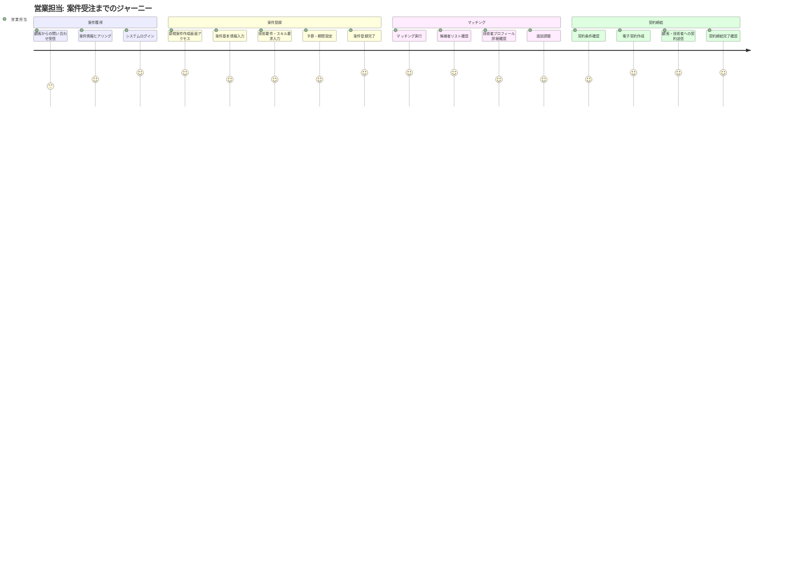
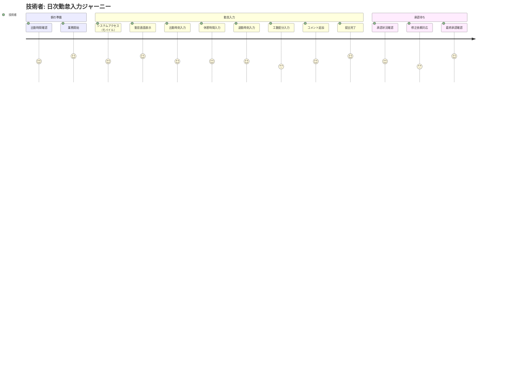
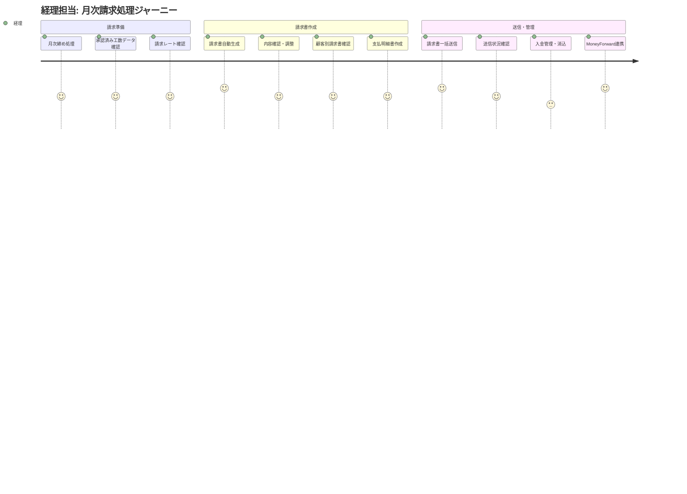
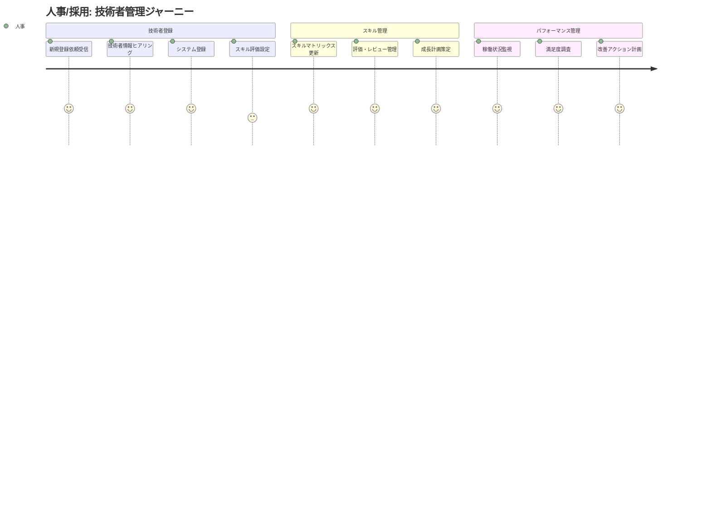
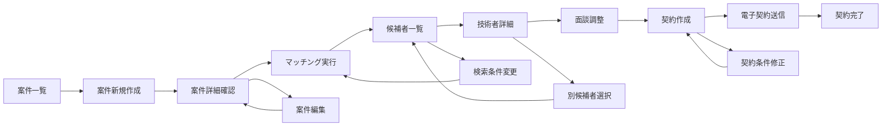
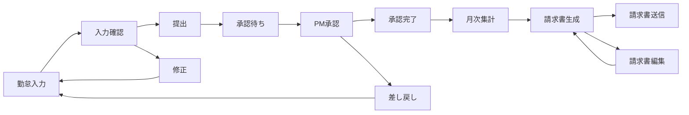
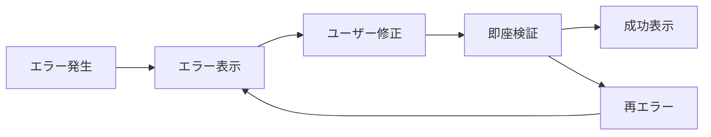
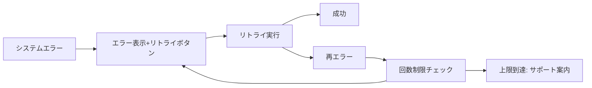
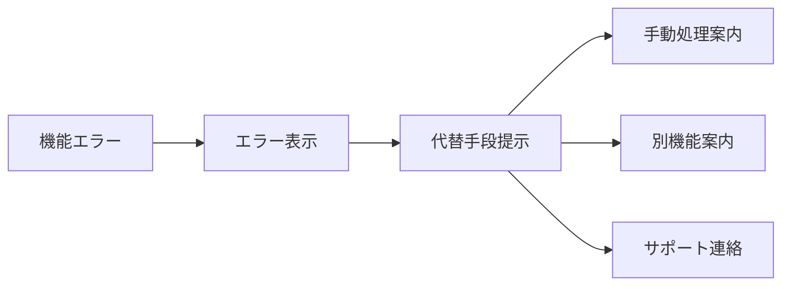

# SES業務システム UXフロー設計

## 目次

1. [概要](#概要)
2. [ユーザージャーニーマップ](#ユーザージャーニーマップ)
3. [画面遷移図](#画面遷移図)
4. [エラーハンドリングUX](#エラーハンドリングUX)
5. [通知・フィードバックUX](#通知・フィードバックUX)
6. [UXパターンライブラリ](#UXパターンライブラリ)

---

## 概要

### 目的
SES業務システムにおける各ユーザータイプの操作フローと体験を最適化し、業務効率の向上とユーザー満足度の向上を実現する。

### 対象ユーザー
1. **営業担当** - 案件登録・選考管理・契約締結
2. **人事/採用** - 技術者登録・スキルシート管理
3. **技術者** - プロフィール更新・勤怠入力
4. **PM/現場責任者** - 工数承認・進捗報告
5. **経理** - 請求書発行・支払処理
6. **経営層** - KPI閲覧・分析

### 設計原則
- **効率性**: 最短操作で目的達成
- **一貫性**: 統一されたUIパターン
- **予測可能性**: 直感的な操作フロー
- **エラー防止**: 操作ミスの事前予防
- **フィードバック**: 明確な操作結果通知

---

## ユーザージャーニーマップ

### 1. 営業担当のジャーニー

#### 1.1 案件受注までの流れ



#### 1.2 主要タッチポイント

| フェーズ | 画面 | 感情 | 痛み点 | 改善ポイント |
|----------|------|------|--------|--------------|
| **ログイン** | 認証画面 | 😐 普通 | 複雑なパスワード | SSO連携、パスワード管理 |
| **案件登録** | 案件作成画面 | 😊 満足 | 入力項目が多い | 段階的入力、自動保存 |
| **マッチング** | マッチング画面 | 😍 喜び | 手動検索が大変 | AI推薦、フィルタ最適化 |
| **面談調整** | 候補者詳細画面 | 😐 普通 | 連絡手段が分散 | 統合コミュニケーション |
| **契約作成** | 契約管理画面 | 😊 満足 | テンプレート管理 | インテリジェント生成 |

### 2. 技術者のジャーニー

#### 2.1 勤怠入力の日次フロー



#### 2.2 主要タッチポイント

| フェーズ | 画面 | 感情 | 痛み点 | 改善ポイント |
|----------|------|------|--------|--------------|
| **アクセス** | ログイン画面 | 😐 普通 | モバイル操作性 | ワンタップログイン |
| **勤怠入力** | タイムシート画面 | 😊 満足 | 手動入力の手間 | 位置情報連携、音声入力 |
| **工数配分** | 工数入力画面 | 😓 困惑 | 複雑な配分計算 | プリセット、自動計算 |
| **提出** | 確認画面 | 😊 満足 | 誤入力の心配 | リアルタイム検証 |
| **承認確認** | 承認状況画面 | 😐 普通 | 承認遅延の不安 | プッシュ通知、進捗表示 |

### 3. PM/現場責任者のジャーニー

#### 3.1 月次承認フロー


### 4. 経理担当のジャーニー

#### 4.1 月次請求処理フロー



### 5. 人事/採用担当のジャーニー

#### 5.1 技術者登録・管理フロー



### 6. 経営層のジャーニー

#### 6.1 KPI分析・意思決定フロー


---

## 画面遷移図

### 全体サイトマップ

```mermaid
graph TD
    A[ログイン画面] --> B[ダッシュボード]
    
    B --> C[案件管理]
    C --> C1[案件一覧]
    C --> C2[案件詳細]
    C --> C3[案件新規作成]
    C --> C4[案件ステータス管理]
    
    B --> D[技術者管理]
    D --> D1[技術者一覧]
    D --> D2[技術者詳細]
    D --> D3[技術者新規登録]
    D --> D4[スキルマトリックス]
    
    B --> E[マッチング]
    E --> E1[マッチング検索]
    E --> E2[マッチング結果]
    E --> E3[マッチング評価]
    E --> E4[マッチング履歴]
    
    B --> F[契約管理]
    F --> F1[契約一覧]
    F --> F2[契約詳細]
    F --> F3[電子契約作成]
    F --> F4[契約承認]
    
    B --> G[勤怠管理]
    G --> G1[勤怠入力]
    G --> G2[工数集計]
    G --> G3[勤怠承認]
    G --> G4[残業・有給申請]
    
    B --> H[請求管理]
    H --> H1[請求書一覧]
    H --> H2[請求書作成]
    H --> H3[支払管理]
    H --> H4[売上分析]
    
    B --> I[レポート]
    I --> I1[KPIダッシュボード]
    I --> I2[売上分析]
    I --> I3[技術者分析]
    I --> I4[カスタムレポート]
    
    B --> J[通知管理]
    J --> J1[通知一覧]
    J --> J2[通知詳細]
    J --> J3[通知設定]
    J --> J4[通知履歴]
    
    B --> K[システム管理]
    K --> K1[ユーザー管理]
    K --> K2[システム設定]
    K --> K3[監査ログ]
```



### 主要画面遷移フロー

#### 1. 案件登録〜マッチング〜契約フロー



#### 2. 勤怠入力〜承認〜請求フロー



### レスポンシブ対応遷移パターン

#### デスクトップ（1024px以上）
- サイドバー常時表示
- タブ形式での詳細画面
- 複数ペイン表示

#### タブレット（768px-1023px）
- 折りたたみサイドバー
- モーダル・ドロワー活用
- グリッドレイアウト

#### モバイル（767px以下）
- オフキャンバスメニュー
- フルスクリーン画面
- 縦積みレイアウト

---

## エラーハンドリングUX

### エラー分類とUXパターン

#### 1. バリデーションエラー

**発生タイミング**: 入力中・フォーカス離脱時・送信時

```html
<!-- リアルタイムバリデーション例 -->
<div class="form-group">
    <label for="email">メールアドレス</label>
    <input type="email" class="form-control is-invalid" id="email" value="invalid-email">
    <div class="invalid-feedback">
        <i class="bi bi-exclamation-triangle"></i>
        正しいメールアドレス形式で入力してください
    </div>
</div>
```

**UXガイドライン**:
- ✅ インライン表示で即座にフィードバック
- ✅ 具体的な修正方法を提示
- ✅ 成功時はグリーンで視覚的確認
- ❌ モーダルポップアップは使用しない

#### 2. システムエラー

**発生タイミング**: API通信エラー・サーバーエラー

```html
<!-- システムエラー表示例 -->
<div class="alert alert-danger d-flex align-items-center" role="alert">
    <i class="bi bi-exclamation-triangle-fill me-2"></i>
    <div>
        <strong>一時的な問題が発生しました</strong><br>
        しばらく待ってから再度お試しください。問題が続く場合はサポートまでお問い合わせください。
        <br><small class="text-muted">エラーコード: API_TIMEOUT_001</small>
    </div>
    <button type="button" class="btn btn-outline-danger ms-auto" onclick="retryOperation()">
        <i class="bi bi-arrow-clockwise"></i> 再試行
    </button>
</div>
```

**UXガイドライン**:
- ✅ ユーザーフレンドリーな言葉で説明
- ✅ 具体的な対処法を提示
- ✅ リトライボタンを提供
- ✅ エラーコードを表示（サポート用）
- ❌ 技術的な詳細は表示しない

#### 3. 権限エラー

**発生タイミング**: 認証失効・権限不足

```html
<!-- 権限エラー表示例 -->
<div class="alert alert-warning d-flex align-items-center" role="alert">
    <i class="bi bi-shield-exclamation me-2"></i>
    <div>
        <strong>アクセス権限がありません</strong><br>
        この機能を利用するには管理者権限が必要です。権限の付与については管理者にお問い合わせください。
    </div>
    <button type="button" class="btn btn-outline-warning ms-auto" onclick="goBack()">
        <i class="bi bi-arrow-left"></i> 戻る
    </button>
</div>
```

#### 4. ネットワークエラー

**発生タイミング**: オフライン・通信切断

```html
<!-- ネットワークエラー表示例 -->
<div class="toast-container position-fixed top-0 end-0 p-3">
    <div class="toast show" role="alert">
        <div class="toast-header text-warning">
            <i class="bi bi-wifi-off me-2"></i>
            <strong class="me-auto">接続エラー</strong>
            <button type="button" class="btn-close" data-bs-dismiss="toast"></button>
        </div>
        <div class="toast-body">
            インターネット接続を確認してください。入力中のデータは自動保存されています。
        </div>
    </div>
</div>
```

### エラー回復フロー

#### パターン1: 即座回復



#### パターン2: リトライ回復



#### パターン3: 代替手段提示



---

## 通知・フィードバックUX

### 通知分類とデザインパターン

#### 1. 成功通知（Success Feedback）

**使用場面**: データ保存完了、処理成功、承認完了

```html
<!-- 成功トースト通知 -->
<div class="toast-container position-fixed top-0 end-0 p-3">
    <div class="toast show align-items-center text-white bg-success" role="alert">
        <div class="d-flex">
            <div class="toast-body">
                <i class="bi bi-check-circle-fill me-2"></i>
                案件情報が正常に保存されました
            </div>
            <button type="button" class="btn-close btn-close-white me-2 m-auto" data-bs-dismiss="toast"></button>
        </div>
    </div>
</div>
```

#### 2. 情報通知（Information Feedback）

**使用場面**: 処理中状態、進捗更新、新機能案内

```html
<!-- 情報バナー通知 -->
<div class="alert alert-info alert-dismissible fade show" role="alert">
    <div class="d-flex align-items-start">
        <i class="bi bi-info-circle-fill me-2 mt-1"></i>
        <div>
            <strong>マッチング処理を実行中です</strong><br>
            候補者の検索には数分かかる場合があります。処理完了後にメール通知いたします。
            <div class="progress mt-2" style="height: 4px;">
                <div class="progress-bar" role="progressbar" style="width: 65%"></div>
            </div>
        </div>
    </div>
    <button type="button" class="btn-close" data-bs-dismiss="alert"></button>
</div>
```

#### 3. 警告通知（Warning Feedback）

**使用場面**: データ不整合、期限接近、注意喚起

```html
<!-- 警告アラート -->
<div class="alert alert-warning d-flex align-items-center" role="alert">
    <i class="bi bi-exclamation-triangle-fill me-2"></i>
    <div>
        <strong>契約期限が近づいています</strong><br>
        技術者「田中太郎」の契約が5日後に終了予定です。更新手続きをご確認ください。
    </div>
    <div class="ms-auto">
        <button type="button" class="btn btn-outline-warning btn-sm">
            <i class="bi bi-calendar-check"></i> 契約確認
        </button>
    </div>
</div>
```

#### 4. 緊急通知（Critical Feedback）

**使用場面**: システム障害、セキュリティ警告、重要エラー

```html
<!-- 緊急バナー -->
<div class="alert alert-danger mb-0" role="alert">
    <div class="container-fluid">
        <div class="d-flex align-items-center justify-content-between">
            <div class="d-flex align-items-center">
                <i class="bi bi-exclamation-octagon-fill me-2"></i>
                <strong>緊急メンテナンス予告:</strong>
                2025年6月1日 22:00-23:00にシステムメンテナンスを実施いたします
            </div>
            <div>
                <button type="button" class="btn btn-outline-light btn-sm me-2">詳細</button>
                <button type="button" class="btn-close btn-close-white"></button>
            </div>
        </div>
    </div>
</div>
```

### プッシュ通知戦略

#### 通知タイミング設計

| 通知タイプ | タイミング | 頻度 | チャネル |
|-----------|-----------|------|----------|
| **承認依頼** | 即座 | 単発 | Web + Email |
| **期限リマインダー** | 3日前、1日前 | 定期 | Web + Email + Slack |
| **システム障害** | 発生時 | 単発 | Web + Email + SMS |
| **週次レポート** | 毎週月曜 9:00 | 定期 | Email |
| **月次サマリー** | 月初 9:00 | 定期 | Email + Slack |

#### 通知設定のパーソナライゼーション

```html
<!-- 通知設定画面 -->
<div class="card">
    <div class="card-header">
        <h5><i class="bi bi-bell"></i> 通知設定</h5>
    </div>
    <div class="card-body">
        <div class="row">
            <div class="col-md-6">
                <h6>承認・ワークフロー</h6>
                <div class="form-check form-switch">
                    <input class="form-check-input" type="checkbox" id="approval-web" checked>
                    <label class="form-check-label" for="approval-web">Web通知</label>
                </div>
                <div class="form-check form-switch">
                    <input class="form-check-input" type="checkbox" id="approval-email" checked>
                    <label class="form-check-label" for="approval-email">メール通知</label>
                </div>
                <div class="form-check form-switch">
                    <input class="form-check-input" type="checkbox" id="approval-slack">
                    <label class="form-check-label" for="approval-slack">Slack通知</label>
                </div>
            </div>
            <div class="col-md-6">
                <h6>レポート・サマリー</h6>
                <div class="form-check form-switch">
                    <input class="form-check-input" type="checkbox" id="report-weekly" checked>
                    <label class="form-check-label" for="report-weekly">週次レポート</label>
                </div>
                <div class="form-check form-switch">
                    <input class="form-check-input" type="checkbox" id="report-monthly" checked>
                    <label class="form-check-label" for="report-monthly">月次レポート</label>
                </div>
            </div>
        </div>
    </div>
</div>
```

### フィードバックのタイミングとアニメーション

#### 即座フィードバック（Immediate）
- **ボタンクリック**: 0.1秒以内の視覚的変化
- **フォーム入力**: リアルタイム検証・補完
- **ドラッグ&ドロップ**: ホバー状態・ドロップゾーン表示

#### 短期フィードバック（Short-term）
- **保存処理**: 2-5秒のプログレス表示
- **検索結果**: 2秒以内の結果表示
- **ファイルアップロード**: プログレスバー

#### 長期フィードバック（Long-term）
- **レポート生成**: バックグラウンド処理＋完了通知
- **大量データ処理**: 進捗メール＋完了通知
- **システムメンテナンス**: 事前予告＋開始・終了通知

---

## UXパターンライブラリ

### 共通操作パターン

#### 1. CRUD操作パターン

```html
<!-- リスト画面の標準パターン -->
<div class="d-flex justify-content-between align-items-center mb-4">
    <div>
        <h1 class="h3">技術者一覧</h1>
        <p class="text-muted">登録済み技術者の管理・検索</p>
    </div>
    <div class="d-flex gap-2">
        <button class="btn btn-outline-secondary">
            <i class="bi bi-download"></i> エクスポート
        </button>
        <button class="btn btn-primary">
            <i class="bi bi-plus"></i> 新規登録
        </button>
    </div>
</div>
```

#### 2. 検索・フィルターパターン

```html
<!-- 検索フィルターの標準パターン -->
<div class="card mb-4">
    <div class="card-body">
        <div class="row g-3">
            <div class="col-md-4">
                <input type="text" class="form-control" placeholder="キーワード検索...">
            </div>
            <div class="col-md-3">
                <select class="form-select">
                    <option>ステータス選択</option>
                </select>
            </div>
            <div class="col-md-3">
                <input type="date" class="form-control" placeholder="期間開始">
            </div>
            <div class="col-md-2">
                <button class="btn btn-primary w-100">
                    <i class="bi bi-search"></i> 検索
                </button>
            </div>
        </div>
    </div>
</div>
```

#### 3. 承認フローパターン

```html
<!-- 承認ボタンの標準パターン -->
<div class="d-flex justify-content-end gap-2 mt-4">
    <button class="btn btn-outline-danger" data-bs-toggle="modal" data-bs-target="#rejectModal">
        <i class="bi bi-x-circle"></i> 差し戻し
    </button>
    <button class="btn btn-success" data-bs-toggle="modal" data-bs-target="#approveModal">
        <i class="bi bi-check-circle"></i> 承認
    </button>
</div>
```

### アクセシビリティ配慮

#### キーボードナビゲーション
- **Tab順序**: 論理的な操作順序
- **ショートカット**: Ctrl+S（保存）、Escape（キャンセル）
- **フォーカス表示**: 明確なフォーカスリング

#### スクリーンリーダー対応
- **ランドマーク**: `role="main"`, `role="navigation"`
- **ラベル**: `aria-label`, `aria-describedby`
- **状態通知**: `aria-live="polite"`

#### カラーアクセシビリティ
- **コントラスト比**: 4.5:1以上
- **色盲対応**: 色以外での情報伝達
- **ダークモード**: 全機能対応

---

## 実装ガイドライン

### Alpine.js実装パターン

```javascript
// 標準的なデータバインディングパターン
Alpine.data('listPage', () => ({
    items: [],
    loading: false,
    filters: {
        keyword: '',
        status: '',
        dateFrom: '',
        dateTo: ''
    },
    
    async init() {
        await this.loadData();
    },
    
    async loadData() {
        this.loading = true;
        try {
            const response = await fetch('/api/items');
            this.items = await response.json();
        } catch (error) {
            this.showError('データの読み込みに失敗しました');
        } finally {
            this.loading = false;
        }
    },
    
    showError(message) {
        // エラー表示の共通処理
        this.dispatchEvent(new CustomEvent('show-toast', {
            detail: { type: 'error', message }
        }));
    }
}));
```

### htmx実装パターン

```html
<!-- AJAX更新の標準パターン -->
<form hx-post="/api/items"
      hx-target="#item-list"
      hx-indicator="#loading"
      hx-swap="innerHTML">
    <!-- フォーム内容 -->
    <button type="submit" class="btn btn-primary">
        <span class="htmx-indicator spinner-border spinner-border-sm me-2"></span>
        保存
    </button>
</form>
```

---

**作成者**: システム化プロジェクトチーム  
**作成日**: 2025年6月1日  
**承認者**: [承認者名]  
**次回レビュー**: 2025年7月1日