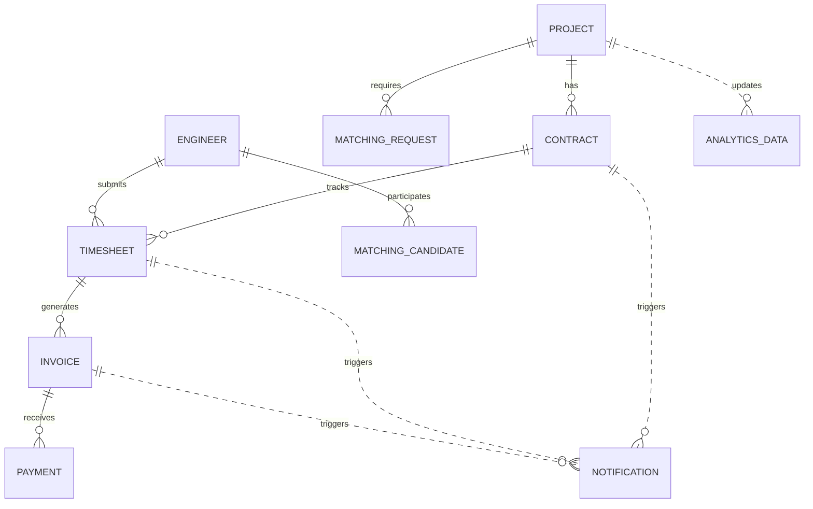

# SES管理システム 統合データベース設計

## 概要

SES（System Engineering Service）管理システムの全8コンテキストを統合した物理データベース設計書。PostgreSQL 15を対象とし、DDD（Domain-Driven Design）に基づく境界づけられたコンテキストを統合しつつ、パフォーマンスとデータ整合性を最適化する。

### 統合対象コンテキスト
1. **Project Context** - 案件管理
2. **Engineer Context** - 技術者管理
3. **Matching Context** - マッチング管理
4. **Contract Context** - 契約管理
5. **Timesheet Context** - 勤怠・工数管理
6. **Billing Context** - 請求・支払管理
7. **Report Context** - レポート・分析管理
8. **Notification Context** - 通知管理

---

## アーキテクチャ設計

### Database per Service パターン
各コンテキストは独立したデータベーススキーマを持ち、マイクロサービス間のデータ分離を実現。

```sql
-- スキーマ定義
CREATE SCHEMA project_context;
CREATE SCHEMA engineer_context;
CREATE SCHEMA matching_context;
CREATE SCHEMA contract_context;
CREATE SCHEMA timesheet_context;
CREATE SCHEMA billing_context;
CREATE SCHEMA report_context;
CREATE SCHEMA notification_context;
```

### クロスコンテキスト参照戦略
- **UUIDベース参照**: コンテキスト間の結合度を最小化
- **イベント駆動通信**: 同期的結合を避け、非同期イベント経由でデータ連携
- **参照整合性**: 物理的外部キー制約は避け、アプリケーションレベルで整合性確保

---

## 統合テーブル構成

### 1. Core Contexts（コア業務）

#### Project Context
```
project_context.projects                 - 案件管理
project_context.project_requirements     - 要件定義
project_context.project_phases          - フェーズ管理
project_context.project_milestones      - マイルストーン
```

#### Engineer Context
```
engineer_context.engineers              - 技術者基本情報
engineer_context.skill_assessments      - スキル評価
engineer_context.certifications         - 資格情報
engineer_context.availability_periods   - 稼働可能期間
```

#### Matching Context
```
matching_context.matching_requests      - マッチング依頼
matching_context.matching_candidates    - 候補者
matching_context.matching_results       - マッチング結果
matching_context.scoring_criteria       - スコアリング基準
```

### 2. Supporting Contexts（サポート業務）

#### Contract Context
```
contract_context.contracts              - 契約管理
contract_context.contract_signatures    - 電子署名
contract_context.contract_templates     - 契約テンプレート
contract_context.contract_amendments    - 契約変更
```

#### Timesheet Context
```
timesheet_context.timesheets            - タイムシート
timesheet_context.daily_attendances     - 日次勤怠
timesheet_context.timesheet_approval_steps - 承認フロー
timesheet_context.timesheet_adjustments - 勤怠調整
```

#### Billing Context
```
billing_context.invoices                - 請求書
billing_context.invoice_billing_items   - 請求明細
billing_context.invoice_payments        - 入金記録
billing_context.accounting_entries      - 会計仕訳
```

### 3. Generic Contexts（汎用業務）

#### Report Context
```
report_context.analytics_data           - 統計データ
report_context.kpi_definitions          - KPI定義
report_context.kpi_values               - KPI値
report_context.dashboards               - ダッシュボード
report_context.dashboard_widgets        - ダッシュボードウィジェット
report_context.report_templates         - レポートテンプレート
report_context.generated_reports        - 生成レポート
```

#### Notification Context
```
notification_context.notifications      - 通知
notification_context.notification_templates - 通知テンプレート
notification_context.notification_rules - 通知ルール
notification_context.notification_deliveries - 配信結果
notification_context.notification_channels - 配信チャネル
notification_context.notification_subscriptions - 購読設定
```

---

## データ関連性マッピング

### 主要な関連性


### イベントベース関連性
| Source Context | Event | Target Context | Action |
|----------------|-------|----------------|--------|
| Project | ProjectOrdered | Notification | 案件受注通知 |
| Contract | ContractSigned | Notification | 契約締結通知 |
| Timesheet | TimesheetSubmitted | Notification | 工数表提出通知 |
| Billing | InvoiceIssued | Notification | 請求書発行通知 |
| Matching | MatchingCompleted | Report | マッチング統計更新 |
| All Contexts | * | Report | 統計データ更新 |

---

## パフォーマンス最適化戦略

### 1. インデックス最適化

#### 共通インデックス戦略
```sql
-- 全テーブル共通：主キー、作成日時、更新日時、削除フラグ
CREATE INDEX idx_{table}_created_at ON {schema}.{table}(created_at) WHERE deleted_at IS NULL;
CREATE INDEX idx_{table}_updated_at ON {schema}.{table}(updated_at) WHERE deleted_at IS NULL;
CREATE INDEX idx_{table}_deleted_at ON {schema}.{table}(deleted_at) WHERE deleted_at IS NOT NULL;

-- UUIDベース外部参照
CREATE INDEX idx_{table}_{ref_table}_id ON {schema}.{table}({ref_table}_id) WHERE deleted_at IS NULL;
```

#### コンテキスト固有インデックス
```sql
-- Project Context
CREATE INDEX idx_projects_status_priority ON project_context.projects(status, priority) WHERE deleted_at IS NULL;
CREATE INDEX idx_projects_start_end_date ON project_context.projects(start_date, end_date) WHERE deleted_at IS NULL;

-- Engineer Context
CREATE INDEX idx_engineers_availability ON engineer_context.engineers(availability_status) WHERE deleted_at IS NULL;
CREATE INDEX idx_skill_assessments_skill_level ON engineer_context.skill_assessments(skill_category, skill_level) WHERE deleted_at IS NULL;

-- Matching Context
CREATE INDEX idx_matching_status_score ON matching_context.matching_results(status, matching_score DESC) WHERE deleted_at IS NULL;

-- Contract Context
CREATE INDEX idx_contracts_status_period ON contract_context.contracts(status, start_date, end_date) WHERE deleted_at IS NULL;

-- Timesheet Context
CREATE INDEX idx_timesheets_period_status ON timesheet_context.timesheets(period_year, period_month, status) WHERE deleted_at IS NULL;

-- Billing Context
CREATE INDEX idx_invoices_status_due_date ON billing_context.invoices(status, due_date) WHERE deleted_at IS NULL;

-- Report Context
CREATE INDEX idx_analytics_category_date ON report_context.analytics_data(category, target_date) WHERE deleted_at IS NULL;

-- Notification Context
CREATE INDEX idx_notifications_status_priority ON notification_context.notifications(status, priority_level DESC) WHERE deleted_at IS NULL;
```

#### JSONB最適化インデックス
```sql
-- JSONBデータ検索用GINインデックス
CREATE INDEX idx_projects_requirements_gin ON project_context.projects USING GIN (requirements);
CREATE INDEX idx_engineers_skills_gin ON engineer_context.engineers USING GIN (skills);
CREATE INDEX idx_matching_criteria_gin ON matching_context.matching_requests USING GIN (required_skills);
CREATE INDEX idx_contracts_terms_gin ON contract_context.contracts USING GIN (contract_terms);
CREATE INDEX idx_timesheets_work_summary_gin ON timesheet_context.timesheets USING GIN (work_summary);
CREATE INDEX idx_invoices_billing_details_gin ON billing_context.invoices USING GIN (billing_details);
CREATE INDEX idx_analytics_metrics_gin ON report_context.analytics_data USING GIN (metrics);
CREATE INDEX idx_notifications_recipients_gin ON notification_context.notifications USING GIN (recipient_users);
```

### 2. パーティショニング戦略

#### 時系列データのパーティショニング
```sql
-- Timesheet Context（月次パーティショニング）
CREATE TABLE timesheet_context.timesheets_partitioned (
    LIKE timesheet_context.timesheets INCLUDING ALL
) PARTITION BY RANGE (period_year, period_month);

-- 月次パーティション例
CREATE TABLE timesheet_context.timesheets_2025_06 
PARTITION OF timesheet_context.timesheets_partitioned
FOR VALUES FROM (2025, 6) TO (2025, 7);

-- Billing Context（年次パーティショニング）
CREATE TABLE billing_context.invoices_partitioned (
    LIKE billing_context.invoices INCLUDING ALL
) PARTITION BY RANGE (invoice_year);

-- Report Context（年次パーティショニング）
CREATE TABLE report_context.analytics_data_partitioned (
    LIKE report_context.analytics_data INCLUDING ALL
) PARTITION BY RANGE (target_year);

-- Notification Context（月次パーティショニング）
CREATE TABLE notification_context.notifications_partitioned (
    LIKE notification_context.notifications INCLUDING ALL
) PARTITION BY RANGE (created_at);
```

### 3. マテリアライズドビュー

#### クロスコンテキスト統計ビュー
```sql
-- 統合ダッシュボード用マテリアライズドビュー
CREATE MATERIALIZED VIEW integrated_dashboard_stats AS
SELECT 
    -- Project統計
    (SELECT COUNT(*) FROM project_context.projects WHERE status = 'ACTIVE' AND deleted_at IS NULL) as active_projects,
    (SELECT COUNT(*) FROM project_context.projects WHERE status = 'COMPLETED' AND deleted_at IS NULL) as completed_projects,
    
    -- Engineer統計
    (SELECT COUNT(*) FROM engineer_context.engineers WHERE availability_status = 'AVAILABLE' AND deleted_at IS NULL) as available_engineers,
    (SELECT COUNT(*) FROM engineer_context.engineers WHERE deleted_at IS NULL) as total_engineers,
    
    -- Contract統計
    (SELECT COUNT(*) FROM contract_context.contracts WHERE status = 'ACTIVE' AND deleted_at IS NULL) as active_contracts,
    
    -- Billing統計
    (SELECT COALESCE(SUM(total_amount), 0) FROM billing_context.invoices WHERE status = 'PAID' AND deleted_at IS NULL) as total_revenue,
    (SELECT COUNT(*) FROM billing_context.invoices WHERE status = 'UNPAID' AND deleted_at IS NULL) as unpaid_invoices,
    
    -- 更新日時
    CURRENT_TIMESTAMP as last_updated;

-- インデックス作成
CREATE UNIQUE INDEX idx_integrated_dashboard_stats_last_updated ON integrated_dashboard_stats(last_updated);

-- 月次売上統計マテリアライズドビュー
CREATE MATERIALIZED VIEW monthly_revenue_stats AS
SELECT 
    b.invoice_year,
    b.invoice_month,
    COUNT(*) as invoice_count,
    SUM(b.total_amount) as total_amount,
    SUM(CASE WHEN b.status = 'PAID' THEN b.total_amount ELSE 0 END) as paid_amount,
    COUNT(CASE WHEN b.status = 'PAID' THEN 1 END) as paid_count,
    ROUND(
        (COUNT(CASE WHEN b.status = 'PAID' THEN 1 END)::DECIMAL / COUNT(*)) * 100, 2
    ) as payment_rate
FROM billing_context.invoices b
WHERE b.deleted_at IS NULL
GROUP BY b.invoice_year, b.invoice_month
ORDER BY b.invoice_year DESC, b.invoice_month DESC;
```

---

## データ整合性管理

### 1. 共通トリガー関数

#### 更新日時自動更新
```sql
-- 汎用更新日時更新関数
CREATE OR REPLACE FUNCTION update_updated_at()
RETURNS TRIGGER AS $$
BEGIN
    NEW.updated_at = CURRENT_TIMESTAMP;
    RETURN NEW;
END;
$$ LANGUAGE plpgsql;

-- 全テーブルへのトリガー適用例
CREATE TRIGGER trigger_projects_updated_at
    BEFORE UPDATE ON project_context.projects
    FOR EACH ROW
    EXECUTE FUNCTION update_updated_at();

-- 他の全テーブルにも同様のトリガーを適用
```

#### バージョン管理関数
```sql
-- バージョン自動増分関数
CREATE OR REPLACE FUNCTION increment_version()
RETURNS TRIGGER AS $$
BEGIN
    NEW.version = OLD.version + 1;
    RETURN NEW;
END;
$$ LANGUAGE plpgsql;
```

#### ソフトデリート関数
```sql
-- ソフトデリート関数
CREATE OR REPLACE FUNCTION soft_delete()
RETURNS TRIGGER AS $$
BEGIN
    NEW.deleted_at = CURRENT_TIMESTAMP;
    NEW.updated_at = CURRENT_TIMESTAMP;
    RETURN NEW;
END;
$$ LANGUAGE plpgsql;
```

### 2. データ整合性チェック

#### クロスコンテキスト参照整合性
```sql
-- 参照整合性チェック関数
CREATE OR REPLACE FUNCTION validate_cross_context_reference(
    target_schema TEXT,
    target_table TEXT,
    target_id UUID
) RETURNS BOOLEAN AS $$
DECLARE
    record_exists BOOLEAN;
    query_sql TEXT;
BEGIN
    query_sql := format(
        'SELECT EXISTS(SELECT 1 FROM %I.%I WHERE id = $1 AND deleted_at IS NULL)',
        target_schema, target_table
    );
    
    EXECUTE query_sql INTO record_exists USING target_id;
    
    RETURN record_exists;
END;
$$ LANGUAGE plpgsql;

-- 使用例：Contract作成時のProject存在チェック
CREATE OR REPLACE FUNCTION validate_contract_project_reference()
RETURNS TRIGGER AS $$
BEGIN
    IF NOT validate_cross_context_reference('project_context', 'projects', NEW.project_id) THEN
        RAISE EXCEPTION 'Referenced project does not exist: %', NEW.project_id;
    END IF;
    
    RETURN NEW;
END;
$$ LANGUAGE plpgsql;

CREATE TRIGGER trigger_validate_contract_project
    BEFORE INSERT OR UPDATE ON contract_context.contracts
    FOR EACH ROW
    EXECUTE FUNCTION validate_contract_project_reference();
```

---

## セキュリティ設計

### 1. Row Level Security (RLS)

#### 統合セキュリティポリシー
```sql
-- 管理者ロール
CREATE ROLE ses_admin_role;
CREATE ROLE ses_project_manager_role;
CREATE ROLE ses_engineer_role;
CREATE ROLE ses_customer_role;
CREATE ROLE ses_finance_role;

-- 全コンテキスト管理者アクセス
CREATE POLICY admin_access ON project_context.projects
    FOR ALL TO ses_admin_role USING (true);

CREATE POLICY admin_access ON engineer_context.engineers
    FOR ALL TO ses_admin_role USING (true);

-- 他のテーブルにも同様のポリシーを適用

-- プロジェクトマネージャーアクセス
CREATE POLICY project_manager_access ON project_context.projects
    FOR ALL TO ses_project_manager_role
    USING (
        project_manager_id = current_setting('app.current_user_id')::UUID OR
        sales_manager_id = current_setting('app.current_user_id')::UUID
    );

-- エンジニアアクセス（自分の情報のみ）
CREATE POLICY engineer_self_access ON engineer_context.engineers
    FOR ALL TO ses_engineer_role
    USING (id = current_setting('app.current_user_id')::UUID);

-- タイムシートアクセス（自分の工数表のみ）
CREATE POLICY engineer_timesheet_access ON timesheet_context.timesheets
    FOR ALL TO ses_engineer_role
    USING (engineer_id = current_setting('app.current_user_id')::UUID);
```

### 2. データ暗号化

#### 機密データ暗号化
```sql
-- 機密データ暗号化関数
CREATE EXTENSION IF NOT EXISTS pgcrypto;

-- 個人情報暗号化
CREATE OR REPLACE FUNCTION encrypt_personal_data(data TEXT)
RETURNS TEXT AS $$
BEGIN
    RETURN encode(pgp_sym_encrypt(data, current_setting('app.encryption_key')), 'base64');
END;
$$ LANGUAGE plpgsql SECURITY DEFINER;

-- 復号化関数
CREATE OR REPLACE FUNCTION decrypt_personal_data(encrypted_data TEXT)
RETURNS TEXT AS $$
BEGIN
    RETURN pgp_sym_decrypt(decode(encrypted_data, 'base64'), current_setting('app.encryption_key'));
END;
$$ LANGUAGE plpgsql SECURITY DEFINER;
```

---

## 運用・保守設計

### 1. バックアップ戦略

#### 論理バックアップ（スキーマ別）
```bash
#!/bin/bash
# スキーマ別バックアップスクリプト

CONTEXTS=("project_context" "engineer_context" "matching_context" "contract_context" "timesheet_context" "billing_context" "report_context" "notification_context")
BACKUP_DIR="/backup/$(date +%Y%m%d)"

mkdir -p $BACKUP_DIR

for context in "${CONTEXTS[@]}"; do
    pg_dump -h localhost -U ses_user -n $context ses_database > $BACKUP_DIR/${context}_$(date +%Y%m%d_%H%M%S).sql
done
```

#### PITR（Point-in-Time Recovery）設定
```sql
-- WALアーカイブ設定
ALTER SYSTEM SET wal_level = 'replica';
ALTER SYSTEM SET archive_mode = 'on';
ALTER SYSTEM SET archive_command = 'cp %p /backup/wal_archive/%f';
```

### 2. 監視・アラート

#### パフォーマンス監視
```sql
-- 長時間実行クエリ監視
CREATE OR REPLACE VIEW long_running_queries AS
SELECT 
    pid,
    usename,
    application_name,
    state,
    query_start,
    NOW() - query_start as duration,
    query
FROM pg_stat_activity 
WHERE state = 'active' 
  AND NOW() - query_start > INTERVAL '30 seconds'
  AND query NOT LIKE '%pg_stat_activity%';

-- インデックス使用効率監視
CREATE OR REPLACE VIEW index_usage_stats AS
SELECT 
    schemaname,
    tablename,
    indexname,
    idx_tup_read,
    idx_tup_fetch,
    CASE 
        WHEN idx_tup_read = 0 THEN 0
        ELSE ROUND((idx_tup_fetch::DECIMAL / idx_tup_read) * 100, 2)
    END as efficiency_rate
FROM pg_stat_user_indexes
ORDER BY efficiency_rate DESC;
```

### 3. データアーカイブ自動化

#### 統合アーカイブ関数
```sql
-- 統合データアーカイブ関数
CREATE OR REPLACE FUNCTION archive_old_data(cutoff_date DATE)
RETURNS TABLE(
    context_name TEXT,
    table_name TEXT,
    archived_count INTEGER,
    archive_status TEXT
) AS $$
DECLARE
    context_table RECORD;
    archived_count INTEGER;
BEGIN
    -- 各コンテキストの主要テーブルをアーカイブ
    FOR context_table IN
        SELECT 
            'project_context' as schema_name,
            'projects' as table_name,
            'status IN (''COMPLETED'', ''CANCELLED'') AND end_date < $1' as archive_condition
        UNION ALL
        SELECT 'timesheet_context', 'timesheets', 'status = ''APPROVED'' AND period_date < $1'
        UNION ALL
        SELECT 'billing_context', 'invoices', 'status = ''PAID'' AND invoice_date < $1'
        UNION ALL
        SELECT 'notification_context', 'notifications', 'status = ''SENT'' AND created_at < $1'
    LOOP
        BEGIN
            EXECUTE format(
                'UPDATE %I.%I SET deleted_at = CURRENT_TIMESTAMP WHERE %s AND deleted_at IS NULL',
                context_table.schema_name,
                context_table.table_name,
                context_table.archive_condition
            ) USING cutoff_date;
            
            GET DIAGNOSTICS archived_count = ROW_COUNT;
            
            RETURN QUERY SELECT 
                context_table.schema_name,
                context_table.table_name,
                archived_count,
                'SUCCESS'::TEXT;
                
        EXCEPTION WHEN OTHERS THEN
            RETURN QUERY SELECT 
                context_table.schema_name,
                context_table.table_name,
                0,
                SQLERRM::TEXT;
        END;
    END LOOP;
    
    RETURN;
END;
$$ LANGUAGE plpgsql;
```

---

## データ移行戦略

### 1. 段階的移行計画

#### Phase 1: Core Contexts（必須業務）
1. Project Context - 案件管理
2. Engineer Context - 技術者管理
3. Contract Context - 契約管理

#### Phase 2: Supporting Contexts（サポート業務）
4. Matching Context - マッチング管理
5. Timesheet Context - 勤怠・工数管理
6. Billing Context - 請求・支払管理

#### Phase 3: Generic Contexts（汎用業務）
7. Report Context - レポート・分析管理
8. Notification Context - 通知管理

### 2. 移行スクリプト

#### マスター移行スクリプト
```sql
-- データ移行マスタースクリプト
\echo 'Starting SES Database Migration...'

-- Phase 1: Core Contexts
\echo 'Phase 1: Creating Core Contexts...'
\i project_context_ddl.sql
\i engineer_context_ddl.sql
\i contract_context_ddl.sql

-- Phase 2: Supporting Contexts
\echo 'Phase 2: Creating Supporting Contexts...'
\i matching_context_ddl.sql
\i timesheet_context_ddl.sql
\i billing_context_ddl.sql

-- Phase 3: Generic Contexts
\echo 'Phase 3: Creating Generic Contexts...'
\i report_context_ddl.sql
\i notification_context_ddl.sql

-- Post-migration setup
\echo 'Post-migration setup...'
\i create_integrated_views.sql
\i create_performance_indexes.sql
\i setup_security_policies.sql

\echo 'SES Database Migration completed successfully!'
```

---

## パフォーマンス評価指標

### 1. 基準値設定

| 指標 | 目標値 | 測定方法 |
|------|--------|----------|
| レスポンス時間 | < 500ms | 95%tile |
| 同時接続数 | 1000+ | Max concurrent |
| データ処理量 | 10000 TPS | Throughput |
| 可用性 | 99.9% | Uptime |
| データ整合性 | 100% | Validation |

### 2. 監視クエリ

```sql
-- パフォーマンス統計取得
CREATE OR REPLACE VIEW performance_metrics AS
SELECT 
    'Database Size' as metric_name,
    pg_size_pretty(pg_database_size(current_database())) as metric_value
UNION ALL
SELECT 
    'Active Connections',
    COUNT(*)::TEXT
FROM pg_stat_activity 
WHERE state = 'active'
UNION ALL
SELECT 
    'Cache Hit Ratio',
    ROUND(
        (sum(heap_blks_hit) / (sum(heap_blks_hit) + sum(heap_blks_read))) * 100, 2
    )::TEXT || '%'
FROM pg_statio_user_tables;
```

---

**作成者**: システム化プロジェクトチーム  
**作成日**: 2025年6月1日  
**対象DB**: PostgreSQL 15  
**関連設計**: 全8コンテキスト物理テーブル設計  
**次回レビュー**: 2025年7月1日