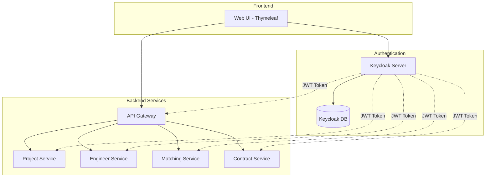

# Keycloak設定仕様書

## 1. 概要

### 1.1 目的
本文書は、SES業務システムにおける認証基盤としてのKeycloak設定仕様を定義する。OAuth2.0/OIDC（OpenID Connect）プロトコルを使用した統一認証を実現し、全マイクロサービスに対する安全なアクセス制御を提供する。

### 1.2 バージョン
- **Keycloak**: 22.x LTS
- **プロトコル**: OAuth 2.0, OpenID Connect 1.0
- **Java Adapter**: keycloak-spring-boot-adapter 22.x

### 1.3 アーキテクチャ概要


## 2. Realm設定

### 2.1 Realm基本情報
```yaml
realm_name: ses-manager
display_name: SES管理システム
enabled: true
registration_allowed: false
email_as_username: true
verify_email: true
login_with_email_allowed: true
duplicate_emails_allowed: false
reset_password_allowed: true
edit_username_allowed: false
```

### 2.2 トークン設定
```yaml
access_token:
  lifespan: 300  # 5分
  lifespan_for_implicit_flow: 900  # 15分
  
refresh_token:
  lifespan: 1800  # 30分
  max_reuse: 0
  
sso_session:
  idle_timeout: 1800  # 30分
  max_lifespan: 36000  # 10時間
  
offline_session:
  idle_timeout: 2592000  # 30日
  max_lifespan: 5184000  # 60日
```

### 2.3 ログイン設定
```yaml
brute_force_protection:
  enabled: true
  permanent_lockout: false
  max_failure_wait_seconds: 900  # 15分
  failure_reset_time_seconds: 43200  # 12時間
  max_delta_time_seconds: 3600  # 1時間
  quick_login_check_milli_seconds: 1000
  minimum_quick_login_wait_seconds: 60
  max_login_failures: 5
  
password_policy: "length(8) and digits(1) and upperCase(1) and lowerCase(1) and specialChars(1) and notUsername()"
```

## 3. Client設定

### 3.1 SESマネージャーWebクライアント
```yaml
client_id: ses-manager-web
client_type: confidential
protocol: openid-connect
enabled: true

access_type: confidential
standard_flow_enabled: true
implicit_flow_enabled: false
direct_access_grants_enabled: false
service_accounts_enabled: false

valid_redirect_uris:
  - "http://localhost:8080/*"
  - "https://ses-manager.example.com/*"
  
web_origins:
  - "http://localhost:8080"
  - "https://ses-manager.example.com"
  
authentication_flow_overrides:
  browser_flow: browser
  direct_grant_flow: direct grant
```

### 3.2 各マイクロサービスクライアント
```yaml
# Project Service
- client_id: project-service
  client_type: bearer-only
  enabled: true

# Engineer Service  
- client_id: engineer-service
  client_type: bearer-only
  enabled: true

# Matching Service
- client_id: matching-service
  client_type: bearer-only
  enabled: true

# Contract Service
- client_id: contract-service
  client_type: bearer-only
  enabled: true

# Timesheet Service
- client_id: timesheet-service
  client_type: bearer-only
  enabled: true

# Billing Service
- client_id: billing-service
  client_type: bearer-only
  enabled: true

# Report Service
- client_id: report-service
  client_type: bearer-only
  enabled: true

# Notification Service
- client_id: notification-service
  client_type: bearer-only
  enabled: true
```

### 3.3 管理用クライアント
```yaml
client_id: ses-manager-admin-cli
client_type: confidential
protocol: openid-connect
enabled: true
service_accounts_enabled: true

service_account_roles:
  - realm-admin
  - manage-users
  - view-realm
  - view-users
```

## 4. ユーザー属性設定

### 4.1 カスタムユーザー属性
```yaml
user_attributes:
  - name: employee_id
    display_name: 社員番号
    type: String
    required: true
    
  - name: department
    display_name: 部署
    type: String
    required: true
    
  - name: position
    display_name: 役職
    type: String
    required: false
    
  - name: phone_number
    display_name: 電話番号
    type: String
    required: true
    
  - name: manager_id
    display_name: 上長社員番号
    type: String
    required: false
```

### 4.2 ユーザープロファイル設定
```yaml
profile_attributes:
  - firstName:
      required: true
      read_only: false
      
  - lastName:
      required: true
      read_only: false
      
  - email:
      required: true
      read_only: false
      
  - username:
      required: true
      read_only: true
```

## 5. ロール定義

### 5.1 Realmレベルロール
```yaml
realm_roles:
  - name: system_admin
    description: システム管理者
    composite: true
    
  - name: company_admin
    description: 会社管理者
    composite: true
    
  - name: department_manager
    description: 部門管理者
    composite: true
    
  - name: project_manager
    description: プロジェクトマネージャー
    composite: false
    
  - name: engineer
    description: 技術者
    composite: false
    
  - name: sales
    description: 営業担当
    composite: false
    
  - name: accounting
    description: 経理担当
    composite: false
    
  - name: viewer
    description: 閲覧者
    composite: false
```

### 5.2 クライアントロール（ses-manager-web）
```yaml
client_roles:
  # 案件管理
  - name: project_create
    description: 案件作成権限
    
  - name: project_update
    description: 案件更新権限
    
  - name: project_delete
    description: 案件削除権限
    
  - name: project_view
    description: 案件閲覧権限
    
  # 技術者管理
  - name: engineer_create
    description: 技術者登録権限
    
  - name: engineer_update
    description: 技術者更新権限
    
  - name: engineer_delete
    description: 技術者削除権限
    
  - name: engineer_view
    description: 技術者閲覧権限
    
  # マッチング管理
  - name: matching_execute
    description: マッチング実行権限
    
  - name: matching_approve
    description: マッチング承認権限
    
  - name: matching_view
    description: マッチング結果閲覧権限
    
  # 契約管理
  - name: contract_create
    description: 契約作成権限
    
  - name: contract_approve
    description: 契約承認権限
    
  - name: contract_view
    description: 契約閲覧権限
    
  # 勤怠管理
  - name: timesheet_submit
    description: 勤怠提出権限
    
  - name: timesheet_approve
    description: 勤怠承認権限
    
  - name: timesheet_view_all
    description: 全勤怠閲覧権限
    
  # 請求管理
  - name: billing_create
    description: 請求書作成権限
    
  - name: billing_approve
    description: 請求書承認権限
    
  - name: billing_view
    description: 請求書閲覧権限
    
  # レポート
  - name: report_view_all
    description: 全レポート閲覧権限
    
  - name: report_export
    description: レポートエクスポート権限
```

### 5.3 ロールマッピング
```yaml
role_mappings:
  system_admin:
    - all client roles
    - all realm roles
    
  company_admin:
    - project_*
    - engineer_*
    - matching_*
    - contract_*
    - timesheet_view_all
    - billing_*
    - report_*
    
  department_manager:
    - project_view
    - engineer_view
    - matching_execute
    - matching_view
    - contract_view
    - timesheet_approve
    - timesheet_view_all
    - report_view_all
    
  project_manager:
    - project_create
    - project_update
    - project_view
    - engineer_view
    - matching_execute
    - matching_view
    - contract_view
    - timesheet_approve
    - report_view_all
    
  engineer:
    - project_view (assigned only)
    - timesheet_submit
    - contract_view (own only)
    
  sales:
    - project_create
    - project_update
    - project_view
    - engineer_view
    - matching_execute
    - matching_view
    - contract_create
    - contract_view
    
  accounting:
    - billing_*
    - contract_view
    - timesheet_view_all
    - report_view_all
    - report_export
    
  viewer:
    - project_view
    - engineer_view
    - report_view_all
```

## 6. 認証フロー設定

### 6.1 ブラウザフロー（カスタマイズ）
```yaml
browser_flow:
  name: ses-browser-flow
  steps:
    - cookie_authentication:
        requirement: ALTERNATIVE
        
    - identity_provider_redirector:
        requirement: ALTERNATIVE
        
    - forms:
        requirement: ALTERNATIVE
        sub_flows:
          - username_password_form:
              requirement: REQUIRED
              
          - otp_form:
              requirement: CONDITIONAL
              condition: user.attribute.mfa_enabled == true
```

### 6.2 登録フロー
```yaml
registration_flow:
  enabled: false  # 管理者のみがユーザー作成可能
```

### 6.3 パスワードリセットフロー
```yaml
reset_credentials_flow:
  name: ses-reset-credentials
  steps:
    - reset_password_email:
        requirement: REQUIRED
        
    - reset_password:
        requirement: REQUIRED
        
    - reset_otp:
        requirement: CONDITIONAL
        condition: user.attribute.mfa_enabled == true
```

## 7. Identity Provider設定

### 7.1 LDAP連携（オプション）
```yaml
ldap_provider:
  enabled: false  # 必要に応じて有効化
  provider_name: corporate-ldap
  vendor: Active Directory
  connection_url: ldaps://ldap.example.com:636
  users_dn: CN=Users,DC=example,DC=com
  bind_dn: CN=keycloak,CN=Users,DC=example,DC=com
  
  user_object_classes:
    - person
    - organizationalPerson
    - user
    
  attribute_mappings:
    - ldap_attribute: sAMAccountName
      user_model_attribute: username
      
    - ldap_attribute: givenName
      user_model_attribute: firstName
      
    - ldap_attribute: sn
      user_model_attribute: lastName
      
    - ldap_attribute: mail
      user_model_attribute: email
      
    - ldap_attribute: employeeID
      user_model_attribute: employee_id
```

## 8. セキュリティ設定

### 8.1 セキュリティヘッダー
```yaml
security_headers:
  x_frame_options: SAMEORIGIN
  content_security_policy: "frame-src 'self'; frame-ancestors 'self'; object-src 'none';"
  x_content_type_options: nosniff
  x_robots_tag: none
  x_xss_protection: 1; mode=block
  strict_transport_security: max-age=31536000; includeSubDomains
```

### 8.2 CORS設定
```yaml
cors_settings:
  allowed_origins:
    - "http://localhost:8080"
    - "https://ses-manager.example.com"
    
  allowed_methods:
    - GET
    - POST
    - PUT
    - DELETE
    - OPTIONS
    
  allowed_headers:
    - Authorization
    - Content-Type
    - X-Requested-With
    
  exposed_headers:
    - Location
    
  max_age: 3600
  allow_credentials: true
```

### 8.3 セッション設定
```yaml
session_settings:
  sso_session_idle: 1800  # 30分
  sso_session_max: 36000  # 10時間
  offline_session_idle: 2592000  # 30日
  
  remember_me: false
  
  session_cookie:
    name: KEYCLOAK_SESSION
    secure: true  # HTTPS環境では必須
    http_only: true
    same_site: Strict
```

## 9. イベント設定

### 9.1 イベントリスナー
```yaml
event_listeners:
  - jboss-logging
  - ses-audit-logger  # カスタムリスナー
  
events_enabled: true
events_expiration: 2592000  # 30日

admin_events_enabled: true
admin_events_details_enabled: true
```

### 9.2 監査対象イベント
```yaml
user_events:
  - LOGIN
  - LOGIN_ERROR
  - LOGOUT
  - REGISTER
  - UPDATE_PASSWORD
  - UPDATE_PROFILE
  - UPDATE_EMAIL
  - SEND_RESET_PASSWORD
  - RESET_PASSWORD
  
admin_events:
  - CREATE
  - UPDATE
  - DELETE
  - ACTION
```

## 10. Spring Boot統合設定

### 10.1 application.yml設定
```yaml
keycloak:
  realm: ses-manager
  auth-server-url: ${KEYCLOAK_URL:http://localhost:8081}
  ssl-required: external
  resource: ${SERVICE_NAME}
  bearer-only: true
  cors: true
  
  security-constraints:
    - auth-roles:
        - "*"
      security-collections:
        - name: protected
          patterns:
            - /api/*
            
    - security-collections:
        - name: public
          patterns:
            - /health
            - /metrics
            - /swagger-ui/*
            - /v3/api-docs/*
```

### 10.2 Spring Security設定
```java
@Configuration
@EnableWebSecurity
@EnableMethodSecurity(prePostEnabled = true)
public class SecurityConfig {
    
    @Bean
    public SecurityFilterChain filterChain(HttpSecurity http) throws Exception {
        http
            .authorizeHttpRequests(authz -> authz
                .requestMatchers("/health", "/metrics").permitAll()
                .requestMatchers("/api/**").authenticated()
                .anyRequest().authenticated()
            )
            .oauth2ResourceServer(oauth2 -> oauth2
                .jwt(jwt -> jwt
                    .jwtAuthenticationConverter(jwtAuthenticationConverter())
                )
            )
            .sessionManagement(session -> session
                .sessionCreationPolicy(SessionCreationPolicy.STATELESS)
            );
            
        return http.build();
    }
    
    @Bean
    public JwtAuthenticationConverter jwtAuthenticationConverter() {
        JwtGrantedAuthoritiesConverter authoritiesConverter = 
            new JwtGrantedAuthoritiesConverter();
        authoritiesConverter.setAuthorityPrefix("ROLE_");
        authoritiesConverter.setAuthoritiesClaimName("roles");
        
        JwtAuthenticationConverter converter = new JwtAuthenticationConverter();
        converter.setJwtGrantedAuthoritiesConverter(authoritiesConverter);
        
        return converter;
    }
}
```

## 11. 運用設定

### 11.1 バックアップ設定
```yaml
backup:
  enabled: true
  schedule: "0 2 * * *"  # 毎日2:00
  retention_days: 30
  
  export_items:
    - realm_settings
    - clients
    - roles
    - groups
    - users
    - identity_providers
```

### 11.2 監視設定
```yaml
monitoring:
  health_check_endpoint: /health
  metrics_endpoint: /metrics
  
  alerts:
    - name: high_login_failure_rate
      condition: login_failure_rate > 0.1
      severity: warning
      
    - name: token_generation_error
      condition: token_generation_error_rate > 0.01
      severity: critical
```

### 11.3 ログ設定
```yaml
logging:
  level:
    root: INFO
    org.keycloak: INFO
    org.keycloak.events: DEBUG
    org.keycloak.authentication: DEBUG
    
  pattern: "%d{yyyy-MM-dd HH:mm:ss.SSS} [%thread] %-5level %logger{36} - %msg%n"
  
  file:
    name: /var/log/keycloak/keycloak.log
    max_size: 100MB
    max_history: 30
```

## 12. 移行・展開計画

### 12.1 初期セットアップ手順
1. Keycloakサーバーのインストール・起動
2. 管理者アカウントの作成
3. ses-manager realmの作成
4. クライアント設定のインポート
5. ロール定義のインポート
6. 初期ユーザーの一括登録
7. Spring Boot アプリケーションとの接続確認

### 12.2 本番環境考慮事項
- **高可用性**: Keycloakクラスタ構成（最小2ノード）
- **データベース**: 外部PostgreSQL/MySQL（レプリケーション構成）
- **キャッシュ**: Infinispanによる分散キャッシュ
- **SSL/TLS**: 全通信の暗号化必須
- **監視**: Prometheus/Grafanaによるメトリクス監視

---

**作成日**: 2025年6月2日  
**作成者**: SES業務システム開発チーム  
**対象**: システム管理者、インフラエンジニア、開発者