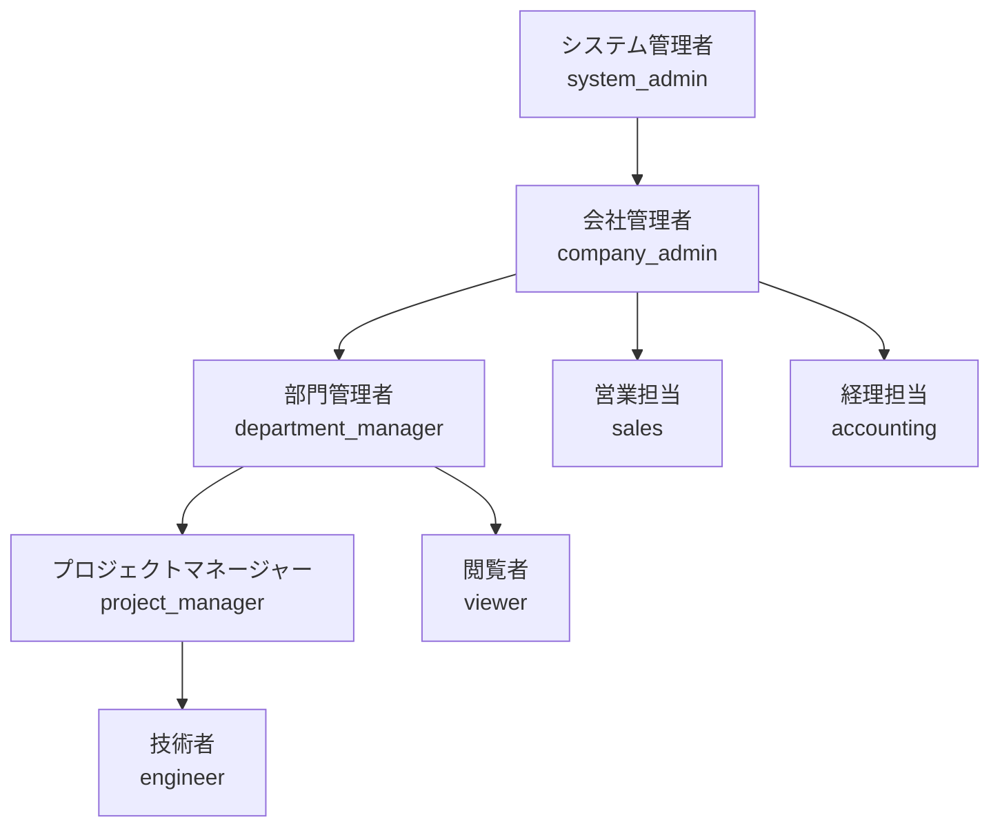
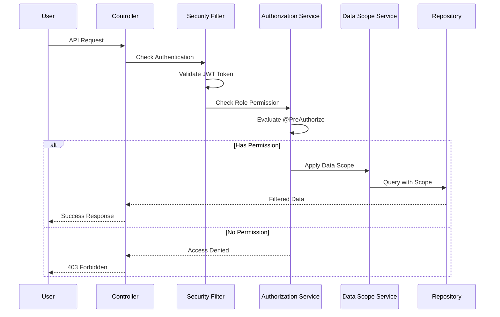

# ロール・権限マトリックス設計

## 1. 概要

### 1.1 目的
本文書は、SES業務システムにおけるロールベースアクセス制御（RBAC）の詳細な権限マトリックスを定義する。各ロールが持つ権限を明確化し、適切なアクセス制御を実現する。

### 1.2 設計方針
- **最小権限の原則**: 各ロールには業務遂行に必要な最小限の権限のみを付与
- **職務分離**: 相反する業務の権限を同一ロールに付与しない
- **階層的権限**: 上位ロールは下位ロールの権限を包含
- **コンテキスト別管理**: 8つの境界づけられたコンテキストごとに権限を定義

## 2. ロール定義

### 2.1 システムロール階層


### 2.2 ロール説明
| ロール | 説明 | 主な責務 | データアクセス範囲 |
|--------|------|----------|------------------|
| **システム管理者** | システム全体の管理者 | システム設定、ユーザー管理、監査 | 全データ |
| **会社管理者** | 会社レベルの管理者 | 組織管理、マスタ管理、承認 | 全社データ |
| **部門管理者** | 部門レベルの管理者 | 部門内リソース管理、承認 | 部門データ |
| **プロジェクトマネージャー** | プロジェクト責任者 | プロジェクト管理、アサイン | 担当プロジェクト |
| **技術者** | SES技術者 | 勤怠入力、タスク実行 | 自身のデータ |
| **営業担当** | 営業部門担当者 | 案件管理、契約管理 | 営業関連データ |
| **経理担当** | 経理部門担当者 | 請求管理、支払管理 | 経理関連データ |
| **閲覧者** | 読み取り専用ユーザー | レポート閲覧、状況確認 | 権限範囲内の閲覧 |

## 3. コンテキスト別権限マトリックス

### 3.1 Project Context（案件管理）

#### 基本権限
| 機能 | システム管理者 | 会社管理者 | 部門管理者 | PM | 技術者 | 営業 | 経理 | 閲覧者 |
|------|:-:|:-:|:-:|:-:|:-:|:-:|:-:|:-:|
| **案件作成** | ✓ | ✓ | ✓ | ✓ | - | ✓ | - | - |
| **案件更新** | ✓ | ✓ | ○ | ○ | - | ○ | - | - |
| **案件削除** | ✓ | ✓ | - | - | - | - | - | - |
| **案件一覧** | ✓ | ✓ | ○ | ○ | ○ | ○ | ○ | ○ |
| **案件詳細** | ✓ | ✓ | ○ | ○ | ○ | ○ | ○ | ○ |
| **案件検索** | ✓ | ✓ | ○ | ○ | ○ | ○ | ○ | ○ |
| **ステータス変更** | ✓ | ✓ | ○ | ○ | - | ○ | - | - |
| **案件承認** | ✓ | ✓ | ✓ | - | - | - | - | - |

**凡例**: ✓ = 全データアクセス可、○ = 権限範囲内のみ、- = アクセス不可

#### データアクセス条件
- **部門管理者**: 自部門の案件のみ
- **PM**: 自身が担当する案件のみ
- **技術者**: 自身がアサインされた案件のみ
- **営業**: 自身が担当する案件のみ
- **経理**: 請求対象の案件のみ（読み取り専用）
- **閲覧者**: 公開設定された案件のみ

### 3.2 Engineer Context（技術者管理）

| 機能 | システム管理者 | 会社管理者 | 部門管理者 | PM | 技術者 | 営業 | 経理 | 閲覧者 |
|------|:-:|:-:|:-:|:-:|:-:|:-:|:-:|:-:|
| **技術者登録** | ✓ | ✓ | ✓ | - | - | - | - | - |
| **技術者更新** | ✓ | ✓ | ○ | - | ○ | - | - | - |
| **技術者削除** | ✓ | ✓ | - | - | - | - | - | - |
| **技術者一覧** | ✓ | ✓ | ○ | ○ | - | ✓ | - | ○ |
| **技術者詳細** | ✓ | ✓ | ○ | ○ | ○ | ✓ | - | ○ |
| **スキル管理** | ✓ | ✓ | ○ | - | ○ | - | - | - |
| **評価入力** | ✓ | ✓ | ✓ | ✓ | - | - | - | - |
| **評価閲覧** | ✓ | ✓ | ○ | ○ | ○ | - | - | - |
| **個人情報閲覧** | ✓ | ✓ | ○ | - | ○ | - | - | - |

#### データアクセス条件
- **部門管理者**: 自部門の技術者のみ
- **PM**: プロジェクトメンバーのみ（基本情報・スキル情報）
- **技術者**: 自身の情報のみ（全項目）
- **営業**: アサイン候補者のみ（スキル・稼働情報）
- **閲覧者**: 公開プロファイルのみ

### 3.3 Matching Context（マッチング）

| 機能 | システム管理者 | 会社管理者 | 部門管理者 | PM | 技術者 | 営業 | 経理 | 閲覧者 |
|------|:-:|:-:|:-:|:-:|:-:|:-:|:-:|:-:|
| **マッチング実行** | ✓ | ✓ | ✓ | ✓ | - | ✓ | - | - |
| **条件設定** | ✓ | ✓ | ✓ | ✓ | - | ✓ | - | - |
| **結果閲覧** | ✓ | ✓ | ○ | ○ | - | ○ | - | - |
| **候補者評価** | ✓ | ✓ | ✓ | ✓ | - | ✓ | - | - |
| **マッチング承認** | ✓ | ✓ | ✓ | - | - | - | - | - |
| **マッチング確定** | ✓ | ✓ | ✓ | - | - | - | - | - |
| **履歴閲覧** | ✓ | ✓ | ○ | ○ | - | ○ | - | - |
| **統計分析** | ✓ | ✓ | ✓ | - | - | ✓ | - | - |

#### データアクセス条件
- **部門管理者**: 自部門案件のマッチングのみ
- **PM**: 担当案件のマッチングのみ
- **営業**: 担当案件のマッチングのみ

### 3.4 Contract Context（契約管理）

| 機能 | システム管理者 | 会社管理者 | 部門管理者 | PM | 技術者 | 営業 | 経理 | 閲覧者 |
|------|:-:|:-:|:-:|:-:|:-:|:-:|:-:|:-:|
| **契約作成** | ✓ | ✓ | - | - | - | ✓ | - | - |
| **契約更新** | ✓ | ✓ | - | - | - | ○ | - | - |
| **契約削除** | ✓ | ✓ | - | - | - | - | - | - |
| **契約一覧** | ✓ | ✓ | ○ | ○ | ○ | ○ | ✓ | ○ |
| **契約詳細** | ✓ | ✓ | ○ | ○ | ○ | ○ | ✓ | ○ |
| **契約承認** | ✓ | ✓ | ✓ | - | - | - | - | - |
| **電子署名実行** | ✓ | ✓ | - | - | - | ✓ | - | - |
| **CloudSign連携** | ✓ | ✓ | - | - | - | ✓ | - | - |
| **契約書ダウンロード** | ✓ | ✓ | ○ | ○ | ○ | ○ | ✓ | - |

#### データアクセス条件
- **部門管理者**: 自部門の契約のみ
- **PM**: 担当プロジェクトの契約のみ
- **技術者**: 自身の契約のみ
- **営業**: 担当案件の契約のみ
- **経理**: 全契約（請求・支払関連）
- **閲覧者**: 契約概要のみ

### 3.5 Timesheet Context（勤怠・工数管理）

| 機能 | システム管理者 | 会社管理者 | 部門管理者 | PM | 技術者 | 営業 | 経理 | 閲覧者 |
|------|:-:|:-:|:-:|:-:|:-:|:-:|:-:|:-:|
| **勤怠入力** | ✓ | - | - | - | ✓ | - | - | - |
| **勤怠修正** | ✓ | ✓ | ○ | ○ | ○ | - | - | - |
| **勤怠承認** | ✓ | ✓ | ✓ | ✓ | - | - | - | - |
| **勤怠一覧** | ✓ | ✓ | ○ | ○ | ○ | - | ✓ | - |
| **工数入力** | ✓ | - | - | - | ✓ | - | - | - |
| **工数承認** | ✓ | ✓ | ✓ | ✓ | - | - | - | - |
| **残業申請** | ✓ | - | - | - | ✓ | - | - | - |
| **残業承認** | ✓ | ✓ | ✓ | ✓ | - | - | - | - |
| **有給申請** | ✓ | - | - | - | ✓ | - | - | - |
| **有給承認** | ✓ | ✓ | ✓ | - | - | - | - | - |
| **集計レポート** | ✓ | ✓ | ○ | ○ | ○ | - | ✓ | - |

#### データアクセス条件
- **部門管理者**: 自部門メンバーの勤怠のみ
- **PM**: プロジェクトメンバーの勤怠のみ
- **技術者**: 自身の勤怠のみ
- **経理**: 全勤怠（請求計算用、読み取り専用）

### 3.6 Billing Context（請求・支払管理）

| 機能 | システム管理者 | 会社管理者 | 部門管理者 | PM | 技術者 | 営業 | 経理 | 閲覧者 |
|------|:-:|:-:|:-:|:-:|:-:|:-:|:-:|:-:|
| **請求書作成** | ✓ | ✓ | - | - | - | - | ✓ | - |
| **請求書更新** | ✓ | ✓ | - | - | - | - | ✓ | - |
| **請求書削除** | ✓ | ✓ | - | - | - | - | ✓ | - |
| **請求書承認** | ✓ | ✓ | - | - | - | - | ✓ | - |
| **請求書発行** | ✓ | ✓ | - | - | - | - | ✓ | - |
| **請求書一覧** | ✓ | ✓ | ○ | - | - | ○ | ✓ | - |
| **支払登録** | ✓ | ✓ | - | - | - | - | ✓ | - |
| **支払承認** | ✓ | ✓ | - | - | - | - | ✓ | - |
| **MoneyForward連携** | ✓ | ✓ | - | - | - | - | ✓ | - |
| **売上分析** | ✓ | ✓ | ○ | - | - | ○ | ✓ | - |

#### データアクセス条件
- **部門管理者**: 自部門の請求情報（概要のみ）
- **営業**: 担当案件の請求情報（概要のみ）

### 3.7 Report Context（レポート・分析）

| 機能 | システム管理者 | 会社管理者 | 部門管理者 | PM | 技術者 | 営業 | 経理 | 閲覧者 |
|------|:-:|:-:|:-:|:-:|:-:|:-:|:-:|:-:|
| **ダッシュボード** | ✓ | ✓ | ○ | ○ | ○ | ○ | ○ | ○ |
| **売上レポート** | ✓ | ✓ | ○ | - | - | ○ | ✓ | - |
| **技術者稼働率** | ✓ | ✓ | ○ | ○ | - | ○ | - | ○ |
| **案件分析** | ✓ | ✓ | ○ | ○ | - | ○ | ○ | ○ |
| **KPI分析** | ✓ | ✓ | ○ | - | - | ○ | ○ | - |
| **カスタムレポート作成** | ✓ | ✓ | ✓ | - | - | - | ✓ | - |
| **レポートエクスポート** | ✓ | ✓ | ✓ | ○ | - | ○ | ✓ | - |
| **レポートスケジュール** | ✓ | ✓ | ✓ | - | - | - | ✓ | - |

#### データアクセス条件
- **部門管理者**: 自部門データのレポート
- **PM**: 担当プロジェクトのレポート
- **技術者**: 自身の実績レポート
- **営業**: 担当案件・顧客のレポート
- **経理**: 財務関連レポート
- **閲覧者**: 権限範囲内のレポート

### 3.8 Notification Context（通知管理）

| 機能 | システム管理者 | 会社管理者 | 部門管理者 | PM | 技術者 | 営業 | 経理 | 閲覧者 |
|------|:-:|:-:|:-:|:-:|:-:|:-:|:-:|:-:|
| **通知テンプレート管理** | ✓ | ✓ | - | - | - | - | - | - |
| **通知ルール設定** | ✓ | ✓ | ○ | - | - | - | - | - |
| **通知送信** | ✓ | ✓ | ○ | ○ | - | ○ | ○ | - |
| **通知履歴閲覧** | ✓ | ✓ | ○ | ○ | ○ | ○ | ○ | - |
| **通知設定（個人）** | ✓ | ✓ | ✓ | ✓ | ✓ | ✓ | ✓ | ✓ |
| **Slack連携設定** | ✓ | ✓ | - | - | - | - | - | - |
| **メール設定** | ✓ | ✓ | - | - | - | - | - | - |
| **プッシュ通知設定** | ✓ | ✓ | ✓ | ✓ | ✓ | ✓ | ✓ | ✓ |

#### データアクセス条件
- **部門管理者**: 自部門向け通知のみ
- **PM**: プロジェクトメンバー向け通知のみ
- **全ロール**: 自身への通知履歴・設定

## 4. 特殊権限

### 4.1 承認フロー権限
| 承認タイプ | 承認可能ロール | 条件 |
|------------|---------------|------|
| **案件承認** | システム管理者、会社管理者、部門管理者 | 金額による段階承認 |
| **契約承認** | システム管理者、会社管理者、部門管理者 | 契約金額による |
| **勤怠承認** | システム管理者、会社管理者、部門管理者、PM | 直属上長のみ |
| **残業承認** | システム管理者、会社管理者、部門管理者、PM | 月40時間超は部門管理者 |
| **請求承認** | システム管理者、会社管理者、経理担当 | 金額による段階承認 |

### 4.2 データエクスポート権限
| データ種別 | エクスポート可能ロール |
|-----------|---------------------|
| **個人情報含むデータ** | システム管理者、会社管理者 |
| **財務データ** | システム管理者、会社管理者、経理担当 |
| **技術情報** | システム管理者、会社管理者、部門管理者 |
| **レポート** | 権限範囲内のデータを持つ全ロール |

### 4.3 システム管理権限
| 機能 | システム管理者 | 会社管理者 | その他 |
|------|:-:|:-:|:-:|
| **ユーザー管理** | ✓ | ✓ | - |
| **ロール管理** | ✓ | - | - |
| **マスタ管理** | ✓ | ✓ | - |
| **システム設定** | ✓ | - | - |
| **監査ログ閲覧** | ✓ | ○ | - |
| **バックアップ実行** | ✓ | - | - |

## 5. API権限実装

### 5.1 Spring Security設定例
```java
@Configuration
@EnableMethodSecurity(prePostEnabled = true)
public class MethodSecurityConfig {
    
    // Project Context
    @PreAuthorize("hasAnyRole('SYSTEM_ADMIN', 'COMPANY_ADMIN', 'DEPARTMENT_MANAGER', 'PROJECT_MANAGER', 'SALES')")
    public void createProject() {}
    
    @PreAuthorize("hasAnyRole('SYSTEM_ADMIN', 'COMPANY_ADMIN') or " +
                  "(hasRole('DEPARTMENT_MANAGER') and @securityService.isDepartmentProject(#projectId)) or " +
                  "(hasRole('PROJECT_MANAGER') and @securityService.isProjectManager(#projectId)) or " +
                  "(hasRole('SALES') and @securityService.isProjectSales(#projectId))")
    public void updateProject(UUID projectId) {}
    
    // Engineer Context  
    @PreAuthorize("hasAnyRole('SYSTEM_ADMIN', 'COMPANY_ADMIN', 'DEPARTMENT_MANAGER')")
    public void createEngineer() {}
    
    @PreAuthorize("hasAnyRole('SYSTEM_ADMIN', 'COMPANY_ADMIN') or " +
                  "(hasRole('DEPARTMENT_MANAGER') and @securityService.isDepartmentEngineer(#engineerId)) or " +
                  "(hasRole('ENGINEER') and #engineerId == authentication.principal.engineerId)")
    public void updateEngineer(UUID engineerId) {}
    
    // Timesheet Context
    @PreAuthorize("hasRole('ENGINEER') and #engineerId == authentication.principal.engineerId")
    public void submitTimesheet(UUID engineerId) {}
    
    @PreAuthorize("hasAnyRole('SYSTEM_ADMIN', 'COMPANY_ADMIN') or " +
                  "(hasRole('DEPARTMENT_MANAGER') and @securityService.isDepartmentMember(#engineerId)) or " +
                  "(hasRole('PROJECT_MANAGER') and @securityService.isProjectMember(#engineerId))")
    public void approveTimesheet(UUID engineerId) {}
}
```

### 5.2 データスコープ制御
```java
@Component
public class DataScopeService {
    
    public Specification<Project> getProjectScope(UserPrincipal user) {
        return (root, query, cb) -> {
            List<Predicate> predicates = new ArrayList<>();
            
            switch (user.getPrimaryRole()) {
                case SYSTEM_ADMIN:
                case COMPANY_ADMIN:
                    // 全データアクセス可
                    return cb.conjunction();
                    
                case DEPARTMENT_MANAGER:
                    // 自部門のプロジェクトのみ
                    predicates.add(cb.equal(root.get("departmentId"), user.getDepartmentId()));
                    break;
                    
                case PROJECT_MANAGER:
                    // 担当プロジェクトのみ
                    predicates.add(cb.equal(root.get("managerId"), user.getUserId()));
                    break;
                    
                case SALES:
                    // 担当案件のみ
                    predicates.add(cb.equal(root.get("salesId"), user.getUserId()));
                    break;
                    
                case ENGINEER:
                    // アサインされたプロジェクトのみ
                    Join<Project, Assignment> assignment = root.join("assignments");
                    predicates.add(cb.equal(assignment.get("engineerId"), user.getEngineerId()));
                    break;
                    
                default:
                    // アクセス不可
                    return cb.disjunction();
            }
            
            return cb.and(predicates.toArray(new Predicate[0]));
        };
    }
}
```

## 6. 権限チェックフロー

### 6.1 認可処理フロー


## 7. 運用ガイドライン

### 7.1 ロール割り当て原則
1. **最小権限の原則**: 業務遂行に必要な最小限のロールのみ割り当て
2. **兼務考慮**: 複数の業務を兼務する場合は、複数ロールを割り当て
3. **一時的権限**: プロジェクト期間中のみの権限は期限付きで設定
4. **定期レビュー**: 四半期ごとにロール割り当てをレビュー

### 7.2 権限昇格手順
1. 上長による申請
2. 人事部門による承認
3. システム管理者による設定
4. 変更履歴の記録

### 7.3 監査要件
- 全権限変更の記録
- アクセスログの保存（最低1年）
- 不正アクセスの検知・通知
- 定期的な権限棚卸し

---

**作成日**: 2025年6月2日  
**作成者**: SES業務システム開発チーム  
**対象**: システム管理者、セキュリティ担当者、開発者