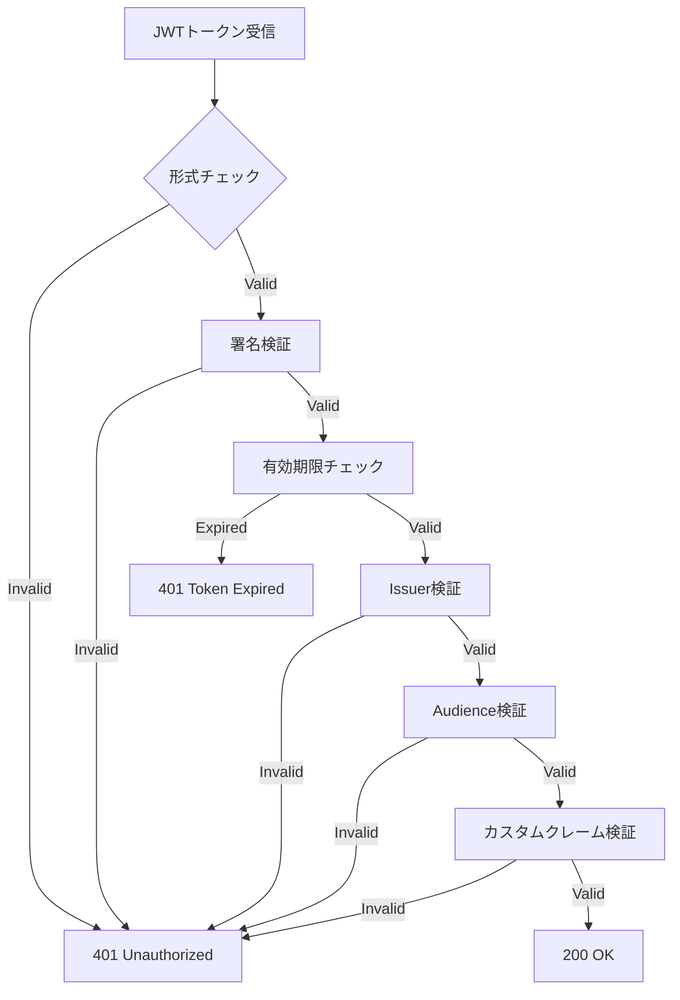

# JWT（JSON Web Token）仕様書

## 1. 概要

### 1.1 目的
本文書は、SES業務システムにおけるJWT（JSON Web Token）の詳細仕様を定義する。Keycloakが発行するトークンの構造、検証方法、セキュリティ要件を明確化し、安全なAPI認証を実現する。

### 1.2 トークン種別
| トークン種別 | 用途 | 有効期限 | 更新可否 |
|------------|------|----------|----------|
| **Access Token** | APIアクセス認証 | 5分 | 不可（Refresh Tokenで更新） |
| **Refresh Token** | Access Token更新 | 30分（スライディング） | 可（使用時に更新） |
| **ID Token** | ユーザー認証情報 | 5分 | 不可 |
| **Offline Token** | 長期アクセス | 60日 | 可（条件付き） |

### 1.3 JWT構成
```
header.payload.signature
```

## 2. Access Token仕様

### 2.1 ヘッダー（Header）
```json
{
  "alg": "RS256",
  "typ": "JWT",
  "kid": "rsa-key-12345"
}
```

| フィールド | 説明 | 値 |
|-----------|------|-----|
| **alg** | 署名アルゴリズム | RS256（RSA + SHA-256） |
| **typ** | トークンタイプ | JWT |
| **kid** | 署名検証用キーID | Keycloakが生成 |

### 2.2 ペイロード（Payload）
```json
{
  "exp": 1701234567,
  "iat": 1701234267,
  "auth_time": 1701234000,
  "jti": "550e8400-e29b-41d4-a716-446655440000",
  "iss": "https://keycloak.example.com/realms/ses-manager",
  "aud": [
    "ses-manager-web",
    "project-service",
    "engineer-service"
  ],
  "sub": "f:550e8400-e29b-41d4-a716-446655440001:johndoe",
  "typ": "Bearer",
  "azp": "ses-manager-web",
  "session_state": "550e8400-e29b-41d4-a716-446655440002",
  "acr": "1",
  "allowed-origins": [
    "https://ses-manager.example.com",
    "http://localhost:8080"
  ],
  "realm_access": {
    "roles": [
      "project_manager",
      "default-roles-ses-manager"
    ]
  },
  "resource_access": {
    "ses-manager-web": {
      "roles": [
        "project_create",
        "project_update",
        "project_view",
        "engineer_view",
        "matching_execute",
        "matching_view",
        "timesheet_approve"
      ]
    }
  },
  "scope": "openid email profile",
  "sid": "550e8400-e29b-41d4-a716-446655440003",
  "email_verified": true,
  "name": "John Doe",
  "preferred_username": "johndoe",
  "given_name": "John",
  "family_name": "Doe",
  "email": "john.doe@example.com",
  "employee_id": "EMP001234",
  "department": "Engineering",
  "department_id": "DEPT001",
  "position": "Senior Project Manager",
  "manager_id": "EMP000100"
}
```

### 2.3 標準クレーム
| クレーム | 説明 | 必須 | 例 |
|---------|------|------|-----|
| **exp** | 有効期限（Unix時間） | ✓ | 1701234567 |
| **iat** | 発行時刻（Unix時間） | ✓ | 1701234267 |
| **auth_time** | 認証時刻（Unix時間） | ✓ | 1701234000 |
| **jti** | JWT ID（一意識別子） | ✓ | UUID |
| **iss** | 発行者（Issuer） | ✓ | Keycloak Realm URL |
| **aud** | 対象者（Audience） | ✓ | クライアントID配列 |
| **sub** | 主体（Subject） | ✓ | ユーザー識別子 |
| **typ** | トークンタイプ | ✓ | "Bearer" |
| **azp** | 認可されたパーティ | ✓ | クライアントID |
| **session_state** | セッション状態 | ○ | セッションID |
| **acr** | 認証コンテキストクラス | ○ | "1" |
| **scope** | スコープ | ✓ | "openid email profile" |

### 2.4 カスタムクレーム
| クレーム | 説明 | 必須 | 例 |
|---------|------|------|-----|
| **employee_id** | 社員番号 | ✓ | "EMP001234" |
| **department** | 部署名 | ✓ | "Engineering" |
| **department_id** | 部署ID | ✓ | "DEPT001" |
| **position** | 役職 | ○ | "Senior Project Manager" |
| **manager_id** | 上長社員番号 | ○ | "EMP000100" |
| **company_id** | 会社ID（マルチテナント用） | ○ | "COMP001" |
| **data_scope** | データアクセス範囲 | ○ | ["DEPT001", "PROJ001"] |

### 2.5 ロール・権限クレーム
```json
{
  "realm_access": {
    "roles": ["project_manager", "default-roles-ses-manager"]
  },
  "resource_access": {
    "ses-manager-web": {
      "roles": [
        "project_create",
        "project_update",
        "project_view",
        "engineer_view",
        "matching_execute",
        "matching_view",
        "timesheet_approve"
      ]
    },
    "project-service": {
      "roles": ["project_api_access"]
    },
    "engineer-service": {
      "roles": ["engineer_api_access"]
    }
  }
}
```

## 3. Refresh Token仕様

### 3.1 構造
```json
{
  "exp": 1701236067,
  "iat": 1701234267,
  "jti": "550e8400-e29b-41d4-a716-446655440004",
  "iss": "https://keycloak.example.com/realms/ses-manager",
  "aud": "https://keycloak.example.com/realms/ses-manager",
  "sub": "f:550e8400-e29b-41d4-a716-446655440001:johndoe",
  "typ": "Refresh",
  "azp": "ses-manager-web",
  "session_state": "550e8400-e29b-41d4-a716-446655440002",
  "scope": "openid email profile offline_access"
}
```

### 3.2 使用方法
```http
POST /realms/ses-manager/protocol/openid-connect/token
Content-Type: application/x-www-form-urlencoded

grant_type=refresh_token&
refresh_token={refresh_token}&
client_id=ses-manager-web&
client_secret={client_secret}
```

## 4. ID Token仕様

### 4.1 構造
```json
{
  "exp": 1701234567,
  "iat": 1701234267,
  "auth_time": 1701234000,
  "jti": "550e8400-e29b-41d4-a716-446655440005",
  "iss": "https://keycloak.example.com/realms/ses-manager",
  "aud": "ses-manager-web",
  "sub": "f:550e8400-e29b-41d4-a716-446655440001:johndoe",
  "typ": "ID",
  "azp": "ses-manager-web",
  "session_state": "550e8400-e29b-41d4-a716-446655440002",
  "at_hash": "0hpLJHPAu5Q2emFr9mrcLA",
  "acr": "1",
  "sid": "550e8400-e29b-41d4-a716-446655440003",
  "email_verified": true,
  "name": "John Doe",
  "preferred_username": "johndoe",
  "given_name": "John",
  "family_name": "Doe",
  "email": "john.doe@example.com"
}
```

## 5. トークン検証

### 5.1 検証手順


### 5.2 Spring Security実装例
```java
@Configuration
public class JwtSecurityConfig {
    
    @Value("${keycloak.auth-server-url}")
    private String keycloakUrl;
    
    @Value("${keycloak.realm}")
    private String realm;
    
    @Bean
    public JwtDecoder jwtDecoder() {
        String jwkSetUri = keycloakUrl + "/realms/" + realm + "/protocol/openid-connect/certs";
        
        NimbusJwtDecoder decoder = NimbusJwtDecoder.withJwkSetUri(jwkSetUri)
            .jwtProcessorCustomizer(customizer -> {
                customizer.setJWSTypeVerifier(new DefaultJOSEObjectTypeVerifier<>(
                    new JOSEObjectType("JWT")
                ));
            })
            .build();
            
        decoder.setJwtValidator(jwtValidator());
        
        return decoder;
    }
    
    @Bean
    public OAuth2TokenValidator<Jwt> jwtValidator() {
        List<OAuth2TokenValidator<Jwt>> validators = new ArrayList<>();
        
        // 標準バリデーター
        validators.add(new JwtTimestampValidator());
        validators.add(new JwtIssuerValidator(keycloakUrl + "/realms/" + realm));
        
        // カスタムバリデーター
        validators.add(new CustomClaimValidator());
        validators.add(new AudienceValidator());
        
        return new DelegatingOAuth2TokenValidator<>(validators);
    }
}
```

### 5.3 カスタムバリデーター
```java
@Component
public class CustomClaimValidator implements OAuth2TokenValidator<Jwt> {
    
    @Override
    public OAuth2TokenValidatorResult validate(Jwt jwt) {
        // 必須カスタムクレームの検証
        if (!jwt.hasClaim("employee_id")) {
            return OAuth2TokenValidatorResult.failure(
                new OAuth2Error("missing_claim", 
                    "Required claim 'employee_id' is missing", null)
            );
        }
        
        if (!jwt.hasClaim("department_id")) {
            return OAuth2TokenValidatorResult.failure(
                new OAuth2Error("missing_claim", 
                    "Required claim 'department_id' is missing", null)
            );
        }
        
        // ロールの存在確認
        Map<String, Object> realmAccess = jwt.getClaim("realm_access");
        if (realmAccess == null || !realmAccess.containsKey("roles")) {
            return OAuth2TokenValidatorResult.failure(
                new OAuth2Error("missing_roles", 
                    "No roles found in token", null)
            );
        }
        
        return OAuth2TokenValidatorResult.success();
    }
}
```

## 6. トークン管理

### 6.1 トークンストレージ
| 保存場所 | 推奨度 | セキュリティ | 備考 |
|---------|--------|------------|------|
| **HTTPOnly Cookie** | ◎ | 高 | XSS攻撃に強い、CSRF対策必要 |
| **SessionStorage** | ○ | 中 | タブ閉じると削除、XSS脆弱 |
| **LocalStorage** | △ | 低 | 永続化可能、XSS脆弱 |
| **Memory** | ○ | 高 | 最も安全、リロードで消失 |

### 6.2 推奨実装
```javascript
// トークン管理サービス
class TokenManager {
    constructor() {
        this.accessToken = null;
        this.refreshToken = null;
        this.tokenRefreshTimer = null;
    }
    
    // トークン保存（メモリ + HTTPOnly Cookie）
    saveTokens(accessToken, refreshToken) {
        // Access Tokenはメモリに保存
        this.accessToken = accessToken;
        
        // Refresh TokenはHTTPOnly Cookieに保存（サーバー側で設定）
        // Set-Cookie: refresh_token={token}; HttpOnly; Secure; SameSite=Strict
        
        // 自動更新タイマー設定
        this.scheduleTokenRefresh();
    }
    
    // トークン自動更新
    scheduleTokenRefresh() {
        if (this.tokenRefreshTimer) {
            clearTimeout(this.tokenRefreshTimer);
        }
        
        // 有効期限の80%経過時に更新
        const expiresIn = this.getTokenExpiration() - Date.now();
        const refreshTime = expiresIn * 0.8;
        
        this.tokenRefreshTimer = setTimeout(() => {
            this.refreshAccessToken();
        }, refreshTime);
    }
    
    // Access Token更新
    async refreshAccessToken() {
        try {
            const response = await fetch('/api/auth/refresh', {
                method: 'POST',
                credentials: 'include', // Cookie送信
                headers: {
                    'Content-Type': 'application/json'
                }
            });
            
            if (response.ok) {
                const data = await response.json();
                this.accessToken = data.access_token;
                this.scheduleTokenRefresh();
            } else {
                // リフレッシュ失敗 → 再ログイン
                this.redirectToLogin();
            }
        } catch (error) {
            console.error('Token refresh failed:', error);
            this.redirectToLogin();
        }
    }
}
```

## 7. セキュリティ要件

### 7.1 署名アルゴリズム
- **必須**: RS256（RSA + SHA-256）
- **禁止**: HS256（対称鍵）、なし（none）
- **推奨**: RS512、ES256（楕円曲線）

### 7.2 鍵管理
```yaml
key_management:
  rotation_period: 90_days
  key_size: 2048_bits_minimum
  backup: encrypted_secure_storage
  
  jwks_endpoint: /realms/ses-manager/protocol/openid-connect/certs
  cache_duration: 1_hour
  
  key_usage:
    - signing: active_key_only
    - verification: all_valid_keys
```

### 7.3 トークン無効化
```java
@Service
public class TokenRevocationService {
    
    private final Set<String> revokedTokens = new ConcurrentHashMap<>();
    
    public void revokeToken(String jti) {
        revokedTokens.add(jti);
        // Redisに保存（有効期限まで）
        redisTemplate.opsForValue().set(
            "revoked:" + jti, 
            true, 
            Duration.ofMinutes(5)
        );
    }
    
    public boolean isRevoked(String jti) {
        return revokedTokens.contains(jti) || 
               Boolean.TRUE.equals(redisTemplate.hasKey("revoked:" + jti));
    }
}
```

## 8. エラーハンドリング

### 8.1 トークンエラー応答
```json
{
  "error": "invalid_token",
  "error_description": "Token signature verification failed",
  "error_code": "AUTH001",
  "correlation_id": "550e8400-e29b-41d4-a716-446655440006",
  "timestamp": "2024-12-01T12:00:00Z"
}
```

### 8.2 エラーコード一覧
| エラーコード | エラー種別 | 説明 | HTTPステータス |
|------------|-----------|------|---------------|
| AUTH001 | invalid_token | 無効なトークン形式 | 401 |
| AUTH002 | expired_token | トークン有効期限切れ | 401 |
| AUTH003 | invalid_signature | 署名検証失敗 | 401 |
| AUTH004 | invalid_issuer | 発行者不正 | 401 |
| AUTH005 | invalid_audience | 対象者不正 | 401 |
| AUTH006 | insufficient_scope | スコープ不足 | 403 |
| AUTH007 | missing_claim | 必須クレーム欠落 | 401 |
| AUTH008 | token_revoked | トークン無効化済み | 401 |

## 9. パフォーマンス最適化

### 9.1 JWKSキャッシュ
```java
@Configuration
public class JwksConfig {
    
    @Bean
    public JWKSource<SecurityContext> jwkSource() {
        return new RemoteJWKSet<>(
            new URL(jwksUri),
            new DefaultResourceRetriever(
                5000,  // 接続タイムアウト
                5000,  // 読み取りタイムアウト
                50 * 1024  // 最大サイズ 50KB
            ),
            new JWKSetCache(
                1,     // ライフスパン: 1時間
                15,    // リフレッシュ: 15分
                TimeUnit.HOURS
            )
        );
    }
}
```

### 9.2 トークンサイズ最適化
- 不要なクレームを除外
- クレーム名を短縮（可能な場合）
- ネストを最小限に
- 配列要素を必要最小限に

## 10. 監視・ログ

### 10.1 監視メトリクス
```yaml
metrics:
  - token_validation_success_rate
  - token_validation_latency
  - token_refresh_rate
  - token_expiration_rate
  - invalid_token_attempts
```

### 10.2 ログ出力
```java
@Slf4j
@Component
public class JwtAuditLogger {
    
    public void logTokenValidation(Jwt jwt, boolean success) {
        log.info("JWT validation: sub={}, jti={}, success={}, roles={}", 
            jwt.getSubject(),
            jwt.getId(),
            success,
            extractRoles(jwt)
        );
    }
    
    public void logTokenRefresh(String oldJti, String newJti) {
        log.info("Token refreshed: old_jti={}, new_jti={}", oldJti, newJti);
    }
    
    public void logTokenRevocation(String jti, String reason) {
        log.warn("Token revoked: jti={}, reason={}", jti, reason);
    }
}
```

---

**作成日**: 2025年6月2日  
**作成者**: SES業務システム開発チーム  
**対象**: 開発者、セキュリティエンジニア