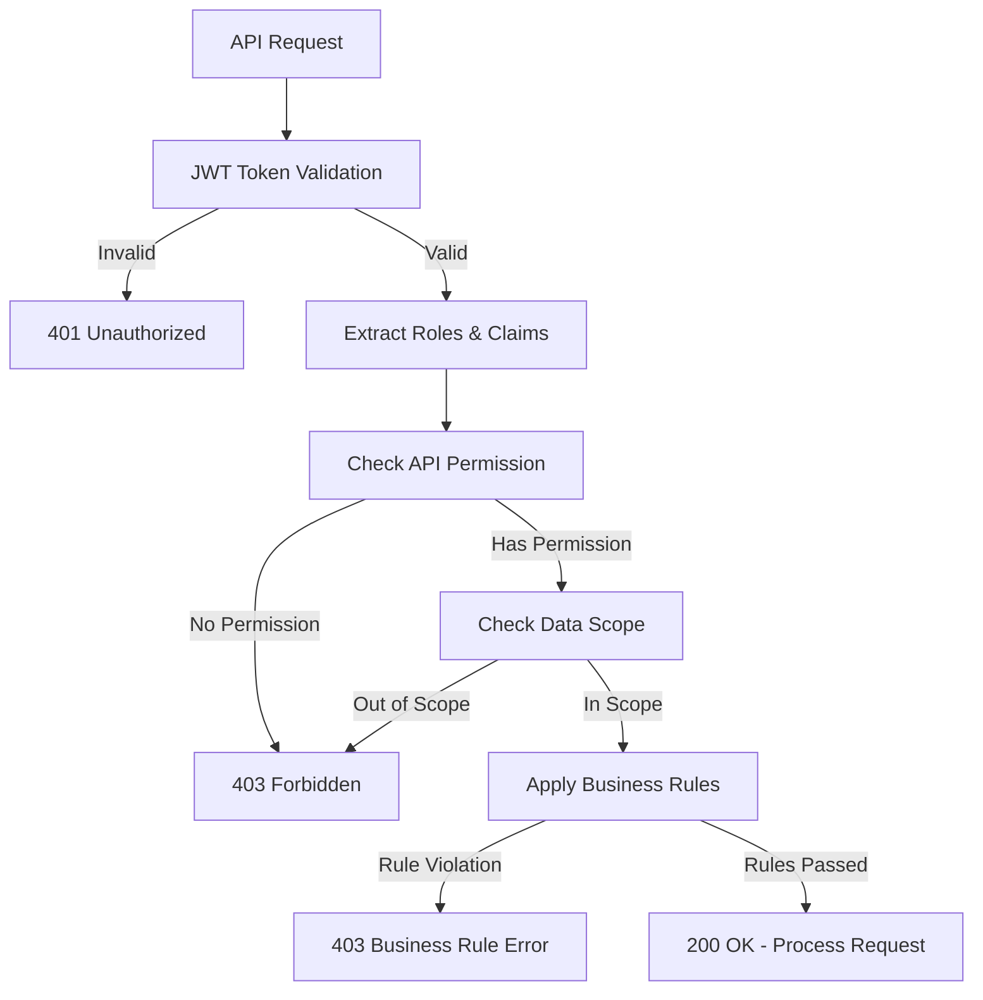

# API認可ルール設計

## 1. 概要

### 1.1 目的
本文書は、SES業務システムの各マイクロサービスAPIに対する認可ルールを定義する。Spring SecurityとKeycloakを使用したロールベースおよび属性ベースのアクセス制御を実装し、セキュアなAPI保護を実現する。

### 1.2 認可方式
| 認可タイプ | 説明 | 使用場面 |
|-----------|------|----------|
| **RBAC** | Role-Based Access Control | 基本的な機能アクセス制御 |
| **ABAC** | Attribute-Based Access Control | データスコープ制御 |
| **OAuth Scope** | OAuthスコープベース制御 | 外部API連携 |
| **Dynamic Permission** | 動的権限評価 | 承認フロー、条件付きアクセス |

### 1.3 認可フロー


## 2. Project Service API認可ルール

### 2.1 エンドポイント別認可設定
| エンドポイント | メソッド | 必要ロール | データスコープ | ビジネスルール |
|--------------|---------|-----------|--------------|----------------|
| `/api/projects` | GET | project_view | 部門/担当範囲 | - |
| `/api/projects` | POST | project_create | - | 予算上限チェック |
| `/api/projects/{id}` | GET | project_view | 部門/担当範囲 | - |
| `/api/projects/{id}` | PUT | project_update | 部門/担当範囲 | ステータス遷移ルール |
| `/api/projects/{id}` | DELETE | project_delete | 全社（管理者のみ） | 関連データ存在チェック |
| `/api/projects/{id}/status` | PUT | project_update | 部門/担当範囲 | 承認権限チェック |
| `/api/projects/{id}/engineers` | GET | project_view | 部門/担当範囲 | - |
| `/api/projects/{id}/engineers` | POST | matching_execute | 部門/担当範囲 | アサイン可能チェック |
| `/api/projects/search` | POST | project_view | 部門/担当範囲 | - |
| `/api/projects/export` | GET | report_export | 部門/担当範囲 | - |

### 2.2 Spring Security実装
```java
@RestController
@RequestMapping("/api/projects")
@PreAuthorize("hasRole('ROLE_USER')")
public class ProjectController {
    
    @GetMapping
    @PreAuthorize("hasAuthority('project_view')")
    public Page<ProjectDto> listProjects(
            @AuthenticationPrincipal JwtPrincipal principal,
            Pageable pageable) {
        // データスコープ適用
        Specification<Project> spec = projectService.getDataScope(principal);
        return projectService.findAll(spec, pageable);
    }
    
    @PostMapping
    @PreAuthorize("hasAuthority('project_create')")
    @BusinessRule("project.budget.limit")
    public ProjectDto createProject(
            @Valid @RequestBody CreateProjectRequest request,
            @AuthenticationPrincipal JwtPrincipal principal) {
        // 予算上限チェック
        businessRuleEngine.validate("project.budget.limit", request, principal);
        return projectService.create(request, principal);
    }
    
    @PutMapping("/{id}")
    @PreAuthorize("hasAuthority('project_update') and " +
                  "@projectSecurityService.canUpdate(#id, authentication)")
    public ProjectDto updateProject(
            @PathVariable UUID id,
            @Valid @RequestBody UpdateProjectRequest request,
            @AuthenticationPrincipal JwtPrincipal principal) {
        return projectService.update(id, request, principal);
    }
    
    @DeleteMapping("/{id}")
    @PreAuthorize("hasAnyRole('SYSTEM_ADMIN', 'COMPANY_ADMIN')")
    public void deleteProject(@PathVariable UUID id) {
        projectService.delete(id);
    }
    
    @PutMapping("/{id}/status")
    @PreAuthorize("hasAuthority('project_update') and " +
                  "@projectSecurityService.canChangeStatus(#id, #request.status, authentication)")
    public ProjectDto changeStatus(
            @PathVariable UUID id,
            @Valid @RequestBody ChangeStatusRequest request,
            @AuthenticationPrincipal JwtPrincipal principal) {
        return projectService.changeStatus(id, request, principal);
    }
}
```

### 2.3 データスコープサービス
```java
@Service
public class ProjectSecurityService {
    
    public boolean canUpdate(UUID projectId, Authentication auth) {
        JwtPrincipal principal = (JwtPrincipal) auth.getPrincipal();
        
        // システム管理者・会社管理者は全アクセス可
        if (hasAnyRole(principal, "SYSTEM_ADMIN", "COMPANY_ADMIN")) {
            return true;
        }
        
        Project project = projectRepository.findById(projectId)
            .orElseThrow(() -> new ResourceNotFoundException("Project", projectId));
        
        // 部門管理者: 自部門のプロジェクトのみ
        if (hasRole(principal, "DEPARTMENT_MANAGER")) {
            return project.getDepartmentId().equals(principal.getDepartmentId());
        }
        
        // PM: 担当プロジェクトのみ
        if (hasRole(principal, "PROJECT_MANAGER")) {
            return project.getManagerId().equals(principal.getUserId());
        }
        
        // 営業: 担当案件のみ
        if (hasRole(principal, "SALES")) {
            return project.getSalesId().equals(principal.getUserId());
        }
        
        return false;
    }
    
    public boolean canChangeStatus(UUID projectId, ProjectStatus newStatus, 
                                   Authentication auth) {
        if (!canUpdate(projectId, auth)) {
            return false;
        }
        
        JwtPrincipal principal = (JwtPrincipal) auth.getPrincipal();
        Project project = projectRepository.findById(projectId).orElseThrow();
        
        // ステータス遷移ルール
        return switch (newStatus) {
            case APPROVED -> hasAnyRole(principal, "SYSTEM_ADMIN", "COMPANY_ADMIN", 
                                        "DEPARTMENT_MANAGER");
            case CANCELLED -> hasAnyRole(principal, "SYSTEM_ADMIN", "COMPANY_ADMIN");
            case COMPLETED -> project.getManagerId().equals(principal.getUserId()) ||
                              hasAnyRole(principal, "DEPARTMENT_MANAGER");
            default -> true;
        };
    }
}
```

## 3. Engineer Service API認可ルール

### 3.1 エンドポイント別認可設定
| エンドポイント | メソッド | 必要ロール | データスコープ | ビジネスルール |
|--------------|---------|-----------|--------------|----------------|
| `/api/engineers` | GET | engineer_view | 部門/公開情報 | - |
| `/api/engineers` | POST | engineer_create | - | 重複チェック |
| `/api/engineers/{id}` | GET | engineer_view | 部門/個人/公開 | 個人情報マスク |
| `/api/engineers/{id}` | PUT | engineer_update | 部門/個人 | スキル検証 |
| `/api/engineers/{id}` | DELETE | engineer_delete | 全社（管理者のみ） | 稼働チェック |
| `/api/engineers/{id}/skills` | GET | engineer_view | 部門/個人/公開 | - |
| `/api/engineers/{id}/skills` | PUT | engineer_update | 部門/個人 | スキルレベル制限 |
| `/api/engineers/{id}/availability` | GET | matching_execute | 公開 | - |
| `/api/engineers/{id}/evaluation` | POST | engineer_update | 上長のみ | 評価権限チェック |
| `/api/engineers/search` | POST | engineer_view | 部門/公開 | - |

### 3.2 個人情報保護実装
```java
@Service
public class EngineerSecurityService {
    
    private static final Set<String> PUBLIC_FIELDS = Set.of(
        "id", "name", "skills", "availability", "yearsOfExperience"
    );
    
    private static final Set<String> PRIVATE_FIELDS = Set.of(
        "email", "phone", "address", "salary", "evaluation"
    );
    
    public EngineerDto filterByPermission(Engineer engineer, JwtPrincipal principal) {
        EngineerDto dto = engineerMapper.toDto(engineer);
        
        // 本人または管理権限がある場合は全情報
        if (engineer.getId().equals(principal.getEngineerId()) ||
            hasEngineerManagementPermission(engineer, principal)) {
            return dto;
        }
        
        // それ以外は公開情報のみ
        return maskPrivateFields(dto);
    }
    
    private boolean hasEngineerManagementPermission(Engineer engineer, 
                                                    JwtPrincipal principal) {
        // システム管理者・会社管理者
        if (hasAnyRole(principal, "SYSTEM_ADMIN", "COMPANY_ADMIN")) {
            return true;
        }
        
        // 部門管理者: 自部門のみ
        if (hasRole(principal, "DEPARTMENT_MANAGER")) {
            return engineer.getDepartmentId().equals(principal.getDepartmentId());
        }
        
        // 上長: 直属部下のみ
        return engineer.getManagerId().equals(principal.getUserId());
    }
    
    private EngineerDto maskPrivateFields(EngineerDto dto) {
        dto.setEmail(null);
        dto.setPhone(null);
        dto.setAddress(null);
        dto.setSalary(null);
        dto.setEvaluations(null);
        dto.setPersonalInfo(null);
        return dto;
    }
}
```

## 4. Matching Service API認可ルール

### 4.1 エンドポイント別認可設定
| エンドポイント | メソッド | 必要ロール | データスコープ | ビジネスルール |
|--------------|---------|-----------|--------------|----------------|
| `/api/matching/search` | POST | matching_execute | 部門/担当 | - |
| `/api/matching/evaluate` | POST | matching_execute | 部門/担当 | スコア閾値 |
| `/api/matching/results/{id}` | GET | matching_view | 部門/担当 | - |
| `/api/matching/approve/{id}` | POST | matching_approve | 部門/担当 | 承認階層チェック |
| `/api/matching/confirm/{id}` | POST | matching_approve | 部門/担当 | 最終承認権限 |
| `/api/matching/history` | GET | matching_view | 部門/担当 | - |
| `/api/matching/statistics` | GET | report_view_all | 部門/全社 | - |

### 4.2 マッチング権限実装
```java
@Component
public class MatchingAuthorizationService {
    
    @PreAuthorize("hasAuthority('matching_execute')")
    public MatchingResult executeMatching(MatchingRequest request, 
                                          JwtPrincipal principal) {
        // プロジェクトへのアクセス権限チェック
        Project project = projectRepository.findById(request.getProjectId())
            .orElseThrow();
            
        if (!projectSecurityService.canUpdate(project.getId(), principal)) {
            throw new AccessDeniedException("No permission to match for this project");
        }
        
        // マッチング実行
        return matchingEngine.execute(request);
    }
    
    @PreAuthorize("hasAuthority('matching_approve')")
    public void approveMatching(UUID matchingId, JwtPrincipal principal) {
        MatchingResult result = matchingRepository.findById(matchingId)
            .orElseThrow();
            
        // 承認権限チェック
        if (!canApproveMatching(result, principal)) {
            throw new AccessDeniedException("No permission to approve this matching");
        }
        
        // 承認処理
        matchingService.approve(matchingId, principal);
    }
    
    private boolean canApproveMatching(MatchingResult result, JwtPrincipal principal) {
        BigDecimal contractAmount = result.getEstimatedContractAmount();
        
        // 金額による承認権限
        if (contractAmount.compareTo(new BigDecimal("5000000")) > 0) {
            // 500万円超: 会社管理者以上
            return hasAnyRole(principal, "SYSTEM_ADMIN", "COMPANY_ADMIN");
        } else if (contractAmount.compareTo(new BigDecimal("3000000")) > 0) {
            // 300万円超: 部門管理者以上
            return hasAnyRole(principal, "SYSTEM_ADMIN", "COMPANY_ADMIN", 
                              "DEPARTMENT_MANAGER");
        } else {
            // それ以下: プロジェクトマネージャー以上
            return hasAnyRole(principal, "SYSTEM_ADMIN", "COMPANY_ADMIN", 
                              "DEPARTMENT_MANAGER", "PROJECT_MANAGER");
        }
    }
}
```

## 5. Contract Service API認可ルール

### 5.1 エンドポイント別認可設定
| エンドポイント | メソッド | 必要ロール | データスコープ | ビジネスルール |
|--------------|---------|-----------|--------------|----------------|
| `/api/contracts` | GET | contract_view | 部門/担当/個人 | - |
| `/api/contracts` | POST | contract_create | - | 契約条件検証 |
| `/api/contracts/{id}` | GET | contract_view | 部門/担当/個人 | - |
| `/api/contracts/{id}` | PUT | contract_update | 営業担当のみ | ステータス制限 |
| `/api/contracts/{id}/approve` | POST | contract_approve | 承認者 | 承認フロー |
| `/api/contracts/{id}/sign` | POST | contract_create | 営業担当 | CloudSign連携 |
| `/api/contracts/{id}/document` | GET | contract_view | 権限範囲 | - |

### 5.2 契約データ保護
```java
@Service
public class ContractAuthorizationService {
    
    public boolean canViewContract(UUID contractId, JwtPrincipal principal) {
        Contract contract = contractRepository.findById(contractId)
            .orElseThrow();
            
        // 管理者権限
        if (hasAnyRole(principal, "SYSTEM_ADMIN", "COMPANY_ADMIN")) {
            return true;
        }
        
        // 経理: 全契約閲覧可
        if (hasRole(principal, "ACCOUNTING")) {
            return true;
        }
        
        // 部門管理者: 自部門の契約
        if (hasRole(principal, "DEPARTMENT_MANAGER")) {
            return contract.getDepartmentId().equals(principal.getDepartmentId());
        }
        
        // 営業: 担当契約
        if (hasRole(principal, "SALES")) {
            return contract.getSalesId().equals(principal.getUserId());
        }
        
        // 技術者: 自身の契約
        if (hasRole(principal, "ENGINEER")) {
            return contract.getEngineerId().equals(principal.getEngineerId());
        }
        
        // PM: プロジェクトメンバーの契約
        if (hasRole(principal, "PROJECT_MANAGER")) {
            return projectService.isProjectMember(
                contract.getProjectId(), 
                contract.getEngineerId(), 
                principal.getUserId()
            );
        }
        
        return false;
    }
}
```

## 6. Timesheet Service API認可ルール

### 6.1 エンドポイント別認可設定
| エンドポイント | メソッド | 必要ロール | データスコープ | ビジネスルール |
|--------------|---------|-----------|--------------|----------------|
| `/api/timesheets` | GET | timesheet_view_all | 部門/個人 | - |
| `/api/timesheets` | POST | timesheet_submit | 本人のみ | 締切チェック |
| `/api/timesheets/{id}` | GET | timesheet_view_all | 部門/個人 | - |
| `/api/timesheets/{id}` | PUT | timesheet_submit | 本人のみ | 承認前のみ |
| `/api/timesheets/{id}/approve` | POST | timesheet_approve | 承認者 | 承認権限 |
| `/api/timesheets/overtime` | POST | timesheet_submit | 本人のみ | 上限チェック |
| `/api/timesheets/leave` | POST | timesheet_submit | 本人のみ | 残日数チェック |

### 6.2 勤怠承認フロー
```java
@Service
public class TimesheetAuthorizationService {
    
    public boolean canApproveTimesheet(UUID timesheetId, JwtPrincipal principal) {
        Timesheet timesheet = timesheetRepository.findById(timesheetId)
            .orElseThrow();
            
        Engineer engineer = engineerRepository.findById(timesheet.getEngineerId())
            .orElseThrow();
            
        // 自分の勤怠は承認不可
        if (engineer.getId().equals(principal.getEngineerId())) {
            return false;
        }
        
        // 直属上長
        if (engineer.getManagerId().equals(principal.getUserId())) {
            return true;
        }
        
        // PM: プロジェクトメンバーの勤怠
        if (hasRole(principal, "PROJECT_MANAGER")) {
            return projectService.isProjectManager(
                timesheet.getProjectId(), 
                principal.getUserId()
            );
        }
        
        // 部門管理者: 部門メンバーの勤怠
        if (hasRole(principal, "DEPARTMENT_MANAGER")) {
            return engineer.getDepartmentId().equals(principal.getDepartmentId());
        }
        
        // 管理者権限
        return hasAnyRole(principal, "SYSTEM_ADMIN", "COMPANY_ADMIN");
    }
    
    @BusinessRule("overtime.limit.check")
    public void validateOvertimeRequest(OvertimeRequest request, 
                                        JwtPrincipal principal) {
        // 月間残業時間チェック
        int currentMonthOvertime = timesheetRepository
            .sumOvertimeHours(principal.getEngineerId(), YearMonth.now());
            
        if (currentMonthOvertime + request.getHours() > 45) {
            // 45時間超: 部門管理者の事前承認必要
            if (!request.isPreApproved()) {
                throw new BusinessRuleException(
                    "Overtime over 45 hours requires pre-approval"
                );
            }
        }
        
        if (currentMonthOvertime + request.getHours() > 80) {
            // 80時間超: 禁止
            throw new BusinessRuleException(
                "Overtime cannot exceed 80 hours per month"
            );
        }
    }
}
```

## 7. Billing Service API認可ルール

### 7.1 エンドポイント別認可設定
| エンドポイント | メソッド | 必要ロール | データスコープ | ビジネスルール |
|--------------|---------|-----------|--------------|----------------|
| `/api/invoices` | GET | billing_view | 経理/営業担当 | - |
| `/api/invoices` | POST | billing_create | 経理のみ | 請求条件検証 |
| `/api/invoices/{id}` | GET | billing_view | 経理/営業担当 | - |
| `/api/invoices/{id}` | PUT | billing_create | 経理のみ | 発行前のみ |
| `/api/invoices/{id}/approve` | POST | billing_approve | 経理責任者 | 金額チェック |
| `/api/invoices/{id}/issue` | POST | billing_create | 経理のみ | 承認済みのみ |
| `/api/payments` | GET | billing_view | 経理のみ | - |
| `/api/payments` | POST | billing_create | 経理のみ | - |
| `/api/payments/reconcile` | POST | billing_approve | 経理責任者 | MoneyForward連携 |

### 7.2 請求書アクセス制御
```java
@RestController
@RequestMapping("/api/invoices")
@PreAuthorize("hasRole('ACCOUNTING')")
public class InvoiceController {
    
    @PostMapping
    @PreAuthorize("hasAuthority('billing_create')")
    @Transactional
    public InvoiceDto createInvoice(
            @Valid @RequestBody CreateInvoiceRequest request,
            @AuthenticationPrincipal JwtPrincipal principal) {
        // 請求条件検証
        Contract contract = contractRepository.findById(request.getContractId())
            .orElseThrow();
            
        validateBillingConditions(contract, request);
        
        // 請求書作成
        return invoiceService.create(request, principal);
    }
    
    @PostMapping("/{id}/approve")
    @PreAuthorize("hasAuthority('billing_approve')")
    public void approveInvoice(
            @PathVariable UUID id,
            @AuthenticationPrincipal JwtPrincipal principal) {
        Invoice invoice = invoiceRepository.findById(id).orElseThrow();
        
        // 金額による承認権限チェック
        if (invoice.getTotalAmount().compareTo(new BigDecimal("10000000")) > 0) {
            // 1000万円超: 経理部長以上
            if (!hasRole(principal, "ACCOUNTING_MANAGER")) {
                throw new AccessDeniedException(
                    "Large amount invoices require manager approval"
                );
            }
        }
        
        invoiceService.approve(id, principal);
    }
}
```

## 8. Report Service API認可ルール

### 8.1 エンドポイント別認可設定
| エンドポイント | メソッド | 必要ロール | データスコープ | ビジネスルール |
|--------------|---------|-----------|--------------|----------------|
| `/api/reports/dashboard` | GET | report_view_all | ロール別 | - |
| `/api/reports/revenue` | GET | report_view_all | 部門/全社 | - |
| `/api/reports/utilization` | GET | report_view_all | 部門/全社 | - |
| `/api/reports/projects` | GET | report_view_all | 部門/担当 | - |
| `/api/reports/custom` | POST | report_view_all | データ範囲 | - |
| `/api/reports/export` | POST | report_export | データ範囲 | 個人情報除外 |
| `/api/reports/schedule` | POST | report_view_all | - | 管理者のみ |

### 8.2 レポートデータフィルタリング
```java
@Service
public class ReportAuthorizationService {
    
    public ReportData filterReportData(ReportType type, 
                                       JwtPrincipal principal) {
        ReportData data = reportEngine.generate(type);
        
        // ロール別フィルタリング
        return switch (principal.getPrimaryRole()) {
            case SYSTEM_ADMIN, COMPANY_ADMIN -> data; // 全データ
            case DEPARTMENT_MANAGER -> filterByDepartment(data, principal.getDepartmentId());
            case PROJECT_MANAGER -> filterByProjects(data, principal.getManagedProjectIds());
            case SALES -> filterBySalesProjects(data, principal.getUserId());
            case ACCOUNTING -> filterFinancialData(data);
            case ENGINEER -> filterOwnData(data, principal.getEngineerId());
            default -> ReportData.empty();
        };
    }
    
    public boolean canExportReport(ReportType type, JwtPrincipal principal) {
        // 個人情報を含むレポートのエクスポート制限
        if (type.containsPersonalInfo()) {
            return hasAnyRole(principal, "SYSTEM_ADMIN", "COMPANY_ADMIN") ||
                   (hasRole(principal, "DEPARTMENT_MANAGER") && 
                    type.getScope() == ReportScope.DEPARTMENT);
        }
        
        return hasAuthority(principal, "report_export");
    }
}
```

## 9. Notification Service API認可ルール

### 9.1 エンドポイント別認可設定
| エンドポイント | メソッド | 必要ロール | データスコープ | ビジネスルール |
|--------------|---------|-----------|--------------|----------------|
| `/api/notifications` | GET | 全ロール | 個人のみ | - |
| `/api/notifications/send` | POST | 送信権限 | 宛先制限 | - |
| `/api/notifications/templates` | GET | 管理者 | - | - |
| `/api/notifications/templates` | POST | システム管理者 | - | - |
| `/api/notifications/settings` | GET | 全ロール | 個人のみ | - |
| `/api/notifications/settings` | PUT | 全ロール | 個人のみ | - |

### 9.2 通知送信権限
```java
@Service
public class NotificationAuthorizationService {
    
    public boolean canSendNotification(NotificationRequest request, 
                                       JwtPrincipal principal) {
        // システム通知: システム管理者のみ
        if (request.getType() == NotificationType.SYSTEM) {
            return hasRole(principal, "SYSTEM_ADMIN");
        }
        
        // 部門通知: 部門管理者
        if (request.getType() == NotificationType.DEPARTMENT) {
            return hasRole(principal, "DEPARTMENT_MANAGER") &&
                   request.getTargetDepartmentId().equals(principal.getDepartmentId());
        }
        
        // プロジェクト通知: PM
        if (request.getType() == NotificationType.PROJECT) {
            return projectService.isProjectManager(
                request.getTargetProjectId(), 
                principal.getUserId()
            );
        }
        
        // 個人通知: 上長または関係者
        if (request.getType() == NotificationType.PERSONAL) {
            return canSendPersonalNotification(
                request.getTargetUserId(), 
                principal
            );
        }
        
        return false;
    }
}
```

## 10. 共通認可コンポーネント

### 10.1 認可エラーハンドリング
```java
@RestControllerAdvice
public class AuthorizationExceptionHandler {
    
    @ExceptionHandler(AccessDeniedException.class)
    public ResponseEntity<ErrorResponse> handleAccessDenied(
            AccessDeniedException ex,
            HttpServletRequest request) {
        
        ErrorResponse error = ErrorResponse.builder()
            .errorCode("AUTH403")
            .message("Access denied")
            .details(Map.of(
                "path", request.getRequestURI(),
                "method", request.getMethod(),
                "reason", ex.getMessage()
            ))
            .correlationId(MDC.get("correlationId"))
            .timestamp(Instant.now())
            .build();
            
        return ResponseEntity.status(HttpStatus.FORBIDDEN).body(error);
    }
    
    @ExceptionHandler(InsufficientAuthenticationException.class)
    public ResponseEntity<ErrorResponse> handleInsufficientAuth(
            InsufficientAuthenticationException ex) {
        
        ErrorResponse error = ErrorResponse.builder()
            .errorCode("AUTH401")
            .message("Authentication required")
            .correlationId(MDC.get("correlationId"))
            .timestamp(Instant.now())
            .build();
            
        return ResponseEntity.status(HttpStatus.UNAUTHORIZED).body(error);
    }
}
```

### 10.2 認可メトリクス
```java
@Component
@Slf4j
public class AuthorizationMetrics {
    
    private final MeterRegistry meterRegistry;
    
    @EventListener
    public void onAuthorizationSuccess(AuthorizationSuccessEvent event) {
        meterRegistry.counter("authorization.success",
            "role", event.getPrincipal().getPrimaryRole(),
            "resource", event.getResource(),
            "action", event.getAction()
        ).increment();
    }
    
    @EventListener
    public void onAuthorizationFailure(AuthorizationFailureEvent event) {
        meterRegistry.counter("authorization.failure",
            "role", event.getPrincipal().getPrimaryRole(),
            "resource", event.getResource(),
            "action", event.getAction(),
            "reason", event.getReason()
        ).increment();
        
        log.warn("Authorization failed: user={}, resource={}, action={}, reason={}",
            event.getPrincipal().getUsername(),
            event.getResource(),
            event.getAction(),
            event.getReason()
        );
    }
}
```

## 11. 監査・コンプライアンス

### 11.1 認可監査ログ
```java
@Aspect
@Component
public class AuthorizationAuditAspect {
    
    @AfterReturning(
        pointcut = "@annotation(preAuthorize)",
        returning = "result"
    )
    public void auditAuthorization(JoinPoint joinPoint, 
                                   PreAuthorize preAuthorize, 
                                   Object result) {
        Authentication auth = SecurityContextHolder.getContext().getAuthentication();
        
        AuditLog log = AuditLog.builder()
            .timestamp(Instant.now())
            .userId(auth.getName())
            .action(joinPoint.getSignature().getName())
            .resource(joinPoint.getTarget().getClass().getSimpleName())
            .expression(preAuthorize.value())
            .result("SUCCESS")
            .build();
            
        auditLogRepository.save(log);
    }
}
```

### 11.2 定期的な権限レビュー
```java
@Component
@Scheduled(cron = "0 0 1 * * MON") // 毎週月曜日1:00
public class PermissionReviewScheduler {
    
    public void generatePermissionReviewReport() {
        List<UserPermissionReport> reports = userRepository.findAll().stream()
            .map(user -> UserPermissionReport.builder()
                .userId(user.getId())
                .username(user.getUsername())
                .roles(user.getRoles())
                .lastLoginDate(user.getLastLoginDate())
                .unusedPermissions(findUnusedPermissions(user))
                .excessivePermissions(findExcessivePermissions(user))
                .build()
            )
            .filter(report -> !report.getUnusedPermissions().isEmpty() ||
                              !report.getExcessivePermissions().isEmpty())
            .toList();
            
        notificationService.notifySecurityTeam(reports);
    }
}
```

---

**作成日**: 2025年6月2日  
**作成者**: SES業務システム開発チーム  
**対象**: 開発者、セキュリティエンジニア、システム管理者